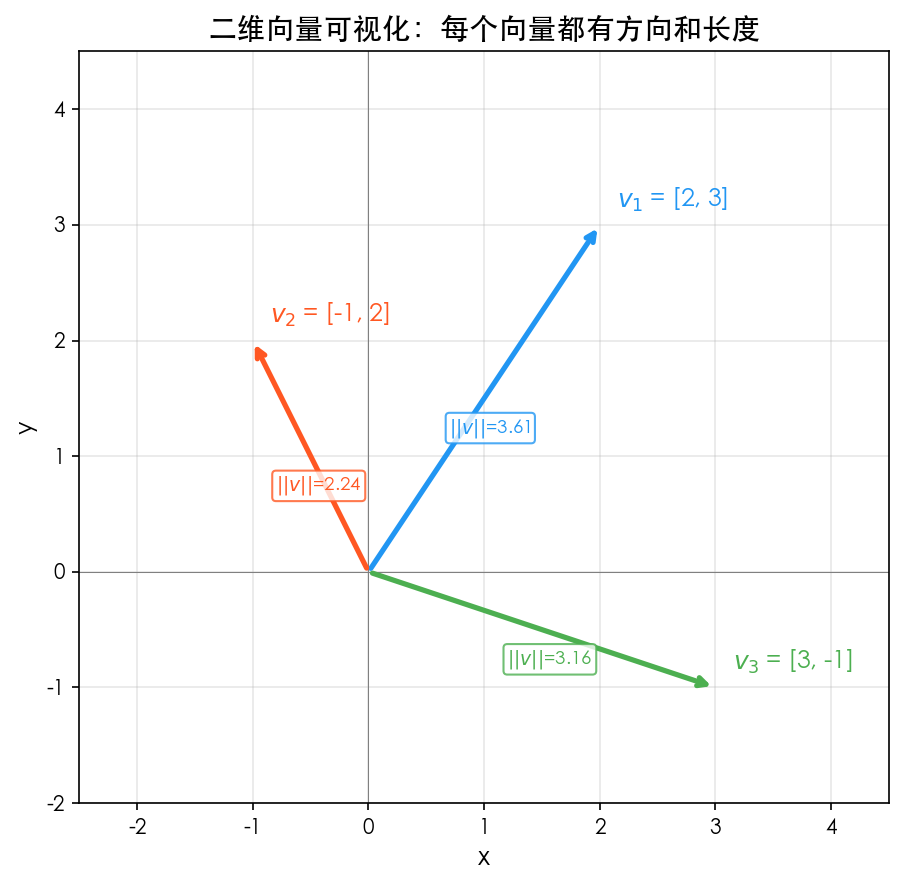
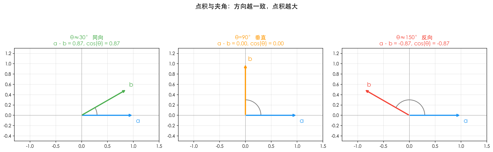
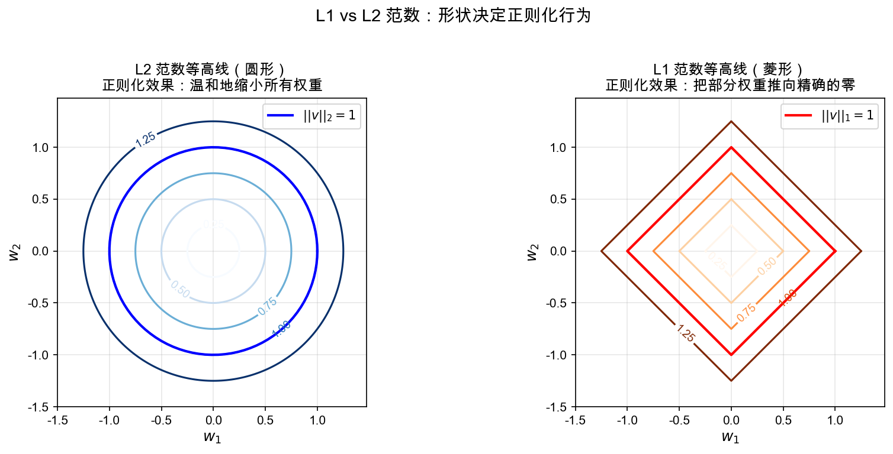
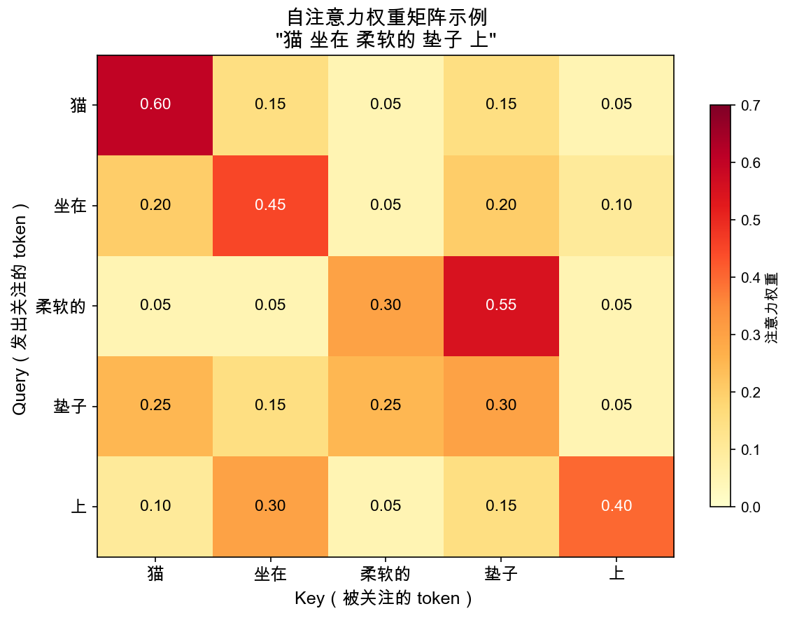

# 第一章：线性代数基础 —— LLM 的数学骨架 🧮🌱

> 🌱 *妙蛙种子说：*"如果把大语言模型比作一棵大树，线性代数就是深埋地下的根系——你看不见它，但每时每刻都在支撑着整棵树的生长。今天，咱们一起把根扎深！"

> **前置知识**：Ch0 数学预备（Σ 求和、log/exp、函数复合）

---

## 🎯 本章目标

学完这一章，你将能够：

1. **理解向量、矩阵的数学定义和几何直觉**
2. **手推点积、矩阵乘法的计算过程**
3. **用 NumPy 代码验证每一个概念**
4. **准确说出这些概念在 Transformer 中的具体位置**

### 📍 线性代数在 LLM 中的位置

Transformer 架构几乎每一步都是线性代数运算：

| Transformer 组件 | 使用的线性代数概念 |
|:---|:---|
| 词嵌入（Word Embedding） | 向量、向量空间 |
| 位置编码（Positional Encoding） | 向量加法、三角函数向量 |
| 自注意力（Self-Attention）Q/K/V 计算 | 矩阵乘法、点积（相似度） |
| 注意力分数缩放 | 向量范数（维度开方） |
| 前馈网络（FFN） | 矩阵乘法、偏置向量加法 |
| LayerNorm | 向量范数、标准化 |
| 权重正则化 | L1/L2 范数 |

看，是不是到处都是？那咱们开始吧！

---

## 1. 向量（Vector）：万物皆数的第一步 📐

> **核心**：向量是线性代数的原子——后续所有概念（点积、矩阵、梯度）都建立在向量之上。

### 1.1 什么是向量？

**数学定义**：向量是一个有序的数字列表。

$$
\mathbf{v} = \begin{bmatrix} v_1 \\ v_2 \\ \vdots \\ v_n \end{bmatrix}
$$

比如，一个三维向量：

$$
\mathbf{a} = \begin{bmatrix} 2 \\ 3 \\ 1 \end{bmatrix}
$$

这就是一个包含 3 个数的有序列表。

**🤔 停一下，想一想**：为什么强调「有序」？把 `[2, 3, 1]` 换成 `[1, 3, 2]`，它们是同一个向量吗？

> 答案：不是！向量 `[2, 3, 1]` 和 `[1, 3, 2]` 是两个不同的向量，就像坐标 (2,3) 和 (1,3) 指向不同的位置一样。

### 1.2 几何意义

在二维平面上，向量 `[2, 3]` 就是从原点 (0,0) 出发，到达点 (2, 3) 的箭头。

- **方向**：箭头指向哪里
- **长度**：箭头有多长

### 1.3 在 LLM 中：词嵌入

这是最核心的应用！每个词被表示为一个高维向量（比如 768 维、4096 维）。

举个例子，假设我们用 4 维向量来表示几个词：

| 词语 | 维度1（动物性） | 维度2（体型） | 维度3（颜色） | 维度4（可爱度） |
|:---|:---|:---|:---|:---|
| 猫 | 0.9 | 0.3 | 0.5 | 0.95 |
| 狗 | 0.85 | 0.5 | 0.4 | 0.9 |
| 汽车 | 0.0 | 0.7 | 0.6 | 0.1 |

```
猫  → [0.9, 0.3, 0.5, 0.95]
狗  → [0.85, 0.5, 0.4, 0.9]
汽车 → [0.0, 0.7, 0.6, 0.1]
```

> 🌱 注意：实际 LLM 中，维度不是人工设计的，而是模型自己学出来的。每个维度代表什么含义，人类不一定能解释——这就是「潜在空间」。

**关键洞察**：意义相近的词，向量也相近。就像"猫"和"狗"的向量比"猫"和"汽车"的向量更相似。后面讲点积的时候，咱们会看到怎么用数学来量化这种"相似度"。

#### 💻 动手验证：向量长什么样？

刚才咱们说了向量有"方向"和"长度"，文字讲得再多不如亲眼看看。下面这段代码画了三个二维向量，注意观察每个箭头的方向和长短——这就是向量的几何面貌。

```python
import matplotlib.pyplot as plt
import numpy as np

fig, ax = plt.subplots(1, 1, figsize=(8, 6))

# 画几个向量
vectors = {
    '$v_1$ = [2, 3]': np.array([2, 3]),
    '$v_2$ = [-1, 2]': np.array([-1, 2]),
    '$v_3$ = [3, -1]': np.array([3, -1]),
}
colors = ['#2196F3', '#FF5722', '#4CAF50']

for (label, v), color in zip(vectors.items(), colors):
    ax.annotate('', xy=v, xytext=(0, 0),
                arrowprops=dict(arrowstyle='->', color=color, lw=2.5))
    ax.text(v[0] + 0.15, v[1] + 0.15, label, fontsize=12,
            color=color, fontweight='bold')
    norm = np.linalg.norm(v)
    mid = v / 2
    ax.text(mid[0] - 0.3, mid[1] - 0.3, f'||v||={norm:.2f}', fontsize=9,
            color=color,
            bbox=dict(boxstyle='round,pad=0.2', facecolor='white',
                      edgecolor=color, alpha=0.8))

ax.axhline(y=0, color='gray', linewidth=0.5)
ax.axvline(x=0, color='gray', linewidth=0.5)
ax.set_xlim(-2.5, 4.5)
ax.set_ylim(-2, 4.5)
ax.set_aspect('equal')
ax.grid(True, alpha=0.3)
ax.set_title('二维向量可视化：每个向量都有方向和长度', fontsize=14)
plt.tight_layout()
plt.savefig('vectors_2d.png', dpi=150, bbox_inches='tight')
```

> 完整脚本见 [`vectors_2d.py`](./scripts/vectors_2d.py)



看到了吗？三个箭头从原点出发，各有各的方向和长短。$v_1$ 指向右上角，$v_2$ 指向左上角，$v_3$ 指向右下角。旁边标注的 `||v||` 就是每个向量的长度（范数），这个概念咱们第 4 节会细讲。现在只要记住：**向量就是有方向、有长度的箭头**。

---

## 2. 矩阵（Matrix）：向量的集合 📋

### 2.1 什么是矩阵？

**数学定义**：矩阵是数字的矩形阵列，可以看作是一组向量的排列。

$$
\mathbf{A} = \begin{bmatrix} a_{11} & a_{12} & \cdots & a_{1n} \\ a_{21} & a_{22} & \cdots & a_{2n} \\ \vdots & \vdots & \ddots & \vdots \\ a_{m1} & a_{m2} & \cdots & a_{mn} \end{bmatrix}
$$

一个 $m \times n$ 矩阵有 $m$ 行 $n$ 列。

**直觉理解**：
- 每一行是一个向量（行向量）
- 每一列也是一个向量（列向量）
- 矩阵就是一组向量的"表格"

### 2.2 在 LLM 中：权重矩阵

Transformer 中的每一个"层"本质上都是一个巨大的矩阵。比如：

- **嵌入矩阵** $E$：大小为 `|词汇表| × 嵌入维度`（比如 50000 × 768）
- **Q/K/V 权重矩阵** $W_Q, W_K, W_V$：大小为 `嵌入维度 × 嵌入维度`
- **FFN 权重矩阵** $W_1, W_2$：大小为 `嵌入维度 × 隐藏维度`

> 🌱 可以把矩阵想象成一个"变换器"——输入一个向量，经过矩阵乘法，输出一个新向量。就像一个工厂，原料进去，产品出来。

### 2.3 基本运算

#### 矩阵加法

对应位置相加，要求两个矩阵**形状相同**：

$$
\begin{bmatrix} 1 & 2 \\ 3 & 4 \end{bmatrix} + \begin{bmatrix} 5 & 6 \\ 7 & 8 \end{bmatrix} = \begin{bmatrix} 1+5 & 2+6 \\ 3+7 & 4+8 \end{bmatrix} = \begin{bmatrix} 6 & 8 \\ 10 & 12 \end{bmatrix}
$$

#### 转置

把行和列互换，矩阵"翻转"一下：

$$
\begin{bmatrix} 1 & 2 & 3 \\ 4 & 5 & 6 \end{bmatrix}^T = \begin{bmatrix} 1 & 4 \\ 2 & 5 \\ 3 & 6 \end{bmatrix}
$$

原来的第 1 行 `[1, 2, 3]` 变成了第 1 列 `[1, 2, 3]ᵀ`。

> 🤔 **小问题**：一个 $2 \times 3$ 矩阵的转置是什么形状？
> 
> 答案：$3 \times 2$。转置就是行列互换，所以 $m \times n$ 变成 $n \times m$。

---

## 3. 点积（内积）：相似度的数学表达 ✨

> **核心**：点积是注意力机制的数学核心——$QK^T$ 就是批量做点积。

这是本章**最关键**的概念！注意力机制的核心就是点积。

### 3.1 定义

两个向量 $\mathbf{a}$ 和 $\mathbf{b}$ 的点积（也叫内积）：

$$
\mathbf{a} \cdot \mathbf{b} = \sum_{i=1}^{n} a_i \cdot b_i = a_1 b_1 + a_2 b_2 + \cdots + a_n b_n
$$

**手推一遍**：设 $\mathbf{a} = [2, 3, 1]$，$\mathbf{b} = [4, -1, 5]$

$$
\mathbf{a} \cdot \mathbf{b} = 2 \times 4 + 3 \times (-1) + 1 \times 5
$$

$$
= 8 + (-3) + 5
$$

$$
= 10
$$

### 3.2 几何意义：投影与相似度

点积有一个非常优美的几何公式：

$$
\mathbf{a} \cdot \mathbf{b} = \|\mathbf{a}\| \cdot \|\mathbf{b}\| \cdot \cos\theta
$$

其中 $\theta$ 是两个向量之间的夹角，$\|\mathbf{a}\|$ 是向量的长度（范数）。

> 📌 **预告**：这里的 $\|\mathbf{a}\|$ 叫做向量的**范数**，简单来说就是向量的"长度"。比如二维向量 $[3, 4]$ 的范数就是 $\sqrt{3^2 + 4^2} = 5$（勾股定理！）。咱们在第 4 节会详细讲各种范数，现在先把它理解为"向量的长度"就好。

从这个公式可以看出：

| 夹角 $\theta$ | $\cos\theta$ | 点积结果 | 含义 |
|:---|:---|:---|:---|
| $0°$（方向相同） | $1$ | 最大正值 | 完全正相关 |
| $90°$（垂直） | $0$ | $0$ | 完全不相关 |
| $180°$（方向相反） | $-1$ | 最大负值 | 完全负相关 |

**🎯 这就是为什么点积能衡量相似度！**

方向相同的向量，点积大（相似度高）；方向垂直的向量，点积为零（无关）；方向相反的向量，点积为负（对立）。



### 3.3 在 LLM 中：注意力分数

在 Transformer 的自注意力机制中：

$$
\text{Attention}(Q, K, V) = \text{softmax}\left(\frac{QK^T}{\sqrt{d_k}}\right)V
$$

> 💡 **softmax 是什么？** softmax 是一个"归一化"函数，它把一组数字转换成概率分布（每个值在 0~1 之间，且所有值加起来等于 1）。公式是 $\text{softmax}(z_i) = \frac{e^{z_i}}{\sum_j e^{z_j}}$。你可以把它理解为"把分数变成百分比"——分数高的得到更大的比例，分数低的得到更小的比例。后面章节会深入讲解。

其中 $QK^T$ 就是 Query 向量和 Key 向量的点积！

**直觉**：
- **Query（查询）**："我需要什么信息？"
- **Key（键）**："我有什么信息？"
- **点积 Q·K**："我们有多匹配？"

就像搜索引擎：你在搜索框输入的查询（Query），和每个网页的关键词（Key）做点积，点积越大说明越匹配，排在前面。

> 🌱 回到前面词嵌入的例子，"猫"和"狗"的点积一定比"猫"和"汽车"的点积大——因为"猫"和"狗"的向量方向更接近！

#### 💻 动手验证：用点积衡量相似度

咱们前面说了"猫"和"狗"的向量方向更接近，点积应该更大——口说无凭，跑个代码看看。这里咱们用 §1.3 里那三个词的嵌入向量，算一算它们两两之间的点积。

```python
import numpy as np

# 还记得 §1.3 的词嵌入向量吗？
cat = np.array([0.9, 0.3, 0.5, 0.95])
dog = np.array([0.85, 0.5, 0.4, 0.9])
car = np.array([0.0, 0.7, 0.6, 0.1])

# 猫 vs 狗：方向接近，点积应该大
print("猫·狗 =", np.dot(cat, dog))

# 猫 vs 汽车：方向差异大，点积应该小
print("猫·汽车 =", np.dot(cat, car))
```

**预期输出**：
```
猫·狗 = 1.645
猫·汽车 = 0.515
```

有没有发现？猫和狗的点积（1.645）是猫和汽车（0.515）的 3 倍多！这就用数学验证了咱们的直觉——语义相近的词，向量方向确实更接近，点积也更大。Transformer 的注意力机制就是靠这个原理来判断"哪些词之间关联更强"的。

---

## 4. 向量范数（Norm）：度量向量的"大小"📏

> **核心**：范数在 LLM 中用于注意力缩放（$\sqrt{d_k}$）和权重正则化（L1/L2）。

### 4.1 L2 范数（欧几里得范数）

最常见的范数，就是向量的"长度"：

$$
\|\mathbf{v}\|_2 = \sqrt{v_1^2 + v_2^2 + \cdots + v_n^2}
$$

**手推一遍**：$\mathbf{v} = [3, 4]$

$$
\|\mathbf{v}\|_2 = \sqrt{3^2 + 4^2} = \sqrt{9 + 16} = \sqrt{25} = 5
$$

> 🌱 这不就是勾股定理吗！3-4-5 直角三角形的斜边长度。数学到处都是相通的。

### 4.2 L1 范数（曼哈顿范数）

所有元素的绝对值之和：

$$
\|\mathbf{v}\|_1 = |v_1| + |v_2| + \cdots + |v_n|
$$

**手推**：$\mathbf{v} = [3, 4]$

$$
\|\mathbf{v}\|_1 = |3| + |4| = 7
$$

**为什么叫"曼哈顿范数"？** 因为在曼哈顿的街道网格中，你只能横着走或竖着走（不能穿墙走直线），所以距离就是横向距离 + 纵向距离。

### 4.3 在 LLM 中的应用

#### ① 注意力分数缩放

在注意力公式中，我们除以 $\sqrt{d_k}$：

$$
\frac{QK^T}{\sqrt{d_k}}
$$

这里的 $\sqrt{d_k}$ 和 L2 范数有关！当维度 $d_k$ 很大时，点积的值会变得很大（因为加了很多项），导致 softmax 梯度消失。除以 $\sqrt{d_k}$ 可以让方差稳定在 1 左右。

#### ② 权重正则化

训练 LLM 时，为了防止过拟合，会在损失函数中加入正则化项：

- **L2 正则化**（权重衰减 / Weight Decay）：$\lambda \|\mathbf{W}\|_2^2$
  - 效果：让权重整体变小，但不倾向于精确为零
  - 像一个「柔软的约束」，温和地把所有权重往零推

- **L1 正则化**：$\lambda \|\mathbf{W}\|_1$
  - 效果：让部分权重精确变为零（稀疏性）
  - 像一个「严格的约束」，直接砍掉不重要的权重

> 🤔 **思考**：为什么 L1 会让权重变成零，而 L2 只是变小？
>
> 提示：想想梯度的形状。L1 范数的梯度是常数（始终是 $\pm\lambda$），不管权重多小，推力一样大；L2 范数的梯度是 $2\lambda w$，权重越小，推力越小。

#### 💻 动手验证：L1 和 L2 范数长什么样？

刚才咱们说 L1 会让权重精确变成零、L2 只是让权重变小——为什么呢？秘密藏在两种范数的"形状"里。咱们画个等高线图看看，注意观察左边（L2）和右边（L1）的形状差异。

```python
import numpy as np

# 先用代码算一下范数
cat = np.array([0.9, 0.3, 0.5, 0.95])
print("猫的 L2 范数 =", np.linalg.norm(cat))       # 欧几里得长度
print("猫的 L1 范数 =", np.linalg.norm(cat, ord=1))  # 绝对值之和
```

**预期输出**：
```
猫的 L2 范数 = 1.4142...
猫的 L1 范数 = 2.65
```

同一个向量，L1 范数（2.65）比 L2 范数（1.41）大不少。这不是偶然——L1 把所有分量"一视同仁"地加起来，而 L2 先平方再开方，大的分量贡献更多。

再看等高线图，这才能直观理解两种范数的本质区别：

> 完整脚本见 [`l1_l2_norm_contour.py`](./scripts/l1_l2_norm_contour.py)



注意看！左边的 L2 等高线是**圆形**的——光滑、均匀，没有"棱角"。右边的 L1 等高线是**菱形**的——有尖锐的角，正好顶在坐标轴上。想想正则化在做什么：它要找一个"损失最小"的点，同时被范数"约束"住。L2 的圆和损失函数等高线相切时，通常切在某个普通位置；而 L1 的菱形有尖角，这些尖角正好在坐标轴上——也就是说，优化器很容易被"卡"在某个权重恰好为零的位置。这就是 L1 产生稀疏解的几何直觉！

---

## 5. 矩阵乘法：Transformer 的引擎 ⚙️

> **核心**：矩阵乘法是 Transformer 每一层的计算基础——`W @ x` 就是一层前向传播。

### 5.1 定义

矩阵 $\mathbf{A}$（$m \times k$）和矩阵 $\mathbf{B}$（$k \times n$）的乘积 $\mathbf{C} = \mathbf{AB}$ 是一个 $m \times n$ 矩阵，其中：

$$
c_{ij} = \sum_{p=1}^{k} a_{ip} \cdot b_{pj}
$$

**核心规则**：$\mathbf{A}$ 的列数必须等于 $\mathbf{B}$ 的行数！

$$
(m \times \underbrace{k) \times (k}_\text{必须相等} \times n) \rightarrow (m \times n)
$$

### 5.2 手推一遍（不跳步！）

$$
\mathbf{A} = \begin{bmatrix} 1 & 2 \\ 3 & 4 \end{bmatrix}, \quad \mathbf{B} = \begin{bmatrix} 5 & 6 \\ 7 & 8 \end{bmatrix}
$$

计算 $\mathbf{C} = \mathbf{AB}$：

**第1行第1列**（$\mathbf{A}$ 的第1行 · $\mathbf{B}$ 的第1列）：

$$
c_{11} = 1 \times 5 + 2 \times 7 = 5 + 14 = 19
$$

**第1行第2列**（$\mathbf{A}$ 的第1行 · $\mathbf{B}$ 的第2列）：

$$
c_{12} = 1 \times 6 + 2 \times 8 = 6 + 16 = 22
$$

**第2行第1列**（$\mathbf{A}$ 的第2行 · $\mathbf{B}$ 的第1列）：

$$
c_{21} = 3 \times 5 + 4 \times 7 = 15 + 28 = 43
$$

**第2行第2列**（$\mathbf{A}$ 的第2行 · $\mathbf{B}$ 的第2列）：

$$
c_{22} = 3 \times 6 + 4 \times 8 = 18 + 32 = 50
$$

所以：

$$
\mathbf{AB} = \begin{bmatrix} 19 & 22 \\ 43 & 50 \end{bmatrix}
$$

> 🌱 你发现了吗？矩阵乘法的每个元素本质上就是**行向量和列向量的点积**！这把前面的知识串起来了。

### 5.3 矩阵-向量乘法

矩阵乘向量是矩阵乘法的特例。在 LLM 中最常见：

$$
\mathbf{y} = \mathbf{W}\mathbf{x} + \mathbf{b}
$$

其中 $\mathbf{W}$ 是权重矩阵，$\mathbf{x}$ 是输入向量，$\mathbf{b}$ 是偏置向量。

**例子**：

$$
\begin{bmatrix} 1 & 2 & 3 \\ 4 & 5 & 6 \end{bmatrix} \begin{bmatrix} 1 \\ 0 \\ -1 \end{bmatrix} = \begin{bmatrix} 1 \times 1 + 2 \times 0 + 3 \times (-1) \\ 4 \times 1 + 5 \times 0 + 6 \times (-1) \end{bmatrix} = \begin{bmatrix} -2 \\ -2 \end{bmatrix}
$$

> 🌱 这就是一个线性变换：3 维空间中的点 `[1, 0, -1]` 被映射到了 2 维空间中的点 `[-2, -2]`。在神经网络里，每一层都在做类似的事情——变换数据的表示空间。

### 5.4 在 Transformer FFN 层中的对应

Transformer 的前馈网络（FFN）是：

$$
\text{FFN}(\mathbf{x}) = \text{ReLU}(\mathbf{x}\mathbf{W}_1 + \mathbf{b}_1)\mathbf{W}_2 + \mathbf{b}_2
$$

拆解来看：

| 步骤 | 运算 | 形状变化（假设嵌入维度 768，FFN 隐藏维度 3072） |
|:---|:---|:---|
| 输入 $\mathbf{x}$ | — | `(1, 768)` |
| $\mathbf{x}\mathbf{W}_1$ | 矩阵乘法 | `(1, 768) × (768, 3072) → (1, 3072)` |
| $+ \mathbf{b}_1$ | 向量加法 | `(1, 3072) + (3072,) → (1, 3072)` |
| ReLU | 逐元素激活 | `(1, 3072) → (1, 3072)` |
| $\cdot\mathbf{W}_2$ | 矩阵乘法 | `(1, 3072) × (3072, 768) → (1, 768)` |
| $+ \mathbf{b}_2$ | 向量加法 | `(1, 768) + (768,) → (1, 768)` |

> 🤔 **思考**：为什么 FFN 要先变大（768→3072）再变小（3072→768）？
>
> 这就像一个"沙漏"结构：先展开到更高维度，让模型有更大的空间来学习和表达复杂的特征组合，再压缩回原来的维度。更大的"腰部"意味着更强的表达能力。

#### 💻 动手验证：从矩阵乘法到注意力热力图

咱们刚手推了矩阵乘法，也说了它在 Transformer 里无处不在。现在来做两件事：先用代码验证手推结果对不对，然后模拟一段注意力分数，看看 QK^T 到底长什么样。

**Part 1：矩阵乘法手推检验**

```python
import numpy as np

A = np.array([[1, 2], [3, 4]])
B = np.array([[5, 6], [7, 8]])

# 矩阵乘法——和咱们手推的结果对一下
C = A @ B  # 等价于 np.matmul(A, B)
print("AB =\n", C)
# 预期: [[19, 22], [43, 50]]

# 矩阵转置
print("\nA^T =\n", A.T)
# 预期: [[1, 3], [2, 4]]

# 矩阵-向量乘法
v = np.array([1, 0, -1])
M = np.array([[1, 2, 3], [4, 5, 6]])
print("\nMv =", M @ v)
# 预期: [-2, -2]
```

**预期输出**：
```
AB =
 [[19 22]
 [43 50]]

A^T =
 [[1 3]
  [2 4]]

Mv = [-2 -2]
```

和手推结果一模一样！以后遇到矩阵乘法不确定的时候，就这样用 NumPy 验证，又快又准。

**Part 2：注意力分数模拟 + 热力图**

接下来咱们把矩阵乘法用到"真实场景"——模拟 Transformer 的自注意力。3 个 token，每个用 4 维向量表示，咱们看看 QK^T 算出来的注意力分数矩阵长什么样，再用热力图可视化。

```python
# 模拟 3 个 token 的 Q 和 K 向量（简化为 4 维）
np.random.seed(42)
Q = np.random.randn(3, 4)  # 3 个 token，每个 4 维
K = np.random.randn(3, 4)

# 计算注意力分数矩阵（QK^T）
scores = Q @ K.T
print("注意力分数矩阵（未缩放）:\n", scores)

# 缩放：除以 sqrt(d_k)
d_k = Q.shape[1]
scaled_scores = scores / np.sqrt(d_k)
print("\n缩放后的注意力分数:\n", scaled_scores)

# Softmax（沿最后一维）
def softmax(x):
    e_x = np.exp(x - np.max(x, axis=-1, keepdims=True))
    return e_x / e_x.sum(axis=-1, keepdims=True)

attention_weights = softmax(scaled_scores)
print("\n注意力权重（softmax 后）:\n", attention_weights)
print("\n每行和:", attention_weights.sum(axis=1))  # 每行应该和为 1
```

运行 [`attention_heatmap.py`](./scripts/attention_heatmap.py) 可以看到用真实的中文句子"猫 坐在 柔软的 垫子 上"生成的注意力权重热力图——每个格子的颜色深浅代表一个 token 对另一个 token 的"关注程度"：



你看，热力图里最亮的格子往往在对角线上——每个 token 最关注自己。但也有有趣的例外：比如"柔软的"对"垫子"的关注度（0.55）很高，因为形容词天然要修饰后面的名词。注意力机制就是通过 QK^T 这种矩阵乘法来自动学会这些关系的，不需要人手工标注！

---

## 🎯 LLM 关联总结

> **✅ 学完本章你应该能做到**：
> 1. 手算两个向量的点积，并解释点积为什么能衡量相似度
> 2. 给定两个矩阵的形状，立刻判断能否相乘、结果是什么形状
> 3. 解释 Transformer 中 $QK^T$ 的数学含义——Query 和 Key 的相似度
> 4. 用 NumPy 实现矩阵乘法（`@` 运算符），并与手推结果对照验证
> 5. 说出 L1 和 L2 范数的区别，以及它们在正则化中的作用

让我们把所有概念映射到 Transformer 架构中：

```
输入文本: "猫 坐在 垫子 上"
    │
    ▼
┌─────────────────────┐
│  词嵌入（Embedding）  │  ← 向量：每个词变成一个高维向量
│  查嵌入矩阵 E        │  ← 矩阵：|词汇表| × 嵌入维度
└─────────┬───────────┘
          │
          ▼
┌─────────────────────┐
│  自注意力（Attention）│
│  Q = XW_Q           │  ← 矩阵乘法：输入 × 权重矩阵
│  K = XW_K           │
│  V = XW_V           │
│  Scores = QK^T      │  ← 点积！衡量 Query 和 Key 的相似度
│  Scores /= √d_k     │  ← L2 范数的延伸：维度缩放
│  Attn = softmax(S)V │  ← 矩阵乘法：加权求和
└─────────┬───────────┘
          │
          ▼
┌─────────────────────┐
│  前馈网络（FFN）      │
│  h = ReLU(xW₁+b₁)  │  ← 矩阵乘法 + 向量加法
│  out = hW₂+b₂       │  ← 矩阵乘法 + 向量加法
│                     │
│  训练时加正则化：      │  ← L2 范数（权重衰减）
│  Loss + λ‖W‖²       │
└─────────────────────┘
```

> 🌱 看到了吗？线性代数贯穿了 Transformer 的每一个环节。掌握了这些概念，读 Transformer 的代码就像读小说一样顺畅！

---

## ⚠️ 常见卡点

**卡点 1：矩阵乘法不是逐元素相乘**

- **困惑**：两个矩阵"相乘"，直觉上觉得是对应位置乘——但结果完全不对。
- **直觉**：向量是「菜谱」（一组原料的用量），矩阵是「变换规则」（把一套原料变成另一套成品）。矩阵乘向量 = 按规则变换菜谱。
- **正确理解**：矩阵乘法的每个元素是「A 的一行」与「B 的一列」做点积。记住口诀：**行点列**。$(m \times k) \times (k \times n) \to (m \times n)$，中间的 $k$ 必须匹配，结果的维度是"外层"的 $m \times n$。

**卡点 2：点积为什么能衡量相似度？**

- **困惑**：点积的公式 $\mathbf{a} \cdot \mathbf{b} = \sum a_i b_i$ 看起来只是"对应相乘再相加"，怎么就跟"相似"扯上关系了？
- **直觉**：想象两个箭头，方向越接近，投影越长，点积越大。方向完全相反时点积为负。
- **正确理解**：点积的几何公式 $\mathbf{a} \cdot \mathbf{b} = |\mathbf{a}||\mathbf{b}|\cos\theta$，其中 $\theta$ 是夹角。方向相同（$\theta=0$）时最大，垂直（$\theta=90°$）时为零。所以点积天然衡量"方向一致性"。

---

## ❓ 思考题

### 📝 题 1：向量相似度
假设有四个词的 3 维嵌入向量：
- 苹果 = `[0.8, 0.1, 0.3]`
- 香蕉 = `[0.7, 0.2, 0.4]`
- 手机 = `[0.1, 0.9, 0.2]`
- 橙子 = `[0.75, 0.15, 0.35]`

不用代码，凭直觉判断：哪个词和"苹果"的点积最大？为什么？

<details>
<summary>💡 提示</summary>

比较向量的方向。苹果、香蕉、橙子在每个维度上都很接近，但苹果和橙子的数值最为相似。
</details>

### 📝 题 2：维度匹配
矩阵 $\mathbf{A}$ 的形状是 $4 \times 7$，矩阵 $\mathbf{B}$ 的形状是 $7 \times 3$。
1. $\mathbf{AB}$ 能做吗？结果是什么形状？
2. $\mathbf{BA}$ 能做吗？为什么？

### 📝 题 3：注意力缩放的数学直觉
假设 $d_k = 64$，两个随机向量做点积，值大约在 $[-8, 8]$ 范围内（方差约 64）。
1. 如果不缩放，直接过 softmax，会出现什么问题？
2. 除以 $\sqrt{64} = 8$ 后，值的范围变成多少？为什么这能解决问题？

<details>
<summary>💡 提示</summary>

回忆 softmax 的公式：$\text{softmax}(z_i) = \frac{e^{z_i}}{\sum e^{z_j}}$。如果某个 $z_i$ 非常大（比如 100），$e^{100}$ 会导致数值溢出，其他项几乎为零——梯度就消失了。
</details>

### 📝 题 4：范数与正则化
在训练 LLM 时，L2 正则化的梯度是 $2\lambda\mathbf{W}$，L1 正则化的梯度是 $\lambda \cdot \text{sign}(\mathbf{W})$。

当一个权重 $w = 0.001$（很接近零）时，两种正则化对它的推力分别是多少？这解释了为什么 L1 能产生稀疏解？

### 📝 题 5：综合应用
在 Transformer 的 FFN 层中，$\mathbf{W}_1$ 的形状是 `(768, 3072)`，$\mathbf{W}_2$ 的形状是 `(3072, 768)`。
1. 输入向量 $\mathbf{x}$ 的形状是什么？（假设没有 batch 维度）
2. 中间隐藏层 $\mathbf{h} = \mathbf{x}\mathbf{W}_1$ 的形状是什么？
3. 最终输出 $\mathbf{y} = \mathbf{h}\mathbf{W}_2$ 的形状是什么？
4. 整个 FFN 的输入和输出形状相同，这是巧合吗？为什么 Transformer 要这样设计？

---

## 📚 延伸阅读

- [3Blue1Brown：线性代数的本质](https://www.youtube.com/playlist?list=PLZHQObOWTQDPD3MizzM2xVFitgF8hE_ab) — 最好的线性代数可视化教程
- [The Matrix Cookbook](https://www.math.uwaterloo.ca/~hwolkowi/matrixcookbook.pdf) — 矩阵公式速查手册
- [Attention Is All You Need](https://arxiv.org/abs/1706.03762) — Transformer 原始论文，读一遍看看能不能识别出所有线性代数运算

---

> 🌱 **妙蛙种子的学习小贴士**：
> 
> 学数学最好的方法是"三步法"：
> 1. **看懂** — 阅读定义和公式，理解每个符号的含义
> 2. **手推** — 关掉书，自己在纸上推导一遍
> 3. **代码验证** — 用 NumPy 实现一遍，确保和手推结果一致
> 
> 这章的内容值得反复练习。不用急，慢慢来——每一棵大树都是从一颗小小的种子开始的 🌱
> 
> *下一章预告：微积分核心 —— 导数、梯度、链式法则，这些是理解模型如何"学习"的数学钥匙。*

---

*本章节由学习者妙蛙种子 🌱 和 cc 一起完成 | 学无止境，终身学习！📚*
