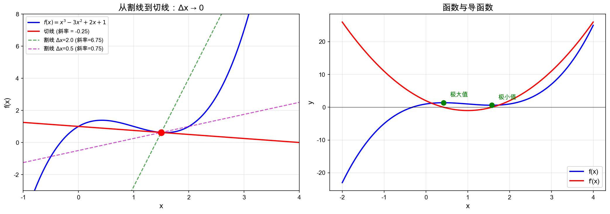
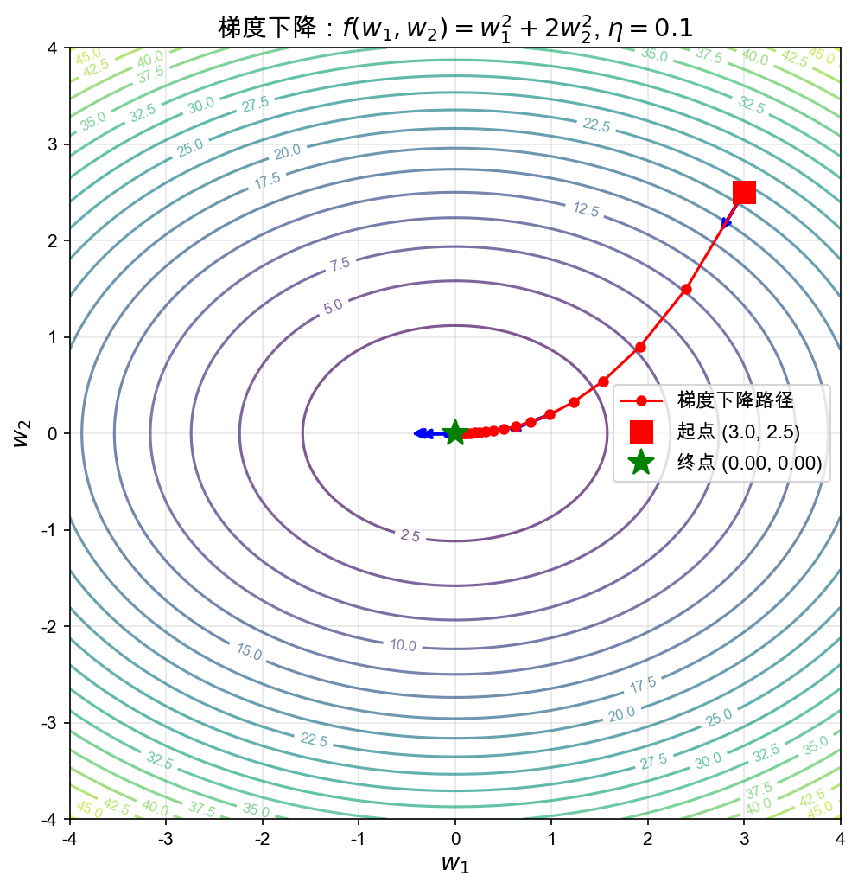
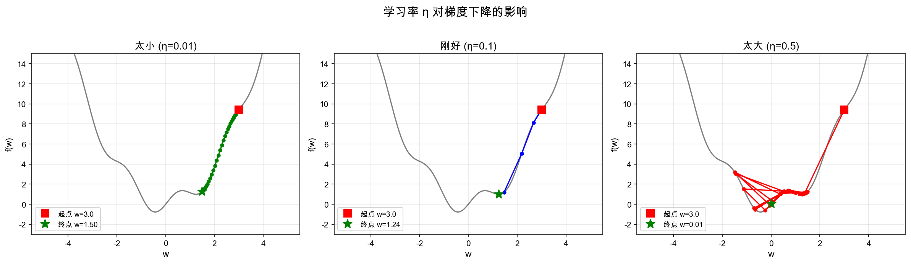
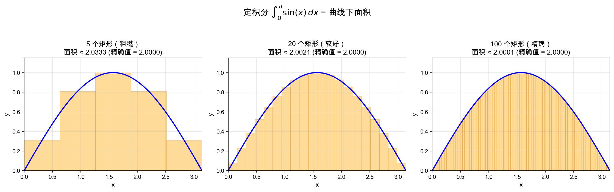

# 第二章：微积分核心 —— 变化的语言

> *「微积分是研究变化的数学。而训练一个大语言模型，本质上就是一场关于"变化"的旅程——找到让损失函数下降最快的方向，然后一步步走过去。」*

> **前置知识**：Ch1 线性代数（向量、矩阵基础）

---

## 🎯 本章目标

| 学完这一章，你将能够… | 对应 LLM 场景 |
|---|---|
| 理解导数和偏导数的定义与计算 | 理解梯度下降中每个权重如何更新 |
| 掌握链式法则的推导过程 | 理解反向传播的数学本质 |
| 理解梯度的几何含义 | 理解为什么梯度指向"最快上升"方向 |
| 了解积分的基本概念 | 理解概率分布中的面积与期望 |

**在 LLM 中的位置**：训练 GPT 的核心循环是——

```
前向传播（算预测） → 算损失 → 反向传播（用链式法则求梯度） → 梯度下降（更新权重）
```

这一章我们解锁的就是 **反向传播 + 梯度下降** 的数学基础。

---

## 2.1 函数与极限 —— 微积分的起点

### 什么是函数？

函数就像一台「加工机器」：你丢进去一个数 $x$，它吐出来另一个数 $y$。

$$y = f(x)$$

在 LLM 中，到处都是函数：
- 线性变换：$z = Wx + b$
- 激活函数：$a = \text{ReLU}(z) = \max(0, z)$
- 损失函数：$L = \frac{1}{N}\sum(y_{\text{pred}} - y_{\text{true}})^2$

### 极限：微积分的地基

**极限**描述的是：当 $x$ 越来越接近某个值 $a$ 时，$f(x)$ 会趋向什么？

$$\lim_{x \to a} f(x) = L$$

意思是：$x$ 可以无限接近 $a$（但不一定等于 $a$），此时 $f(x)$ 无限接近 $L$。

**一个直观的例子**：

$$\lim_{x \to 0} \frac{\sin x}{x} = 1$$

当 $x$ 越来越接近 0 时，$\frac{\sin x}{x}$ 越来越接近 1。注意：$x=0$ 时这个式子是 $\frac{0}{0}$（无定义），但极限存在！

> 💡 **为什么极限重要？** 因为导数的定义就建立在极限之上——它是微积分最底层的砖块。

---

## 2.2 导数 —— 瞬间变化的度量

> **核心**：导数是整个微积分的基石——梯度下降、反向传播都从导数出发。

### 2.2.1 从"平均变化率"到"瞬间变化率"

想象你开车从上海到杭州，300 公里花了 3 小时，平均速度 100 km/h。但途中你肯定有时快有时慢。那在某个**特定瞬间**，你的速度是多少？

这就是导数的直觉：**瞬时变化率**。

**平均变化率**（过两点的割线斜率）：

$$\frac{\Delta y}{\Delta x} = \frac{f(x + \Delta x) - f(x)}{\Delta x}$$

**导数**（让 $\Delta x$ 趋近于 0）：

$$f'(x) = \lim_{\Delta x \to 0} \frac{f(x + \Delta x) - f(x)}{\Delta x}$$

> 🎨 **比喻**：割线是"用尺子连两点"看斜率，导数是"无限放大曲线，直到看起来像直线"——这条直线的斜率就是导数。
>
> 

### 2.2.2 几何意义：切线的斜率

导数 $f'(x)$ 就是函数在点 $x$ 处**切线的斜率**。

- $f'(x) > 0$：函数在上升 ↗️
- $f'(x) < 0$：函数在下降 ↘️
- $f'(x) = 0$：函数在平缓处，可能是极值点 ⬆️ 或 ⬇️

**在 LLM 中**：损失函数的导数告诉我们——「如果参数往这个方向微调一点点，损失会增大还是减小？」

### 2.2.3 物理意义：瞬时变化率

如果 $f(t)$ 表示时间 $t$ 时的位置，那么 $f'(t)$ 就是速度，$f''(t)$ 就是加速度。

### 2.2.4 基本求导公式（记住这些就够了）

| 函数 $f(x)$ | 导数 $f'(x)$ | 记忆口诀 |
|---|---|---|
| $c$（常数） | $0$ | 常数不变，变化率为零 |
| $x^n$ | $nx^{n-1}$ | 「降幂乘前」 |
| $e^x$ | $e^x$ | 唯一等于自己导数的函数 |
| $\ln x$ | $\frac{1}{x}$ | 自然对数的导数 |
| $\sin x$ | $\cos x$ | 正弦余弦互为导数 |
| $\cos x$ | $-\sin x$ | 注意负号！ |

### 2.2.5 求导法则

**加法法则**：
$$(f + g)' = f' + g'$$

**乘法法则**（莱布尼茨法则）：
$$(fg)' = f'g + fg'$$
> 记忆：「前导后不导 + 前不导后导」

**除法法则**：
$$\left(\frac{f}{g}\right)' = \frac{f'g - fg'}{g^2}$$

### 📝 例题：一步步求导

**求 $f(x) = 3x^4 - 2x^2 + 5x - 7$ 的导数**

$$f'(x) = 3 \cdot 4x^3 - 2 \cdot 2x + 5 \cdot 1 - 0 = 12x^3 - 4x + 5$$

就这么简单——逐项用「降幂乘前」法则即可。

**求 $f(x) = e^x \sin x$ 的导数**（乘法法则）

$$f'(x) = (e^x)'\sin x + e^x(\sin x)' = e^x\sin x + e^x\cos x = e^x(\sin x + \cos x)$$

#### 💻 动手验证：数值导数

好，口说无凭，咱们用导数的原始定义来算一算——取一个极小的 $\Delta x$，看看算出来的数值导数跟解析公式是不是吻合。

```python
import numpy as np

# 数值导数（用定义来算）
def numerical_derivative(f, x, h=1e-5):
    return (f(x + h) - f(x - h)) / (2 * h)

# 测试几个函数
print("=== 数值导数验证 ===")
print(f"x² 在 x=3 处的导数: 数值={numerical_derivative(lambda x: x**2, 3):.6f}, 解析=6.000000")
print(f"sin(x) 在 x=π/4 处的导数: 数值={numerical_derivative(np.sin, np.pi/4):.6f}, 解析={np.cos(np.pi/4):.6f}")
print(f"e^x 在 x=1 处的导数: 数值={numerical_derivative(np.exp, 1):.6f}, 解析={np.exp(1):.6f}")
print(f"ln(x) 在 x=2 处的导数: 数值={numerical_derivative(np.log, 2):.6f}, 解析={1/2:.6f}")
```

你看，数值导数和解析公式给出的结果几乎完全一致（差异在小数点后 6 位以内）。咱们用的「中心差分」`(f(x+h) - f(x-h)) / 2h` 比单侧差分更精确，这也是工程里最常用的数值求导方式。发现了吗？那套看起来抽象的「极限 → 导数」定义，写成代码就这么几行——数学和代码本来就是一回事。

---

## 2.3 偏导数 —— 多变量世界的变化率

> **核心**：偏导数是梯度向量的分量——每个权重都需要自己的偏导数来更新。

### 问题来了：函数有多个变量怎么办？

在神经网络中，损失函数 $L$ 依赖于成千上万个参数 $w_1, w_2, \ldots, w_n$。我们想知道：**只改变其中一个参数，损失怎么变？**

### 定义

对于函数 $f(x, y)$，对 $x$ 的偏导数：

$$\frac{\partial f}{\partial x} = \lim_{\Delta x \to 0} \frac{f(x + \Delta x, y) - f(x, y)}{\Delta x}$$

关键：**把其他变量当作常数，只对一个变量求导**。

> 🎨 **比喻**：想象你站在一座山上（高度 = $f(x,y)$），偏导数就是——你只往东走（改变 $x$），不看南北（固定 $y$），脚下的坡度是多少？

### 📝 例题

**$f(x, y) = 3x^2y + y^3$，求 $\frac{\partial f}{\partial x}$ 和 $\frac{\partial f}{\partial y}$**

对 $x$ 求偏导（把 $y$ 当常数）：
$$\frac{\partial f}{\partial x} = 6xy$$

对 $y$ 求偏导（把 $x$ 当常数）：
$$\frac{\partial f}{\partial y} = 3x^2 + 3y^2$$

### 在神经网络中

一个简单的神经元：$z = w_1 x_1 + w_2 x_2 + b$，激活后 $a = \sigma(z)$，损失 $L = (a - y)^2$

> 🌱 **什么是 $\sigma(z)$？**
>
> $\sigma(z)$ 是 **Sigmoid 函数**（也叫 logistic 函数），它是神经网络中最经典的激活函数之一：
>
> $$\sigma(z) = \frac{1}{1 + e^{-z}}$$
>
> 它把任意实数 $z$ 「挤压」到 $(0, 1)$ 之间：
> - 当 $z$ 很大（→ $+\infty$）时，$\sigma(z) \to 1$
> - 当 $z$ 很小（→ $-\infty$）时，$\sigma(z) \to 0$
> - 当 $z = 0$ 时，$\sigma(z) = 0.5$
>
> 🎨 **直觉**：Sigmoid 就像一个「S 形弹簧」——输入很大或很小时，输出变化很慢（被压扁了）；输入在 0 附近时，输出变化最快。这个 S 形曲线在二分类问题中特别有用，因为输出可以直接当作「概率」。
>
> 它的导数有一个优美的性质：$\sigma'(z) = \sigma(z)(1 - \sigma(z))$，这在反向传播中非常方便。

要更新 $w_1$，我们需要的就是 $\frac{\partial L}{\partial w_1}$——这引出了我们的下一个主角：**链式法则**。

---

## 2.4 链式法则 —— 反向传播的数学灵魂 ⭐⭐⭐

> **核心**：链式法则是反向传播的数学基础——如果这章只记住一个知识点，就是这个。

> 如果这一章只记住一个知识点，**就是这个**。

### 2.4.1 为什么需要链式法则？

很多函数是**嵌套**的：$y = f(g(x))$。比如在神经网络中：

$$L = \text{Loss}(\sigma(w \cdot x + b))$$

损失是激活值的函数，激活值是线性组合的函数，线性组合又是权重的函数。一层套一层。

**链式法则**告诉我们怎么求这种复合函数的导数。

### 2.4.2 单变量链式法则

如果 $y = f(g(x))$，令 $u = g(x)$，则：

$$\frac{dy}{dx} = \frac{dy}{du} \cdot \frac{du}{dx}$$

> 🎨 **比喻**：就像齿轮传动——大齿轮转一圈，中齿轮转 3 圈；中齿轮转一圈，小齿轮转 5 圈。那么大齿轮转一圈，小齿轮转 $3 \times 5 = 15$ 圈。链式法则就是「逐级传递」。

### 📝 一步步推导

**求 $y = \sin(e^x)$ 的导数**

分解：
- $u = e^x$ → $\frac{du}{dx} = e^x$
- $y = \sin(u)$ → $\frac{dy}{du} = \cos(u) = \cos(e^x)$

链式法则：
$$\frac{dy}{dx} = \frac{dy}{du} \cdot \frac{du}{dx} = \cos(e^x) \cdot e^x$$

### 2.4.3 多变量链式法则

对于 $L = f(g(x, y), h(x, y))$，令 $u = g(x,y)$，$v = h(x,y)$：

$$\frac{\partial L}{\partial x} = \frac{\partial L}{\partial u}\frac{\partial u}{\partial x} + \frac{\partial L}{\partial v}\frac{\partial v}{\partial x}$$

> 💡 **为什么是「加法」而不是「乘法」？** 因为 $x$ 同时通过两条路径（$u$ 和 $v$）影响 $L$，总影响 = 每条路径的影响之和。就像你同时通过「开车」和「坐地铁」两条路到了目的地——总路程是两条路各走一段之和。

### 📝 例题：多变量链式法则实战

**设 $L = u^2 + v^2$，其中 $u = x + y$，$v = xy$。求 $\frac{\partial L}{\partial x}$ 和 $\frac{\partial L}{\partial y}$。**

**Step 1**：先算「上游导数」（$L$ 对中间变量的导数）
$$\frac{\partial L}{\partial u} = 2u, \quad \frac{\partial L}{\partial v} = 2v$$

**Step 2**：再算「下游导数」（中间变量对 $x$ 的导数）
$$\frac{\partial u}{\partial x} = 1, \quad \frac{\partial v}{\partial x} = y$$

**Step 3**：用多变量链式法则
$$\frac{\partial L}{\partial x} = \frac{\partial L}{\partial u}\frac{\partial u}{\partial x} + \frac{\partial L}{\partial v}\frac{\partial v}{\partial x} = 2u \cdot 1 + 2v \cdot y = 2(x+y) + 2xy^2$$

同理对 $y$：
$$\frac{\partial L}{\partial y} = \frac{\partial L}{\partial u}\frac{\partial u}{\partial y} + \frac{\partial L}{\partial v}\frac{\partial v}{\partial y} = 2u \cdot 1 + 2v \cdot x = 2(x+y) + 2x^2y$$

> ✅ **验证**：把 $u = x+y$, $v = xy$ 代入 $L = u^2 + v^2 = (x+y)^2 + (xy)^2$，直接对 $x$ 求偏导：$\frac{\partial L}{\partial x} = 2(x+y) + 2xy \cdot y = 2(x+y) + 2xy^2$。结果一致！ 🎉

### 2.4.4 链式法则与反向传播 🧠

这就是反向传播的数学基础！看一个简单的前向传播：

```
输入 x → [z = wx + b] → [a = ReLU(z)] → [L = (a - y)²]
         线性层          激活函数           损失函数
```

**前向传播**（从左到右计算）：
1. $z = wx + b$
2. $a = \text{ReLU}(z) = \max(0, z)$
3. $L = (a - y)^2$

**反向传播**（从右到左求导，用链式法则）：
1. $\frac{\partial L}{\partial a} = 2(a - y)$
2. $\frac{\partial L}{\partial z} = \frac{\partial L}{\partial a} \cdot \frac{\partial a}{\partial z} = 2(a - y) \cdot \mathbb{1}_{z>0}$
3. $\frac{\partial L}{\partial w} = \frac{\partial L}{\partial z} \cdot \frac{\partial z}{\partial w} = 2(a - y) \cdot \mathbb{1}_{z>0} \cdot x$

> 🌱 **$\mathbb{1}_{z>0}$ 是什么意思？**
>
> 这叫 **指示函数**（Indicator Function），也叫 Iverson 括号（Iverson bracket），读作「当 z 大于 0 时为 1，否则为 0」。完整定义：
>
> $$\mathbb{1}_{z>0} = \begin{cases} 1, & \text{如果 } z > 0 \\ 0, & \text{如果 } z \leq 0 \end{cases}$$
>
> 为什么这里会出现它？因为 ReLU 的导数不光滑——$z > 0$ 时导数为 1，$z \leq 0$ 时导数为 0，正好用指示函数来表示这个「分段」的效果。

最后一步就是用来更新权重 $w$ 的梯度！

> 💡 **关键洞察**：反向传播 = 链式法则的逐层应用，从输出往回「传递」导数。每一层只需要知道「上一层传来的梯度」和「本层的局部导数」，就能算出本层参数的梯度。

#### 💻 动手验证：链式法则

上面推导了 $y = \sin(e^x)$ 的导数应该是 $\cos(e^x) \cdot e^x$，对吧？咱们用数值导数来交叉验证一下——如果两种完全不同的方法给出一样的答案，那就可以放心了。

```python
# y = sin(e^x), 链式法则说 dy/dx = cos(e^x) * e^x
def composite_func(x):
    return np.sin(np.exp(x))

def chain_rule_derivative(x):
    return np.cos(np.exp(x)) * np.exp(x)

x_test = 1.0
print("\n=== 链式法则验证 ===")
print(f"d/dx[sin(e^x)] 在 x={x_test}:")
print(f"  数值导数: {numerical_derivative(composite_func, x_test):.6f}")
print(f"  链式法则: {chain_rule_derivative(x_test):.6f}")
```

有没有发现？数值导数和链式法则推导出的解析结果完全吻合——小数点后 6 位一模一样。这就是链式法则的威力：再复杂的复合函数，只要一层一层拆开，每一步都是简单的求导再乘起来。

---

## 2.5 梯度 —— 指引方向的指南针

> **核心**：梯度是梯度下降的核心——训练 LLM 就是沿着梯度反方向一步步更新权重。

### 定义

梯度是把所有偏导数收集在一起形成的**向量**：

$$\nabla f = \left(\frac{\partial f}{\partial x_1}, \frac{\partial f}{\partial x_2}, \ldots, \frac{\partial f}{\partial x_n}\right)$$

### 梯度的三个重要性质

1. **方向**：梯度指向函数值**增长最快**的方向
2. **大小**：梯度的模 $|\nabla f|$ 表示最陡的坡度
3. **反方向**：$-\nabla f$ 指向函数值**下降最快**的方向

> 🎨 **比喻**：想象你蒙着眼睛站在山上，想尽快下山。你的脚能感受到哪个方向最陡——那个方向的反方向（$-\nabla f$）就是你该走的方向。这就是**梯度下降**！
>
> 

### 梯度下降公式

$$w_{\text{new}} = w_{\text{old}} - \eta \cdot \nabla_w L$$

其中 $\eta$（eta）是**学习率**——你每一步迈多大。

- $\eta$ 太大：步子迈太大，跳过最低点，来回震荡 🏃‍♂️💨
- $\eta$ 太小：走得太慢，训练时间太长 🐢
- $\eta$ 刚好：稳步下降，收敛到最小值 ✅

> 

### 📝 例题：手动执行一步梯度下降

$f(w_1, w_2) = w_1^2 + 2w_2^2$，当前 $(w_1, w_2) = (1, 1)$，学习率 $\eta = 0.1$

**第一步**：算梯度
$$\frac{\partial f}{\partial w_1} = 2w_1 = 2, \quad \frac{\partial f}{\partial w_2} = 4w_2 = 4$$
$$\nabla f = (2, 4)$$

**第二步**：更新
$$w_1^{\text{new}} = 1 - 0.1 \times 2 = 0.8$$
$$w_2^{\text{new}} = 1 - 0.1 \times 4 = 0.6$$

函数值从 $1 + 2 = 3$ 降到了 $0.64 + 0.72 = 1.36$。✅ 确实在下降！

重复这个过程很多次，就会收敛到 $(0, 0)$——最小值点。

#### 💻 动手验证：梯度下降全过程

刚才咱们手动走了一步，现在来看看连续走 50 步会发生什么——是不是真的能一路滑到谷底？

```python
# 用梯度下降求 f(w1, w2) = w1² + 2w2² 的最小值
w = np.array([1.0, 1.0])
eta = 0.1
trajectory = [w.copy()]

print("=== 梯度下降过程 ===")
for step in range(50):
    grad = np.array([2*w[0], 4*w[1]])   # 梯度
    w = w - eta * grad                   # 更新
    trajectory.append(w.copy())
    if step < 5 or step % 10 == 0:
        f_val = w[0]**2 + 2*w[1]**2
        print(f"  Step {step+1:2d}: w=({w[0]:.4f}, {w[1]:.4f}), f(w)={f_val:.6f}")

print(f"\n  最终: w=({w[0]:.6f}, {w[1]:.6f}), f(w)={w[0]**2 + 2*w[1]**2:.10f}")
```

果然如此！参数一路从 $(1, 1)$ 趋近 $(0, 0)$，函数值从 3 一路跌到近乎 0。有意思的是 $w_2$ 收敛得比 $w_1$ 快——因为 $2w_2^2$ 的梯度（$4w_2$）比 $w_1^2$ 的梯度（$2w_1$）更大，每步走的幅度更大。这就是为什么在训练神经网络时，不同参数的收敛速度可以差很多——梯度的「坡度」不一样嘛。

---

## 2.6 积分基础 —— 累积的艺术

### 2.6.1 不定积分：导数的逆运算

如果说导数是「求变化率」，那积分就是「已知变化率，求原函数」。

$$\int f(x)\,dx = F(x) + C \quad \text{其中} \quad F'(x) = f(x)$$

$C$ 是任意常数，因为导数会「丢失」常数信息。

> 🎨 **比喻**：导数是「压缩」（从路程到速度），积分是「解压缩」（从速度回到路程），但解压缩时会丢失一个「初始位置」的信息，所以 $+C$。

### 基本积分公式

| 被积函数 $f(x)$ | 积分 $\int f(x)\,dx$ |
|---|---|
| $x^n$ | $\frac{x^{n+1}}{n+1} + C$ ($n \neq -1$) |
| $\frac{1}{x}$ | $\ln\|x\| + C$ |
| $e^x$ | $e^x + C$ |
| $\cos x$ | $\sin x + C$ |
| $\sin x$ | $-\cos x + C$ |

### 2.6.2 定积分：曲线下的面积

$$\int_a^b f(x)\,dx = F(b) - F(a)$$

这是**牛顿-莱布尼茨公式**——它把「求面积」转化为「求原函数在端点的差」。

> 🎨 **比喻**：定积分就像用无数个极窄的矩形去逼近曲线下的面积。当矩形的宽度趋近于零时，求和就变成了积分。
>
> 

### 📝 例题：一步步算一个定积分

**计算 $\int_1^3 (2x + 1)\,dx$**

**Step 1**：找原函数
$$f(x) = 2x + 1 \implies F(x) = x^2 + x + C$$
验证：$F'(x) = 2x + 1$ ✅

**Step 2**：用牛顿-莱布尼茨公式
$$\int_1^3 (2x + 1)\,dx = F(3) - F(1) = (9 + 3) - (1 + 1) = 12 - 2 = 10$$

**Step 3**：用几何验证（梯形面积法） 🧐
$f(x) = 2x + 1$ 是一条直线，曲线下面积就是梯形面积：
- 左端点 $(1, 3)$，右端点 $(3, 7)$
- 梯形面积 $= \frac{(3 + 7)}{2} \times (3 - 1) = \frac{10}{2} \times 2 = 10$ ✅

> 🎉 两种方法结果一致！这就是牛顿-莱布尼茨公式的威力——不需要画无数个矩形，只需要找到原函数，代入端点值一减就完事。

#### 💻 动手验证：数值积分

上面用手算和梯形面积都得到了 10，咱们再用代码的「矩形逼近法」来验证——把区间切成很多小矩形，看看面积是不是趋近于解析结果。

```python
# 数值积分：用矩形逼近法计算定积分
def numerical_integral(f, a, b, n=10000):
    """将 [a, b] 分成 n 个小矩形，求和逼近定积分"""
    dx = (b - a) / n
    x_vals = np.linspace(a + dx/2, b - dx/2, n)  # 取每个矩形中点
    return np.sum(f(x_vals) * dx)

# 计算 ∫₁³ (2x + 1) dx
f = lambda x: 2*x + 1
analytical = 10  # 手算结果
numerical = numerical_integral(f, 1, 3)

print("=== 定积分数值验证 ===")
print(f"∫₁³ (2x+1) dx")
print(f"  解析结果: {analytical}")
print(f"  数值积分: {numerical:.6f}")
print(f"  误差: {abs(numerical - analytical):.2e}")
```

你看，10000 个小矩形就能把面积算到小数点后好几位都精确。牛顿-莱布尼茨公式和数值方法殊途同归，答案是 10 没跑了。这个「切矩形」的思路其实就是积分定义的本意——只不过数学家用极限把「无数个无穷小的矩形」变成了优雅的公式，而代码老老实实切有限个矩形，也能得到足够好的答案。

### 2.6.3 积分在概率中的应用

在 LLM 中，模型输出的本质是**概率分布**。积分和概率密不可分：

**概率密度函数（PDF）** 的性质：
$$\int_{-\infty}^{+\infty} p(x)\,dx = 1$$

概率密度函数曲线下的总面积等于 1——这就像是说「所有可能性的总和是 100%」。

**期望值**（Expected Value）：
$$E[X] = \int_{-\infty}^{+\infty} x \cdot p(x)\,dx$$

期望就是「加权平均」，权重就是概率密度。

**方差**（Variance）：
$$\text{Var}(X) = E[(X - \mu)^2] = \int_{-\infty}^{+\infty} (x - \mu)^2 p(x)\,dx$$

在 LLM 训练中，损失函数本质上也是一种期望——我们对所有训练样本的损失取平均。

---

## 2.7 🔢 公式推导：不跳步

> **深入**：本节的严格推导帮助你理解"为什么梯度指向最快方向"。第一遍可以跳过，学完后面的内容再回来细看。

### 推导 1：为什么梯度指向最快上升方向？

设当前位置 $\mathbf{w}$，走一步 $\Delta\mathbf{w}$（方向向量 $\mathbf{u}$，$|\mathbf{u}|=1$，步长 $\alpha$）：

$$f(\mathbf{w} + \alpha\mathbf{u}) \approx f(\mathbf{w}) + \alpha \nabla f \cdot \mathbf{u}$$

要让函数增长最快，就要最大化 $\nabla f \cdot \mathbf{u}$。

> 💡 **直觉铺垫：为什么梯度方向就是最优的？**
>
> 想象你站在山坡上，梯度 $\nabla f$ 指向最陡的上坡方向。你想选一个方向 $\mathbf{u}$（单位向量），使得「沿这个方向走一步，高度增加最多」。
>
> 用向量点积的几何意义：$\nabla f \cdot \mathbf{u} = |\nabla f|\,|\mathbf{u}|\cos\theta$，其中 $\theta$ 是两向量的夹角。
>
> 🎨 **投影直觉**：$\nabla f \cdot \mathbf{u}$ 本质上是「$\nabla f$ 在 $\mathbf{u}$ 方向上的投影长度」。要让这个投影最大，$\mathbf{u}$ 必须和 $\nabla f$ 同方向（$\theta = 0$, $\cos\theta = 1$）。就像手电筒照墙——光垂直打在墙上最亮（投影最大），斜着打就暗了。
>
> 这个「投影不超过原向量长度」的事实，就是**柯西-施瓦茨不等式**的几何含义：
>
> $$|\mathbf{a} \cdot \mathbf{b}| \leq |\mathbf{a}| \cdot |\mathbf{b}|$$
>
> 用投影的话说：一个向量在另一个方向上的投影长度，永远不会超过它自身的长度。等号成立当且仅当两向量同向（或反向）。

由柯西-施瓦茨不等式：

$$\nabla f \cdot \mathbf{u} \leq |\nabla f| \cdot |\mathbf{u}| = |\nabla f|$$

等号成立条件：$\mathbf{u} = \frac{\nabla f}{|\nabla f|}$

**结论**：$\nabla f$ 方向就是函数增长最快的方向！所以 $-\nabla f$ 就是下降最快的方向。 $\blacksquare$

### 推导 2：反向传播中的链式法则（两层的网络）

网络结构：
$$z = W_1 x, \quad h = \sigma(z), \quad \hat{y} = W_2 h, \quad L = \frac{1}{2}(\hat{y} - y)^2$$

**求 $\frac{\partial L}{\partial W_1}$**（一步步，不跳步）：

**Step 1**：$\frac{\partial L}{\partial \hat{y}} = \hat{y} - y$

**Step 2**：$\frac{\partial L}{\partial h} = \frac{\partial L}{\partial \hat{y}} \cdot \frac{\partial \hat{y}}{\partial h} = (\hat{y} - y) \cdot W_2$

**Step 3**：$\frac{\partial L}{\partial z} = \frac{\partial L}{\partial h} \cdot \frac{\partial h}{\partial z} = (\hat{y} - y) \cdot W_2 \cdot \sigma'(z)$

**Step 4**：$\frac{\partial L}{\partial W_1} = \frac{\partial L}{\partial z} \cdot \frac{\partial z}{\partial W_1} = [(\hat{y} - y) \cdot W_2 \cdot \sigma'(z)] \cdot x^T$

看，每一步都是链式法则：**上一层的梯度 × 本层的局部导数 = 本层的梯度**。这就是反向传播的核心模式！

---

## 2.8 📊 可视化脚本

所有可视化脚本都保存在 `scripts/` 目录下：

| 脚本 | 生成图片 | 说明 |
|---|---|---|
| `plot_derivative.py` | `images/derivative_tangent.png` | 导数几何意义：函数与切线 |
| `plot_gradient_descent.py` | `images/gradient_descent.png` | 梯度下降过程可视化 |
| `plot_learning_rate.py` | `images/learning_rate.png` | 不同学习率的影响 |
| `plot_integral.py` | `images/integral_area.png` | 定积分 = 曲线下面积 |

运行所有脚本：
```bash
cd /tmp/llm-math-foundations/chapter02-calculus
python scripts/plot_derivative.py
python scripts/plot_gradient_descent.py
python scripts/plot_learning_rate.py
python scripts/plot_integral.py
```

---

## 2.9 🎯 LLM 关联总结

> **✅ 学完本章你应该能做到**：
> 1. 手算简单函数的导数（如 $3x^4 - 2x^2 + 5x - 7$）
> 2. 用链式法则一步步求复合函数的导数——这是反向传播的数学本质
> 3. 解释梯度下降在做什么：沿梯度的反方向走，让损失降到最低
> 4. 理解偏导数——多变量函数中，只改变一个变量时函数的变化率
> 5. 说出梯度为什么是向量——它收集了所有偏导数，指向"最陡上坡"方向

| 微积分概念 | LLM 中的角色 | 具体体现 |
|---|---|---|
| **导数** | 衡量参数微小变化对损失的影响 | $\frac{\partial L}{\partial w}$ 决定权重更新方向 |
| **偏导数** | 多参数中，单独看每个参数的影响 | 每个权重都有自己的梯度 |
| **链式法则** | 反向传播的数学基础 | 逐层传递梯度，从 Loss 一直传到每一层的参数 |
| **梯度** | 所有偏导数组成的向量 | $\nabla_w L$ 指引所有权重同时更新 |
| **梯度下降** | 训练的核心算法 | $w \leftarrow w - \eta \nabla_w L$ |
| **积分** | 概率分布与期望 | softmax 输出的概率分布、连续概率的归一化 |

**训练一个大模型的过程，用微积分的语言说就是**：

> 在一个拥有数十亿维的参数空间里，沿着损失函数梯度的反方向，一步一步往下走，直到找到（足够好的）最低点。

---

## ⚠️ 常见卡点

**卡点 1：偏导为什么只对一个变量求导？**

- **困惑**：函数有多个变量，为什么偏导数只看其中一个，把其他变量当常数？感觉不够"完整"。
- **直觉**：站在山坡上，只朝东走，不看南北方向的高度变化。既然只朝一个方向走，其他方向当然不变——所以把其他变量当常数。
- **正确理解**：偏导数回答的是一个具体问题——"只调这一个参数，函数变化多少？"在神经网络中，每个权重需要独立知道自己的梯度，才能独立更新。所以偏导数"隔离"了每个变量的贡献。

**卡点 2：梯度为什么是向量？**

- **困惑**：偏导数是标量（一个数），梯度怎么突然变成向量了？
- **直觉**：你在山坡上，想知道"哪个方向最陡"。光知道东边的坡度（一个数）不够，你得把所有方向的坡度组合起来，才能找到最陡的方向——这个组合就是梯度向量。
- **正确理解**：梯度 $\nabla f = (\frac{\partial f}{\partial x_1}, \frac{\partial f}{\partial x_2}, \ldots)$ 把所有偏导数收集成一个向量。这个向量同时编码了"最陡方向"和"最陡程度"。梯度下降时，我们沿着梯度的**反方向**走，就能最快到达谷底。

---

## 2.10 ❓ 思考题

**Q1（概念题）**：为什么说「导数为 0 的点不一定是极值点」？举一个反例。

<details><summary>📝 参考答案</summary>

**解题思路**：导数为零是极值点的必要条件（费马定理），但不是充分条件。需要找到一个点，导数为零但函数在该点既不取极大值也不取极小值。

**经典反例**：$f(x) = x^3$

- $f'(x) = 3x^2$，在 $x = 0$ 处 $f'(0) = 0$
- 但 $x = 0$ 不是极大值也不是极小值：$x < 0$ 时 $f(x) < 0$，$x > 0$ 时 $f(x) > 0$
- $x = 0$ 是一个**拐点**（inflection point）——函数从"上凸"变为"下凸"

进一步检验：$f''(x) = 6x$，$f''(0) = 0$，二阶导数也无法判定。这说明仅看一阶（甚至二阶）导数为零，不能直接得出极值的结论。

**⚠️ 常见错误**：认为"导数为 0 = 极值"。正确的说法是：**若** $x_0$ 是极值点且 $f$ 在 $x_0$ 处可导，**则** $f'(x_0) = 0$。反过来不成立。

</details>

**Q2（计算题）**：求 $f(x, y) = x^3 + x^2y + xy^2 + y^3$ 在点 $(1, 2)$ 处的梯度 $\nabla f$。

<details><summary>📝 参考答案</summary>

**解题思路**：梯度是所有偏导数组成的向量 $\nabla f = (\frac{\partial f}{\partial x}, \frac{\partial f}{\partial y})$。先分别求两个偏导数，再代入 $(1, 2)$。

**Step 1**：对 $x$ 求偏导（把 $y$ 当常数）

$$\frac{\partial f}{\partial x} = 3x^2 + 2xy + y^2$$

**Step 2**：对 $y$ 求偏导（把 $x$ 当常数）

$$\frac{\partial f}{\partial y} = x^2 + 2xy + 3y^2$$

**Step 3**：代入 $(x, y) = (1, 2)$

$$\frac{\partial f}{\partial x}\bigg|_{(1,2)} = 3(1)^2 + 2(1)(2) + (2)^2 = 3 + 4 + 4 = 11$$

$$\frac{\partial f}{\partial y}\bigg|_{(1,2)} = (1)^2 + 2(1)(2) + 3(2)^2 = 1 + 4 + 12 = 17$$

$$\boxed{\nabla f(1, 2) = (11, 17)}$$

**⚠️ 常见错误**：对 $x^2y$ 求 $x$ 的偏导时，容易忘记 $y$ 是系数而漏项。记住：偏导数就是把其他变量当常数，逐项用单变量求导法则。

</details>

**Q3（链式法则）**：设 $z = (2x + 1)^5$，用链式法则求 $\frac{dz}{dx}$。如果直接展开多项式再求导，结果一样吗？哪种方法更快？

<details><summary>📝 参考答案</summary>

**解题思路**：设中间变量 $u = 2x + 1$，则 $z = u^5$。用链式法则 $\frac{dz}{dx} = \frac{dz}{du} \cdot \frac{du}{dx}$ 逐步求解。

**链式法则**：

令 $u = 2x + 1$，则 $z = u^5$

$$\frac{dz}{du} = 5u^4 = 5(2x+1)^4$$

$$\frac{du}{dx} = 2$$

$$\boxed{\frac{dz}{dx} = \frac{dz}{du} \cdot \frac{du}{dx} = 5(2x+1)^4 \cdot 2 = 10(2x+1)^4}$$

**直接展开验证**：

$(2x+1)^5 = 32x^5 + 80x^4 + 80x^3 + 40x^2 + 10x + 1$

$\frac{dz}{dx} = 160x^4 + 320x^3 + 240x^2 + 80x + 10 = 10(16x^4 + 32x^3 + 24x^2 + 8x + 1)$

可以验证 $10(16x^4 + 32x^3 + 24x^2 + 8x + 1) = 10(2x+1)^4$ ✅ 结果一致！

**哪种更快？** 链式法则只需两步（求外层导数 × 求内层导数），而展开 $(2x+1)^5$ 需要用二项式定理展开 6 项再逐项求导。链式法则明显更快，而且越复杂的复合函数优势越大。在神经网络中，函数嵌套可能有几十层，链式法则几乎是唯一可行的路径。

</details>

**Q4（LLM 思考）**：在梯度下降中，如果我们不小心把更新公式写成了 $w_{\text{new}} = w_{\text{old}} + \eta \cdot \nabla_w L$（加号而不是减号），会发生什么？为什么？

<details><summary>📝 参考答案</summary>

**解题思路**：回顾梯度的方向含义——$\nabla_w L$ 指向损失**增长最快**的方向。减号是沿反方向走（下降），换成加号就变成了沿正方向走（上升）。

**后果：损失越来越大，模型越来越差。**

具体来说：

1. **梯度下降（减号）**：$w_{\text{new}} = w_{\text{old}} - \eta \nabla_w L$，沿梯度的反方向（$-\nabla_w L$）走，损失逐步减小 ✅

2. **梯度上升（加号）**：$w_{\text{new}} = w_{\text{old}} + \eta \nabla_w L$，沿梯度正方向走，每一步都在让损失增大 ❌

   - 你会看到训练损失不降反升，而且越来越失控
   - 参数会发散到无穷大（NaN），训练崩溃
   - 这本质上变成了**梯度上升**——用来找最大值的算法，而我们想找的是最小值

**为什么？** 因为梯度的方向是 $L$ 增长最快的方向。沿这个方向走，每一步都在爬坡而不是下坡。

**⚠️ 常见错误**：在实际写代码时，这个 bug 很隐蔽——因为 `+` 和 `-` 就差一个字符，程序不会报错，但训练结果完全错误。建议在训练循环中打印损失值来监控是否在正确下降。

</details>

**Q5（开放题）**：梯度下降只能找到局部最小值，不能保证找到全局最小值。在实际训练 LLM 时，为什么这个问题没有想象中那么严重？（提示：高维空间的性质）

<details><summary>📝 参考答案</summary>

**解题思路**：直觉上，高维空间中"局部最小值"比低维空间中稀有得多，而且大部分驻点其实是鞍点。同时，实践中有多种因素缓解了局部最优的问题。

**核心原因：高维空间中，真正的局部最小值非常稀少。**

1. **鞍点远多于局部最小值**：在 $d$ 维空间中，一个驻点要成为局部最小值，需要在**所有 $d$ 个方向**上都是"上坡"。维度越高，这个条件越苛刻。研究表明，在高维非凸优化中，绝大部分导数为零的点是**鞍点**（某些方向上坡、某些方向下坡），而非局部最小值。SGD 的随机噪声天然能帮助逃离鞍点。

2. **过参数化使损失曲面更"友好"**：现代 LLM 的参数量远超训练数据量，网络有足够的能力拟合数据。研究表明，过参数化网络的局部最小值通常具有相近的损失值——"几乎所有局部最小值都是好的局部最小值"。

3. **SGD 的隐式正则化**：随机梯度下降的噪声不仅帮助逃离鞍点和浅的局部最小值，还起到隐式正则化的作用，倾向于找到平坦的最小值（泛化能力更好）。

4. **实践验证**：大量实验表明，虽然不同随机种子会收敛到不同的局部最小值，但最终的训练损失和测试性能通常非常接近。

**⚠️ 注意**：这并不意味着优化总是容易的——学习率选择、梯度消失/爆炸、批次大小等问题仍然很重要。只是"困在局部最小值"这个理论上可能的问题，在高维实践中远不如人们想象的那么严重。

</details>

---

## 📚 下一章预告

导数、梯度、链式法则——模型如何"学习"的数学钥匙拿到了！下一章我们进入 **[第三章：概率统计](../chapter03-probability/)**——分布、贝叶斯、MLE，理解 LLM 如何用概率"猜"出下一个词！🎲
