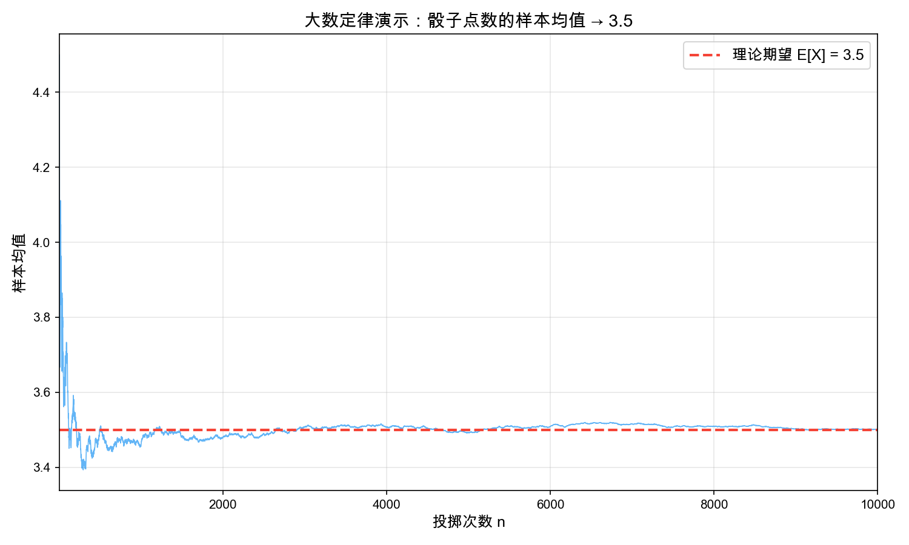
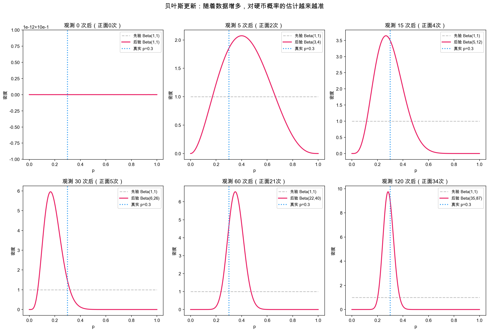
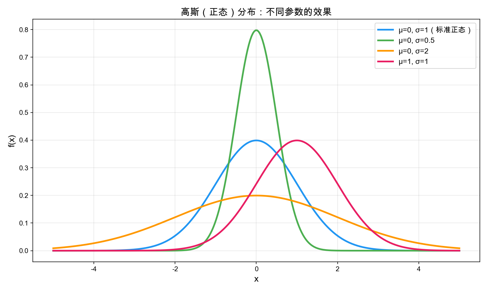
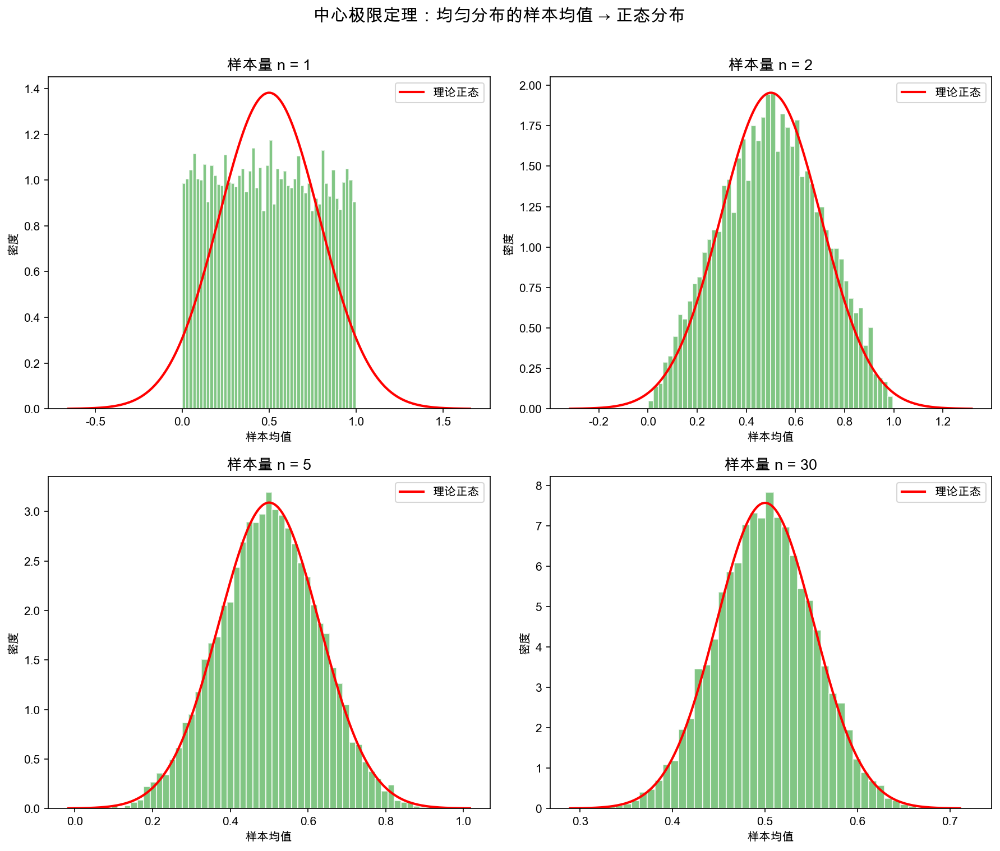
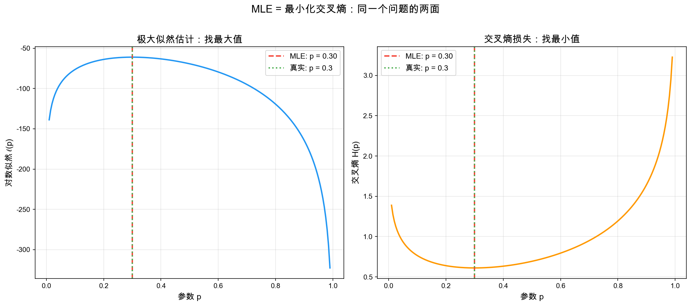

# 第三章：概率统计入门 🎲

> *"概率论不过是化为计算的常识。"——皮埃尔-西蒙·拉普拉斯*

## 🎯 本章目标

学完这一章，你将能够：

1. 理解概率的基本概念——样本空间、事件、概率公理
2. 掌握条件概率与贝叶斯定理，并理解它们在 NLP 中的核心地位
3. 认识常见随机变量与概率分布
4. 理解期望、方差，以及它们和损失函数的关系
5. 知道大数定律与中心极限定理——为什么训练能收敛
6. 掌握极大似然估计（MLE）——语言模型训练的数学灵魂

### 这一章在 LLM 中的位置

**一句话揭示真相：语言模型本质上就是一个概率模型。**

当你问 ChatGPT "下一个词是什么？"，它做的事情可以写成：

$$P(\text{下一个词} \mid \text{前面所有的词})$$

而训练一个语言模型，就是在海量文本上**估计这些概率**。所以，不理解概率统计，就没法真正理解大模型。

整个 LLM 的数学链条中，本章处于这样的位置：

```
线性代数（数据表示）→ 微积分（优化工具）→ 📍概率统计（建模框架）→ 信息论（度量不确定性）→ 机器学习（综合应用）
```

---

## 1. 概率基础

### 1.1 三个核心概念

想象咱们掷一枚骰子🎲。这个简单的场景就包含了概率论的三个基石：

**样本空间 Ω（Omega）**：所有可能结果的集合。

骰子的样本空间：Ω = {1, 2, 3, 4, 5, 6}

**事件 A**：样本空间的一个子集——你关心的一组结果。

比如"掷出偶数"就是一个事件：A = {2, 4, 6}

**概率 P**：给每个事件分配一个 0 到 1 之间的数，表示它发生的可能性。

$$P(A) = \frac{\text{事件 A 包含的结果数}}{\text{样本空间总结果数}} = \frac{3}{6} = \frac{1}{2}$$

> 💡 **暂停一下**：如果事件 B = "掷出大于 4 的数"，P(B) 是多少？
>
> B = {5, 6}，所以 P(B) = 2/6 = 1/3。简单吧？

### 1.2 概率三大公理（Kolmogorov 公理）

概率论整个大厦，建在这三条公理之上：

**公理 1（非负性）**：对任意事件 A，$P(A) \geq 0$

**公理 2（规范性）**：$P(\Omega) = 1$（必然事件的概率是 1）

**公理 3（可加性）**：如果 A 和 B 互斥（不可能同时发生），则：
$$P(A \cup B) = P(A) + P(B)$$

从这三条公理出发，我们可以推导出所有你用过的概率公式。比如：

**补事件公式**：$P(\bar{A}) = 1 - P(A)$

> 推导：A 和 $\bar{A}$ 互斥，且 $A \cup \bar{A} = \Omega$，由公理 2 和 3：$P(A) + P(\bar{A}) = P(\Omega) = 1$，所以 $P(\bar{A}) = 1 - P(A)$。■

**加法公式（一般形式）**：当 A 和 B 不一定互斥时：
$$P(A \cup B) = P(A) + P(B) - P(A \cap B)$$

为什么减去 $P(A \cap B)$？因为交集部分被加了两次，需要扣回来。

### 1.3 从古典概型到现实世界

古典概型（等可能假设）很好用，但现实往往不等可能。比如一个作弊的骰子，或者语言模型中不同词出现的频率。

这时候我们需要**频率学派**的观点：概率 = 长期频率。掷骰子 10000 次，出现 6 的频率约等于 P(6)。

后面会看到，还有**贝叶斯学派**——概率是信念的度量。这个分歧在机器学习中非常重要。

> 🌱 **两种学派的对话**
>
> 🅰️ **频率学派**：「概率是客观的。抛 10000 次硬币，正面朝上的比例就是概率。你不需要有'信念'，数数就行。」
>
> 🅱️ **贝叶斯学派**：「但很多事没法重复 10000 次啊！'明天有 30% 概率下雨'——难道明天重复 10000 次？概率是对不确定性的**量化信念**，新的证据能更新这个信念。」
>
> 🅰️：「那你的先验信念从哪来？主观猜测？」
>
> 🅱️：「先验可以是无信息的（比如均匀分布），也可以来自历史经验。关键是贝叶斯定理给了我们一套**严格的数学规则**来更新信念——这不是随意猜。」
>
> 🅰️：「好吧，但在数据量足够大时，我们的结论会趋同。」
>
> 🅱️：「没错！这就是为什么两个学派在工程实践中经常殊途同归。」
>
> 💡 **一句话总结**：频率学派从数据出发，贝叶斯学派从信念+数据出发。在 LLM 领域，MLE（频率学派）和贝叶斯推断各有用武之地。

#### 💻 动手验证：大数定律——频率学派说得对吗？

频率学派说"掷 10000 次骰子，样本均值会趋近理论期望 3.5"。口说无凭，咱们跑一下看看——真的会收敛吗？收敛得有多快？

```python
# 文件：scripts/law_of_large_numbers.py
"""大数定律的可视化验证：掷骰子的样本均值趋向 3.5"""
import numpy as np
import matplotlib.pyplot as plt

np.random.seed(42)
max_n = 10000
rolls = np.random.randint(1, 7, size=max_n)
cumulative_mean = np.cumsum(rolls) / np.arange(1, max_n + 1)

plt.figure(figsize=(10, 5))
plt.plot(range(1, max_n + 1), cumulative_mean, linewidth=0.8, alpha=0.8)
plt.axhline(y=3.5, color='r', linestyle='--', linewidth=2, label='理论期望 E[X] = 3.5')
plt.xlabel('掷骰子次数 n', fontsize=12)
plt.ylabel('样本均值', fontsize=12)
plt.title('大数定律验证：样本均值 → 期望值', fontsize=14)
plt.legend(fontsize=12)
plt.xscale('log')
plt.grid(True, alpha=0.3)
plt.tight_layout()
plt.savefig('./images/law_of_large_numbers.png', dpi=150)
plt.show()
print("✅ 图片已保存: ./images/law_of_large_numbers.png")
```



你看这条曲线——前几十次还在上蹿下跳，但过了几百次就开始明显收紧，到几千次的时候几乎贴着 3.5 那条红线了。发现了吗？频率学派的直觉果然没错，而且收敛速度比咱们想象中还快。这也解释了为什么机器学习中 mini-batch 越大，梯度估计越稳定——背后就是这个道理。

---

## 2. 条件概率与贝叶斯定理

### 2.1 条件概率——"已知……的情况下"

条件概率是概率论中**最改变思维方式**的概念。

**定义**：在已知事件 B 已经发生的前提下，事件 A 发生的概率：

$$P(A \mid B) = \frac{P(A \cap B)}{P(B)}$$

直觉理解：知道了 B 之后，我们的"世界缩小了"——从整个 Ω 缩小到了 B。在缩小的世界里看 A，就要看 A 和 B 的交集占 B 多大比例。

**生活中的例子**：假设一个班 40 人，其中喜欢数学的 20 人，喜欢编程的 15 人，两个都喜欢的 10 人。

$P(\text{喜欢编程} \mid \text{喜欢数学}) = \frac{10}{20} = 0.5$

在喜欢数学的人里面，有一半也喜欢编程。

### 2.1.1 乘法公式

从条件概率定义出发，我们可以立即得到**乘法公式**——计算两个事件同时发生的概率：

$$\boxed{P(A \cap B) = P(A) \cdot P(B \mid A)}$$

直觉：A 先发生（概率 P(A)），然后在 A 已发生的条件下 B 又发生（概率 P(B|A)），两者相乘就是 A 和 B 同时发生的概率。

> 📚 **例题**：一个盒子有 10 个球，4 红 6 蓝。不放回地取两个球，两个都是红球的概率？
>
> 设 A = "第一个取到红球"，B = "第二个取到红球"
>
> P(A) = 4/10 = 0.4
>
> P(B|A) = 3/9 = 1/3（第一个已经取走红球，剩下 3 红 6 蓝）
>
> P(A∩B) = P(A) · P(B|A) = 0.4 × 1/3 ≈ **0.133**
>
> ✅ 即大约 13.3% 的概率两次都摸到红球。

> 💡 **延伸**：如果 A 和 B **独立**（A 的发生不影响 B），则 P(B|A) = P(B)，乘法公式简化为 P(A∩B) = P(A)·P(B)。这就是咱们熟悉的事件独立性公式。

### 2.2 贝叶斯定理——"反过来想"

贝叶斯定理解决的问题非常自然：**已知 P(B|A)，怎么求 P(A|B)？**

从条件概率定义出发：

$$P(A \mid B) = \frac{P(A \cap B)}{P(B)}$$

而 $P(A \cap B) = P(B \mid A) \cdot P(A)$（还是条件概率定义，换个写法）

所以：

$$\boxed{P(A \mid B) = \frac{P(B \mid A) \cdot P(A)}{P(B)}}$$

这就是**贝叶斯定理**。其中：
- $P(A)$：**先验概率**（prior）——看到证据之前的信念
- $P(B \mid A)$：**似然**（likelihood）——如果 A 为真，看到证据 B 的可能性
- $P(A \mid B)$：**后验概率**（posterior）——看到证据之后更新的信念
- $P(B)$：**证据**（evidence）——归一化常数

> 🌱 **一句话记忆**：后验 = 先验 × 似然 / 证据

**用贝叶斯定理做垃圾邮件分类**：

假设：P(垃圾邮件) = 0.3，P(正常邮件) = 0.7

已知：如果邮件是垃圾邮件，出现"免费"这个词的概率 P(免费|垃圾) = 0.8；如果是正常邮件，P(免费|正常) = 0.1

收到一封含有"免费"的邮件，它是垃圾邮件的概率？

$$P(\text{垃圾} \mid \text{免费}) = \frac{0.8 \times 0.3}{0.8 \times 0.3 + 0.1 \times 0.7} = \frac{0.24}{0.24 + 0.07} = \frac{0.24}{0.31} \approx 0.774$$

看到"免费"之后，垃圾邮件的概率从 30% 跃升到 77.4%！这就是贝叶斯更新的威力。

#### 💻 动手验证：贝叶斯更新——亲眼看着信念被数据重塑

上面的垃圾邮件例子是一次性的贝叶斯更新。但贝叶斯思想更精彩的地方在于：随着数据**逐步**到来，咱们的信念会越来越集中、越来越确定。好，口说无凭，咱们模拟抛一枚偏硬币（p=0.7），看看后验分布是怎么变化的。

```python
# 文件：scripts/bayesian_update.py
"""贝叶斯更新演示：逐步观察数据，更新对硬币偏斜程度的信念"""
import numpy as np
import matplotlib.pyplot as plt
from scipy.stats import beta

# 先验：Beta(1, 1) = 均匀分布（对 p 没有先验知识）
a_prior, b_prior = 1, 1

# 真实硬币：p = 0.7 的偏硬币
true_p = 0.7
np.random.seed(42)
observations = np.random.binomial(1, true_p, size=50)  # 50次抛掷

fig, axes = plt.subplots(2, 3, figsize=(14, 8))
axes = axes.flatten()
show_steps = [0, 1, 5, 10, 25, 50]

x = np.linspace(0, 1, 500)
a, b = a_prior, b_prior

for idx, step in enumerate(show_steps):
    # 更新到第 step 次观察
    new_a = a_prior + observations[:step].sum()
    new_b = b_prior + step - observations[:step].sum()
    
    ax = axes[idx]
    ax.plot(x, beta.pdf(x, new_a, new_b), 'b-', linewidth=2)
    ax.fill_between(x, beta.pdf(x, new_a, new_b), alpha=0.2, color='blue')
    ax.axvline(x=true_p, color='r', linestyle='--', linewidth=1.5, label=f'真实 p={true_p}')
    
    mode = (new_a - 1) / (new_a + new_b - 2) if new_a > 1 and new_b > 1 else new_a / (new_a + new_b)
    ax.set_title(f'观察 {step} 次后\n后验均值={new_a/(new_a+new_b):.3f}', fontsize=11)
    ax.legend(fontsize=9)
    ax.set_xlim(0, 1)
    ax.set_xlabel('p')

plt.suptitle('贝叶斯更新：随着数据增多，信念越来越集中', fontsize=14, y=1.02)
plt.tight_layout()
plt.savefig('./images/bayesian_update.png', dpi=150, bbox_inches='tight')
plt.show()
print("✅ 图片已保存: ./images/bayesian_update.png")
```



你看这6张子图——第0次观察时，咱们对 p 毫无了解，后验是一条平平的线（均匀分布）；到第5次观察，分布已经开始鼓起来；到第50次，蓝色曲线变成了一个又尖又窄的峰，死死锁住了真实值 p=0.7。发现了吗？数据越多，不确定性越小，信念越坚定。贝叶斯学派说的"用证据更新信念"，就是这个效果。

### 2.3 贝叶斯在 NLP 中的应用

**朴素贝叶斯文本分类**就是直接用贝叶斯定理：

$$P(\text{类别} \mid \text{文档}) = \frac{P(\text{文档} \mid \text{类别}) \cdot P(\text{类别})}{P(\text{文档})}$$

"朴素"在于假设每个词独立出现（条件独立假设），这样：

$$P(w_1, w_2, \ldots, w_n \mid \text{类别}) \approx \prod_{i=1}^{n} P(w_i \mid \text{类别})$$

虽然假设"朴素"（词之间并不独立），但实际效果出奇地好——这是机器学习中最经典的反直觉发现之一。

> 💡 **暂停思考**：现代大模型和朴素贝叶斯都用了概率来处理语言，但它们的核心区别是什么？
>
> 提示：朴素贝叶斯假设特征独立，而 Transformer 通过注意力机制**显式建模词与词之间的关系**。

---

## 3. 随机变量与概率分布

### 3.1 随机变量——给随机结果贴标签

**随机变量**是一个从样本空间到实数的映射。听起来抽象，但其实很简单：

- 掷骰子：X = 掷出的点数（X 可以取 1,2,3,4,5,6）——**离散随机变量**
- 等公交：T = 等待时间（T 可以取 0 到 ∞ 之间的任意实数）——**连续随机变量**

### 3.2 离散分布

**均匀分布**（所有结果等可能）：

$$P(X = k) = \frac{1}{n}, \quad k = 1, 2, \ldots, n$$

比如公平骰子：P(X = k) = 1/6。

**伯努利分布**（抛硬币，一次试验）：

$$P(X = 1) = p, \quad P(X = 0) = 1 - p$$

**二项分布**（n 次独立伯努利试验中成功的次数）：

$$P(X = k) = \binom{n}{k} p^k (1-p)^{n-k}$$

其中 $\binom{n}{k} = \frac{n!}{k!(n-k)!}$ 是组合数（$n!$ 读作「n 的阶乘」= $n \times (n-1) \times \cdots \times 2 \times 1$，表示 n 个物品的全排列数）。

> 例：掷 10 次硬币，恰好出现 3 次正面的概率：
> $$P(X=3) = \binom{10}{3} \cdot 0.5^3 \cdot 0.5^7 = 120 \times \frac{1}{1024} \approx 0.117$$

### 3.3 连续分布——概率密度

连续随机变量的 P(X = 某个精确值) = 0（没错，等于 0！）。我们用**概率密度函数（PDF）** 来描述。

> 💡 **量身高——为什么需要「密度」而不是「概率」？**
>
> 假设咱们统计全班同学的身高。身高是一个**连续变量**——可以是 170.0 cm，也可以是 170.1 cm，170.01 cm，170.001 cm……
>
> 问：「恰好 170.000… cm 的概率是多少？」答案是 **0**。因为实数有无限多个，踩中某个精确值的概率为零。
>
> 但问「身高在 169～171 cm 之间的概率」就有意义了。这就需要一个函数来描述**每个区间内有多少概率**——这就是**概率密度函数 f(x)**。
>
> 密度不是概率本身，但密度×区间长度 ≈ 概率。就像「人口密度」不是人数，但密度×面积 ≈ 人数。

所以，连续随机变量的概率用积分来描述：

$$P(a \leq X \leq b) = \int_a^b f(x) \, dx$$

直觉：概率 = 密度曲线下的面积。

**均匀分布** $U(a, b)$：

$$f(x) = \frac{1}{b-a}, \quad a \leq x \leq b$$

**正态分布（高斯分布）** $N(\mu, \sigma^2)$——最重要的分布：

$$\boxed{f(x) = \frac{1}{\sqrt{2\pi}\sigma} \exp\left(-\frac{(x-\mu)^2}{2\sigma^2}\right)}$$

其中 μ 是均值（决定中心位置），σ 是标准差（决定宽度）。

为什么正态分布这么重要？**中心极限定理**（后面会讲）告诉我们，大量独立随机因素的叠加效果近似正态分布。自然界和工程中，到处都是。

#### 💻 动手验证：常见概率分布长什么样？

前面介绍了均匀分布、二项分布、正态分布，光看公式还是有点抽象。好，咱们把它们画出来放一起对比——形状不同，但各有各的用处。

```python
# 文件：scripts/gaussian_distribution.py
"""常见概率分布可视化"""
import numpy as np
import matplotlib.pyplot as plt
from scipy import stats

fig, axes = plt.subplots(1, 3, figsize=(14, 4))

# 1. 均匀分布
ax = axes[0]
x = np.linspace(-1, 2, 300)
for a_val, b_val, color in [(0, 1, 'blue'), (0, 2, 'green')]:
    ax.plot(x, stats.uniform.pdf(x, a_val, b_val - a_val), linewidth=2, 
            color=color, label=f'U({a_val}, {b_val})')
ax.set_title('均匀分布', fontsize=13)
ax.legend()
ax.set_ylim(0, 1.5)

# 2. 二项分布
ax = axes[1]
x_binom = np.arange(0, 16)
for n_val, p_val, color in [(10, 0.3, 'blue'), (10, 0.5, 'green'), (15, 0.3, 'red')]:
    ax.bar(x_binom if n_val == 15 else np.arange(0, n_val + 1),
           stats.binom.pmf(np.arange(0, n_val + 1), n_val, p_val),
           alpha=0.5, color=color, label=f'Bin({n_val}, {p_val})')
ax.set_title('二项分布', fontsize=13)
ax.legend()

# 3. 正态分布
ax = axes[2]
x = np.linspace(-5, 8, 300)
for mu, sigma, color in [(0, 1, 'blue'), (2, 1, 'green'), (0, 2, 'red')]:
    ax.plot(x, stats.norm.pdf(x, mu, sigma), linewidth=2,
            color=color, label=f'N({mu}, {sigma}²)')
ax.set_title('正态分布', fontsize=13)
ax.legend()

plt.tight_layout()
plt.savefig('./images/distributions.png', dpi=150)
plt.show()
print("✅ 图片已保存: ./images/distributions.png")
```



*图：均匀分布、二项分布、正态分布的可视化*

你看这三组图——均匀分布像一段"城墙"，方方正正没有偏好；二项分布像一座小山丘，峰值在 np 附近；正态分布则是经典的钟形曲线，改均值让它平移，改标准差让它胖瘦变化。三种分布形状各异，但在各自的场景中都是"最自然"的选择。

---

## 4. 期望与方差

### 4.1 期望——"平均而言"

**期望（Expected Value）** 是随机变量的"加权平均"：

离散情况：
$$E[X] = \sum_{i} x_i \cdot P(X = x_i)$$

连续情况：
$$E[X] = \int_{-\infty}^{+\infty} x \cdot f(x) \, dx$$

**掷骰子的期望**：$E[X] = 1 \times \frac{1}{6} + 2 \times \frac{1}{6} + \cdots + 6 \times \frac{1}{6} = \frac{21}{6} = 3.5$

注意：期望值不一定是可能出现的结果！你不可能掷出 3.5，但长期平均趋向 3.5。

### 4.2 期望的线性性——超级好用的性质

$$E[aX + bY] = a \cdot E[X] + b \cdot E[Y]$$

**这个性质不需要 X 和 Y 独立！** 这是初学者经常搞错的地方。

### 4.3 方差——"波动有多大"

**方差**衡量随机变量偏离期望的程度：

$$\text{Var}(X) = E[(X - E[X])^2] = E[X^2] - (E[X])^2$$

> 推导不跳步：
> $$\text{Var}(X) = E[(X - \mu)^2]$$
> 展开 $(X - \mu)^2 = X^2 - 2\mu X + \mu^2$：
> $$= E[X^2 - 2\mu X + \mu^2]$$
> 由期望的线性性：
> $$= E[X^2] - 2\mu E[X] + \mu^2$$
> 因为 $\mu = E[X]$：
> $$= E[X^2] - 2\mu^2 + \mu^2 = E[X^2] - \mu^2 = E[X^2] - (E[X])^2$$

**标准差** $\sigma = \sqrt{\text{Var}(X)}$，和原始数据同单位，更有直觉意义。

### 4.4 和损失函数的关系

在机器学习中，**均方误差损失（MSE）** 本质上就是在计算方差：

$$L = \frac{1}{n} \sum_{i=1}^{n}(y_i - \hat{y}_i)^2$$

这就是预测误差的**二阶矩**（平方的期望）。模型训练的目标就是**最小化这个期望**——让预测偏离真实值的波动越小越好。

**交叉熵损失**（分类任务常用）则和信息论挂钩（交叉熵的信息论含义将在第六章详细讲解），它的本质是**负对数似然的期望**。

---

## 5. 大数定律与中心极限定理

### 5.1 大数定律（Law of Large Numbers）

**直觉**：试验次数足够多时，样本均值趋向期望值。

**弱大数定律**（切比雪夫形式）：设 $X_1, X_2, \ldots$ 是**独立同分布**（i.i.d.）的随机变量，均值为 μ，则对任意 ε > 0：

> 🌱 **i.i.d. 是什么意思？逐字拆解：**
> - **i = independent（独立）**：每次抽取互不影响。比如掷骰子，第一次掷出 6 不影响第二次的结果。反面例子：不放回抽牌，第一次抽走红心 A 后第二次就不可能再抽到它。
> - **i = identically（同）**：每次都从同一个分布里抽。比如每次都掷同一枚骰子，而不是第一次掷骰子第二次抛硬币。
> - **d = distributed（分布）**：合起来就是——每个样本来自**同一个概率分布**，且彼此**互不影响**。
>
> 机器学习训练数据通常假设 i.i.d.：每条训练样本独立地从同一个数据分布中采样。

$$P\left(\left|\frac{1}{n}\sum_{i=1}^{n}X_i - \mu\right| \geq \varepsilon\right) \to 0 \quad (n \to \infty)$$

**和 LLM 训练的关系**：训练时我们用**小批量（mini-batch）** 的平均损失来近似整个数据集的期望损失。大数定律保证了：batch 越大，近似越准确。

### 5.2 中心极限定理（Central Limit Theorem, CLT）

**这是概率论中最神奇的结论之一。**

设 $X_1, X_2, \ldots$ 是独立同分布的随机变量，均值为 μ，方差为 $\sigma^2$。则当 n 足够大时：

$$\frac{\bar{X} - \mu}{\sigma / \sqrt{n}} \xrightarrow{d} N(0, 1)$$

翻译成人话：**不管原始数据服从什么分布，样本均值的标准化版本都近似标准正态分布！**

这就是为什么正态分布无处不在——不是因为它描述了所有现象，而是因为很多东西都是"大量小因素的叠加"。

#### 💻 动手验证：中心极限定理——均匀分布的均值怎么就变正态了？

CLT 说的是"不管原始分布长啥样，样本均值都趋向正态"。这听起来有点不可思议——咱们从最"不正态"的均匀分布出发，看看随着每组样本量 n 的增大，均值分布会发生什么变化。

```python
# 文件：scripts/clt_demo.py
"""中心极限定理可视化：均匀分布 → 正态分布"""
import numpy as np
import matplotlib.pyplot as plt
from scipy import stats

np.random.seed(42)
sample_sizes = [1, 2, 5, 30]
num_experiments = 10000

fig, axes = plt.subplots(2, 2, figsize=(12, 8))
axes = axes.flatten()

for idx, n in enumerate(sample_sizes):
    # 每次实验：从均匀分布 U(0,1) 中抽 n 个样本，算均值
    samples = np.random.uniform(0, 1, size=(num_experiments, n))
    means = samples.mean(axis=1)
    
    ax = axes[idx]
    ax.hist(means, bins=50, density=True, alpha=0.7, color='steelblue', edgecolor='white')
    
    # 叠加理论正态分布曲线
    mu_theory = 0.5  # U(0,1) 的均值
    sigma_theory = np.sqrt(1/12) / np.sqrt(n)  # U(0,1) 的方差是 1/12
    x = np.linspace(means.min(), means.max(), 200)
    ax.plot(x, stats.norm.pdf(x, mu_theory, sigma_theory), 'r-', linewidth=2, label='正态拟合')
    
    ax.set_title(f'n = {n}', fontsize=13)
    ax.set_xlabel('样本均值')
    ax.set_ylabel('密度')
    ax.legend(fontsize=10)

plt.suptitle('中心极限定理：均匀分布的样本均值 → 正态分布', fontsize=14, y=1.02)
plt.tight_layout()
plt.savefig('./images/clt_demo.png', dpi=150, bbox_inches='tight')
plt.show()
print("✅ 图片已保存: ./images/clt_demo.png")
```



*图：从均匀分布抽样，样本均值的分布随 n 增大趋向正态*

发现了吗？n=1 时还是均匀分布的方形，n=2 就开始鼓起来了，n=5 已经像个钟形，n=30 的时候红色正态拟合曲线和蓝色直方图几乎完美重合。这就是 CLT 的魔力——就算你从最"平坦"的均匀分布里抽样，只要样本量够大，均值分布就乖乖变成正态。这也解释了为什么正态分布在统计学中地位这么高。

### 5.3 为什么训练能收敛？

把这两个定理合在一起看：

1. **大数定律**：训练数据越多，经验损失 → 期望损失（ SGD 的梯度估计越来越准）
2. **中心极限定理**：参数更新的随机性服从近似正态分布，使得优化轨迹可预测

这两个定理一起，给了我们"训练大模型是可行的"这个信念的数学基础。

---

## 6. 极大似然估计（MLE）

### 6.1 核心思想

**一句话**：找到让观测数据出现概率最大的参数。

假设有一枚可能有偏的硬币，抛了 10 次，出现 7 次正面。你怎么估计正面的概率 p？

直觉告诉我们 p ≈ 0.7。MLE 就是把这个直觉数学化。

### 6.2 严格推导

设 $X_1, \ldots, X_n$ 是来自伯努利分布 $\text{Ber}(p)$ 的独立样本，观测到 $x_1, \ldots, x_n$。

**第一步：写出似然函数**

$$L(p) = P(x_1, x_2, \ldots, x_n \mid p) = \prod_{i=1}^{n} p^{x_i}(1-p)^{1-x_i}$$

**第二步：取对数（化积为和，方便计算）**

$$\ell(p) = \log L(p) = \sum_{i=1}^{n} \left[ x_i \log p + (1-x_i) \log(1-p) \right]$$

$$= \left(\sum x_i\right) \log p + \left(n - \sum x_i\right) \log(1-p)$$

**第三步：对 p 求导并令其为 0**

$$\frac{d\ell}{dp} = \frac{\sum x_i}{p} - \frac{n - \sum x_i}{1-p} = 0$$

$$\frac{\sum x_i}{p} = \frac{n - \sum x_i}{1-p}$$

$$(\sum x_i)(1-p) = p(n - \sum x_i)$$

$$\sum x_i - p \cdot \sum x_i = pn - p \cdot \sum x_i$$

$$\sum x_i = pn$$

$$\boxed{\hat{p}_{MLE} = \frac{\sum x_i}{n} = \frac{\text{成功次数}}{\text{总次数}}}$$

抛 10 次出 7 次正面？$\hat{p} = 7/10 = 0.7$。直觉和数学完美吻合！✅

#### 💻 动手验证：似然函数长什么样？MLE 的峰值真的在 0.7 吗？

推导过程严谨归严谨，但咱们还是画出来看看——把 n=10 次、k=7 次正面这个场景的似然函数画出来，红色虚线标出 MLE 估计值 p̂=0.7，看它是不是真的在峰顶。

```python
# 文件：scripts/mle_cross_entropy.py
"""MLE 似然函数可视化"""
import numpy as np
import matplotlib.pyplot as plt

p_range = np.linspace(0.01, 0.99, 200)
n_trials, n_heads = 10, 7
likelihood = p_range**n_heads * (1 - p_range)**(n_trials - n_heads)
log_likelihood = n_heads * np.log(p_range) + (n_trials - n_heads) * np.log(1 - p_range)

fig, ax = plt.subplots(figsize=(8, 5))
ax.plot(p_range, likelihood, 'b-', linewidth=2, label='似然函数 L(p)')
ax.axvline(x=0.7, color='r', linestyle='--', linewidth=1.5, label=f'MLE: p̂ = {n_heads}/{n_trials} = 0.7')
ax.set_title(f'极大似然估计 (n={n_trials}, k={n_heads})', fontsize=13)
ax.set_xlabel('p', fontsize=12)
ax.set_ylabel('似然 L(p)', fontsize=12)
ax.legend(fontsize=11)
plt.tight_layout()
plt.savefig('./images/mle_cross_entropy.png', dpi=150)
plt.show()
print("✅ 图片已保存: ./images/mle_cross_entropy.png")
```



*图：MLE 估计过程与交叉熵损失的对应关系——训练语言模型本质上就是在做极大似然估计*

果然如此！似然函数在 p=0.7 处取到最大值。这个蓝色曲线的峰值就是咱们的 MLE 估计——"让观测数据出现概率最大的那个参数"。你看，数学推导和直觉完全一致：抛10次出了7次正面，最靠谱的估计就是 p=0.7。

### 6.3 MLE 和语言模型

**语言模型训练本质上就是 MLE！**

一个语言模型对下一个词的预测：

$$P(w_t \mid w_{<t}; \theta)$$

其中 θ 是模型参数。给定训练语料 $w_1, w_2, \ldots, w_N$，似然函数为：

$$L(\theta) = \prod_{t=1}^{N} P(w_t \mid w_{<t}; \theta)$$

取负对数：

$$-\log L(\theta) = -\sum_{t=1}^{N} \log P(w_t \mid w_{<t}; \theta)$$

**这就是交叉熵损失！** 训练语言模型 = 最大化似然 = 最小化交叉熵损失。

$$\boxed{\text{交叉熵损失} = -\frac{1}{N}\sum_{t=1}^{N} \log P(w_t \mid w_{<t}; \theta) = -\frac{1}{N}\ell(\theta)}$$

> 🌱 **这一刻值得停下来消化**：你看到的"交叉熵损失"、"负对数似然"、"MLE"，本质上是同一件事的三种表述。理解了这个等价关系，你就打通了概率统计和深度学习的任督二脉。

---

## 🎯 LLM 关联总结

把本章所有概念串联到 LLM：

| 概率概念 | LLM 中的对应 |
|---------|-------------|
| 条件概率 $P(w_t \mid w_{<t})$ | 语言模型的核心预测：给定上文，预测下一个词 |
| 链式法则 $P(w_1, \ldots, w_n) = \prod P(w_t \mid w_{<t})$ | 一个句子的概率 = 逐词条件概率的连乘 |
| 极大似然估计 (MLE) | 训练目标：最大化训练语料的似然 |
| 交叉熵损失 = 负对数似然 | 模型训练的损失函数 |
| 期望 $E[L]$ | 期望损失（泛化误差） |
| 大数定律 | mini-batch SGD 梯度估计的理论保证 |
| 中心极限定理 | 参数更新的随机性服从近似正态分布 |
| 贝叶斯更新 | 从先验知识+新数据更新模型（贝叶斯神经网络） |
| Softmax | 将 logits 转换为概率分布 |

**最核心的等式**：

$$\text{训练 LLM} \iff \text{极大似然估计} \iff \text{最小化交叉熵}$$

理解了这个等价关系，你就理解了为什么大模型训练需要概率统计。

---

## ❓ 思考题

1. **基础题**：如果 P(下雨) = 0.3，P(带伞|下雨) = 0.9，P(带伞|不下雨) = 0.2。已知某人带了伞，下雨的概率是多少？（提示：贝叶斯定理）

2. **概念题**：为什么连续随机变量取某个精确值的概率是 0？这不矛盾吗？

3. **推导题**：证明二项分布 $B(n, p)$ 的期望是 $np$，方差是 $np(1-p)$。（提示：利用期望和方差的线性性质，把 X 拆成 n 个独立的伯努利变量之和）

4. **LLM 题**：交叉熵损失和负对数似然损失是同一回事吗？如果训练数据不是独立同分布的（比如来自同一段文本的连续句子），MLE 的推导还成立吗？为什么？

5. **开放题**：大数定律告诉我们数据越多估计越准。那为什么大模型不需要看过互联网上的所有文本才能训练好？除了数据量，还有什么因素影响模型质量？

---

> 📚 **下一章预告**：矩阵深度——特征值、SVD、矩阵求导。我们会看到，线性代数远不止矩阵乘法，它是理解 Transformer 参数结构的基础。
