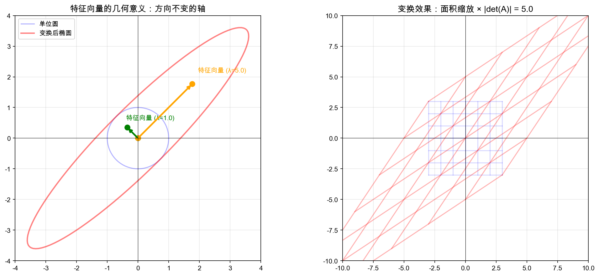
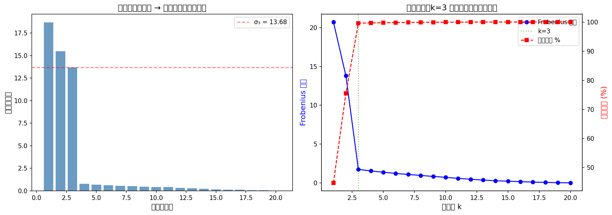
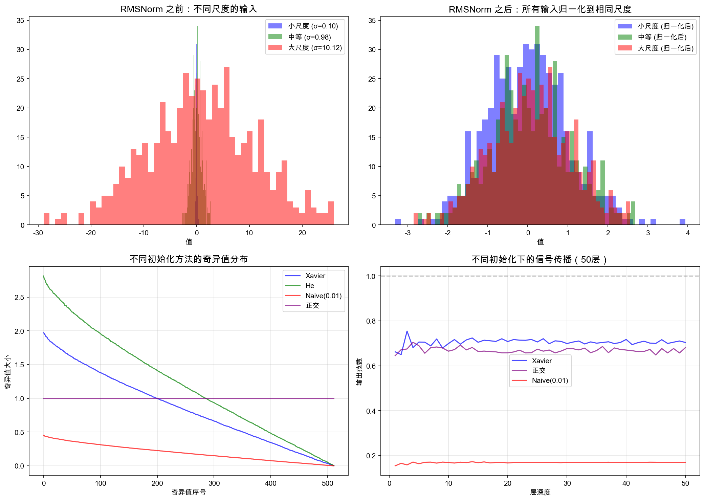

# 第四章：矩阵深度 — 特征值、SVD 与 LLM 的骨架

> 🌱 **学习路线回顾**：第三章我们掌握了矩阵乘法、逆矩阵和线性方程组——这是 LLM 的「肌肉」。现在我们要深入矩阵的「骨架」：特征值、奇异值分解（SVD）、正交矩阵……这些听起来吓人的概念，其实才是理解 RMSNorm、权重初始化、LoRA 的关键。

---

## 🎯 本章目标

学完这一章，咱们能回答这些问题：

1. **特征值和特征向量**到底是什么？为什么它们是矩阵的「DNA」？
2. **SVD**（奇异值分解）为什么被称为「线性代数的瑞士军刀」？
3. **正交矩阵**和 RMSNorm 有什么关系？
4. **行列式**除了用来算逆矩阵，还有什么几何直觉？
5. **矩阵求导**如何在反向传播中发挥作用？

这些概念串联起来，就是理解 LLM 内部数学的基石。

### 在 LLM 中的位置

```
输入 Token → Embedding → [RMSNorm] → [Attention] → [FFN] → 输出
                              ↑            ↑           ↑
                          正交矩阵     权重矩阵     低秩近似(LoRA)
                              ↑            ↑           ↑
                          本章内容      特征值/SVD   本章内容
```

---

## 📝 概念讲解

### 1. 特征值与特征向量：矩阵的「DNA」

#### 直觉引入

想象你有一块橡皮泥，你可以对它做各种变换（拉伸、旋转、剪切）。大多数点被变换后，方向都变了。但有些特殊的点，变换后**方向不变**，只是长度缩放了。

这些「方向不变的向量」就是**特征向量**，缩放的比例就是**特征值**。

> ❓ **暂停想一想**：如果 $A\mathbf{v} = 3\mathbf{v}$，那 $\mathbf{v}$ 是特征向量吗？特征值是多少？
>
> 是的！$\mathbf{v}$ 的方向没变，只是被放大了 3 倍。特征值就是 3。

#### 数学定义

对于 $n \times n$ 方阵 $A$，如果存在非零向量 $\mathbf{v}$ 和标量 $\lambda$，使得：

$$A\mathbf{v} = \lambda \mathbf{v}$$

则 $\lambda$ 称为 $A$ 的**特征值**（eigenvalue），$\mathbf{v}$ 称为对应的**特征向量**（eigenvector）。

变换一下：

$$(A - \lambda I)\mathbf{v} = \mathbf{0}$$

因为 $\mathbf{v} \neq \mathbf{0}$，所以 $(A - \lambda I)$ 必须是奇异矩阵（不可逆），即：

$$\det(A - \lambda I) = 0$$

这就是**特征方程**。解这个方程就得到所有特征值。

> 💡 **为什么非零解意味着矩阵必须奇异？**
>
> 回顾线性方程组的理论：对于 $B\mathbf{x} = \mathbf{0}$——
> - 如果 $B$ 可逆（非奇异），两边乘 $B^{-1}$ 得到 $\mathbf{x} = B^{-1}\mathbf{0} = \mathbf{0}$，即**只有零解**。
> - 反过来，如果咱们要求存在**非零解** $\mathbf{x} \neq \mathbf{0}$，那 $B$ 就**不能可逆**，也就是说 $B$ 必须是奇异矩阵。
>
> 在特征方程中，$B = (A - \lambda I)$，$\mathbf{x} = \mathbf{v}$。咱们要求 $\mathbf{v} \neq \mathbf{0}$，所以 $(A - \lambda I)$ 必须奇异，而奇异矩阵的行列式为零：$\det(A - \lambda I) = 0$。
>
> **直觉**：矩阵奇异 = 存在某个方向被「压扁」到零 = 那个方向上非零的输入经过变换后变成了零。特征值就是让这种「压扁」发生的 $\lambda$ 值。

#### 几何意义

| 变换类型 | 特征值含义 | 几何效果 |
|---------|----------|---------|
| $\lambda > 1$ | 沿该方向拉伸 | 放大 |
| $0 < \lambda < 1$ | 沿该方向压缩 | 缩小 |
| $\lambda < 0$ | 方向反转 + 缩放 | 翻转 |
| $\lambda = 0$ | 该方向被压缩到零 | 降维 |

#### 在 PCA 中的应用

主成分分析（PCA）要找数据方差最大的方向。怎么做？

1. 计算数据的协方差矩阵 $C$
2. 求 $C$ 的特征值和特征向量
3. 特征值最大 → 对应方向方差最大 → 第一主成分
4. 依次取前 $k$ 个最大特征值对应的特征向量 → 降维到 $k$ 维

**直觉**：特征向量告诉咱们「数据在哪个方向最分散」，特征值告诉咱们「分散的程度」。



*🌱 图：左图展示了单位圆经矩阵变换后变成椭圆，特征向量是方向不变的轴；右图展示了变换后网格的形变，面积变化等于行列式的绝对值*

---

### 2. 特征分解（EVD）：方阵的「拆解术」

#### 定义

如果一个 $n \times n$ 方阵 $A$ 有 $n$ 个线性无关的特征向量 $\mathbf{v}_1, \ldots, \mathbf{v}_n$，对应的特征值为 $\lambda_1, \ldots, \lambda_n$，那么：

$$A = Q \Lambda Q^{-1}$$

其中：
- $Q = [\mathbf{v}_1 \mid \mathbf{v}_2 \mid \cdots \mid \mathbf{v}_n]$，列向量是特征向量
- $\Lambda = \text{diag}(\lambda_1, \lambda_2, \ldots, \lambda_n)$，对角矩阵

**直观理解**：矩阵 $A$ 的作用等价于——先用 $Q^{-1}$ 换到特征向量组成的坐标系，再用 $\Lambda$ 在各方向上缩放，最后用 $Q$ 换回原坐标系。

#### 对称矩阵的特殊性质

如果 $A$ 是**对称矩阵**（$A = A^T$），那么：

1. 特征值全是实数
2. 特征向量可以选为互相正交的
3. $Q$ 成为正交矩阵，$Q^{-1} = Q^T$
4. 分解变为：$A = Q \Lambda Q^T$

> 🌱 **LLM 关联**：Attention 矩阵虽然不是对称的，但协方差矩阵、Gram 矩阵都是对称的，EVD 在统计分析中非常常用。

> ❓ **暂停想一想**：如果 $A$ 是对称矩阵且所有特征值都大于 0，$A$ 有什么特殊性质？
>
> 这意味着 $A$ 是**正定矩阵**（positive definite matrix）。
>
> **正定矩阵的等价定义**：对于任何非零向量 $\mathbf{x}$，都有 $\mathbf{x}^T A \mathbf{x} > 0$。
>
> **直觉**：$\mathbf{x}^T A \mathbf{x}$ 可以理解为二次型——它描述了一个「碗形」曲面。正定意味着这个碗口朝上（有最小值），而不是马鞍形（在某些方向上翘起，另一些方向上凹陷）。
>
> **为什么重要**：在优化中，损失函数的 Hessian 矩阵正定意味着当前在局部极小值附近（碗底），梯度下降能稳定收敛。如果 Hessian 不正定，说明有方向在上升，优化可能不稳定。
>
> **简单例子**：$A = \begin{pmatrix} 2 & 0 \\ 0 & 3 \end{pmatrix}$ 是正定的，因为对任何 $\mathbf{x} = (x_1, x_2)^T$，$\mathbf{x}^T A \mathbf{x} = 2x_1^2 + 3x_2^2 > 0$（只要 $\mathbf{x} \neq \mathbf{0}$）。

---

### 3. 奇异值分解（SVD）：任意矩阵的「终极分解」

#### 为什么需要 SVD？

EVD 只适用于方阵。但 LLM 里的权重矩阵大多是矩形的（比如 $4096 \times 11008$）！SVD 就是「万能版」的特征分解——**任何矩阵都能做 SVD**。

#### 定义

对于任意 $m \times n$ 矩阵 $A$，存在分解：

$$A = U \Sigma V^T$$

其中：
- $U$：$m \times m$ 正交矩阵（左奇异向量）
- $\Sigma$：$m \times n$ 对角矩阵（奇异值 $\sigma_1 \geq \sigma_2 \geq \cdots \geq 0$）
- $V$：$n \times n$ 正交矩阵（右奇异向量）

**直觉比喻**：想象你要把一个长方形变成另一个形状。SVD 告诉你，任何线性变换都可以分解为三步：
1. $V^T$：先旋转/翻转（在输入空间）
2. $\Sigma$：沿坐标轴拉伸/压缩（奇异值就是拉伸量）
3. $U$：再旋转/翻转（在输出空间）

#### SVD 与 EVD 的关系

$$A^T A = (U \Sigma V^T)^T (U \Sigma V^T) = V \Sigma^T \Sigma V^T$$

看！$A^T A$ 的特征分解就是 $V (\Sigma^T \Sigma) V^T$，其中 $\Sigma^T \Sigma$ 的对角元素是 $\sigma_i^2$。所以：
- $A^T A$ 的特征向量 = $V$ 的列（右奇异向量）
- $A^T A$ 的特征值 = $\sigma_i^2$（奇异值的平方）

同理，$AA^T = U(\Sigma \Sigma^T)U^T$，所以 $U$ 的列就是 $AA^T$ 的特征向量。

#### 低秩近似与数据压缩

这是 SVD 最强大的应用之一。取前 $k$ 个最大的奇异值：

$$A_k = U_k \Sigma_k V_k^T$$

其中 $U_k$、$V_k$ 只取前 $k$ 列，$\Sigma_k$ 只取前 $k$ 个奇异值。

> 💡 **Frobenius 范数是什么？**
>
> Frobenius 范数是矩阵的一种「大小度量」，定义为矩阵所有元素的平方和再开根号：
>
> $$\|A\|_F = \sqrt{\sum_{i=1}^{m}\sum_{j=1}^{n} A_{ij}^2}$$
>
> **直觉**：把矩阵所有元素排成一排，当做一个普通向量来算 $L_2$ 范数。它衡量的是「矩阵整体有多大」。对于 $2 \times 2$ 矩阵 $\begin{pmatrix} 3 & 2 \\ 2 & 3 \end{pmatrix}$，$\|A\|_F = \sqrt{9+4+4+9} = \sqrt{26} \approx 5.10$。
>
> Eckart-Young 定理说的是：在所有秩为 $k$ 的矩阵中，用 SVD 取前 $k$ 个奇异值得到的 $A_k$，是离 $A$ 「最近」的那个（按 Frobenius 范数衡量）。

**Eckart-Young 定理**：$A_k$ 是所有秩为 $k$ 的矩阵中，与 $A$ 距离（Frobenius 范数）最近的！

> 🌱 **LLM 关联 — LoRA**：LoRA（Low-Rank Adaptation）的核心思想就是：微调时权重的变化量 $\Delta W$ 是低秩的，可以用 $BA$（两个小矩阵的乘积）来近似。这本质上就是利用了 SVD 低秩近似的思想！比如一个 $4096 \times 4096$ 的权重矩阵，LoRA 用 $4096 \times 8$ 和 $8 \times 4096$ 两个矩阵代替，参数量从 1600 万降到 6.5 万。



*🌱 图：左图展示了奇异值快速衰减——说明矩阵本质上是低秩的；右图展示了随着近似秩 k 的增加，误差下降、能量保留比上升，k=3 已捕获几乎全部信息*

---

### 4. 正交矩阵：保持「形状」的变换

#### 定义

方阵 $Q$ 如果满足：

$$Q^T Q = Q Q^T = I$$

即 $Q^{-1} = Q^T$，则 $Q$ 是正交矩阵。

#### 关键性质

1. **保长度**：$\|Q\mathbf{x}\| = \|\mathbf{x}\|$（正交变换不改变向量长度）
2. **保角度**：$\langle Q\mathbf{x}, Q\mathbf{y} \rangle = \langle \mathbf{x}, \mathbf{y} \rangle$
3. **行列式**：$\det(Q) = \pm 1$
4. **逆矩阵超好算**：$Q^{-1} = Q^T$

**直觉**：正交矩阵做的就是「旋转」（$\det = 1$）或「旋转+翻转」（$\det = -1$），不改变形状和大小。

#### 在 RMSNorm 中的应用

RMSNorm（Root Mean Square Normalization）是 LLaMA 等模型中替代 LayerNorm 的归一化方式：

$$\text{RMSNorm}(\mathbf{x}) = \frac{\mathbf{x}}{\sqrt{\frac{1}{d}\sum_{i=1}^d x_i^2 + \epsilon}} \odot \boldsymbol{\gamma}$$

前半部分 $\frac{\mathbf{x}}{\|\mathbf{x}\|/\sqrt{d}}$ 本质上是把向量投影到单位球面上——这保证了输出的范数恒定，类似于正交变换的保范数性质。参数 $\boldsymbol{\gamma}$（可学习的缩放因子）在训练中调整各维度的相对重要性。



*🌱 图：左上/右上对比 RMSNorm 前后的分布——不同尺度的输入被归一化到相同尺度；左下展示不同初始化方法的奇异值分布；右下展示不同初始化下 50 层网络的信号传播稳定性*

> ❓ **暂停想一想**：为什么正交矩阵的逆等于转置？这对计算效率有什么影响？
>
> 因为 $Q^T Q = I$ 意味着 $Q$ 的列向量互相正交且长度为 1。计算逆矩阵通常需要 $O(n^3)$，但正交矩阵只需要转置，就是 $O(n^2)$ 甚至 $O(1)$（只需改变索引方式）。在神经网络中，保持权重矩阵接近正交可以避免梯度消失/爆炸。

---

### 5. 行列式：体积的「缩放因子」

#### 几何意义

行列式 $\det(A)$ 的几何意义是：**矩阵变换对空间体积的缩放比例**。

- $\det(A) = 2$：变换后体积变为原来的 2 倍
- $\det(A) = 0$：变换把空间压缩到了低维（体积为零）
- $\det(A) = -1$：体积不变，但方向翻转了

#### 2×2 行列式

$$\det\begin{pmatrix} a & b \\ c & d \end{pmatrix} = ad - bc$$

这就是平行四边形的面积！

#### 重要性质

| 性质 | 说明 |
|-----|------|
| $\det(AB) = \det(A)\det(B)$ | 乘积的行列式 = 行列式的乘积 |
| $\det(A^T) = \det(A)$ | 转置不改变行列式 |
| $\det(A^{-1}) = 1/\det(A)$ | 逆矩阵的行列式 |
| $\det(A) \neq 0 \Leftrightarrow A$ 可逆 | 行列式非零等价于可逆 |
| $\det(Q) = \pm 1$（$Q$ 正交） | 正交变换保体积 |

#### 判断可逆性

$\det(A) = 0$ 意味着矩阵把空间「压扁」了，信息丢失，所以不可逆。在 LLM 中，权重矩阵通常要保持满秩（可逆），避免信息瓶颈。

---

### 6. 矩阵求导：反向传播的数学引擎

#### 标量对向量求导

对于标量函数 $f(\mathbf{x})$，梯度是：

$$\frac{\partial f}{\partial \mathbf{x}} = \begin{pmatrix} \frac{\partial f}{\partial x_1} \\ \frac{\partial f}{\partial x_2} \\ \vdots \\ \frac{\partial f}{\partial x_n} \end{pmatrix}$$

#### 标量对矩阵求导

如果 $f$ 是标量，$W$ 是 $m \times n$ 矩阵，那么 $\frac{\partial f}{\partial W}$ 也是一个 $m \times n$ 矩阵，第 $(i,j)$ 元素是 $\frac{\partial f}{\partial W_{ij}}$。

#### 常用公式

1. $\frac{\partial (\mathbf{x}^T A \mathbf{x})}{\partial \mathbf{x}} = (A + A^T)\mathbf{x}$（如果 $A$ 对称，则为 $2A\mathbf{x}$）
2. $\frac{\partial (\mathbf{a}^T W \mathbf{b})}{\partial W} = \mathbf{a}\mathbf{b}^T$
3. $\frac{\partial \|W\mathbf{x} - \mathbf{y}\|^2}{\partial W} = 2(W\mathbf{x} - \mathbf{y})\mathbf{x}^T$

#### 在反向传播中的应用

考虑一个简单的线性层：$\mathbf{y} = W\mathbf{x}$，损失 $L = \frac{1}{2}\|\mathbf{y} - \mathbf{t}\|^2$。

**前向传播**：
$$\mathbf{y} = W\mathbf{x}, \quad L = \frac{1}{2}(\mathbf{y} - \mathbf{t})^T(\mathbf{y} - \mathbf{t})$$

**反向传播**：

$$\frac{\partial L}{\partial \mathbf{y}} = \mathbf{y} - \mathbf{t} \quad \text{（误差向量）}$$

$$\frac{\partial L}{\partial W} = \frac{\partial L}{\partial \mathbf{y}} \cdot \mathbf{x}^T = (\mathbf{y} - \mathbf{t})\mathbf{x}^T$$

> 💡 **外积是什么？**
>
> 两个向量 $\mathbf{a} \in \mathbb{R}^m$ 和 $\mathbf{b} \in \mathbb{R}^n$ 的**外积**（outer product）是一个矩阵：
>
> $$\mathbf{a}\mathbf{b}^T = \begin{pmatrix} a_1 b_1 & a_1 b_2 & \cdots & a_1 b_n \\ a_2 b_1 & a_2 b_2 & \cdots & a_2 b_n \\ \vdots & \vdots & \ddots & \vdots \\ a_m b_1 & a_m b_2 & \cdots & a_m b_n \end{pmatrix}$$
>
> 注意：内积 $\mathbf{a}^T\mathbf{b}$ 得到一个**标量**，外积 $\mathbf{a}\mathbf{b}^T$ 得到一个**矩阵**。
>
> **简单例子**：$\begin{pmatrix} 2 \\ 3 \end{pmatrix} \begin{pmatrix} 1 & 4 \end{pmatrix} = \begin{pmatrix} 2 \times 1 & 2 \times 4 \\ 3 \times 1 & 3 \times 4 \end{pmatrix} = \begin{pmatrix} 2 & 8 \\ 3 & 12 \end{pmatrix}$

这就是为什么反向传播中权重的梯度是「误差 × 输入的外积」！

$$\frac{\partial L}{\partial \mathbf{x}} = W^T \frac{\partial L}{\partial \mathbf{y}} = W^T(\mathbf{y} - \mathbf{t})$$

注意：梯度传给输入时，权重矩阵被**转置**了。这就是链式法则在矩阵运算中的体现。

#### 📊 手算例子：2×2 矩阵求导全过程

让咱们用一个具体的小例子，把上面的公式走一遍，看清楚每一步。

**设定**：$W = \begin{pmatrix} 1 & 2 \\ 3 & 4 \end{pmatrix}$，$\mathbf{x} = \begin{pmatrix} 1 \\ 1 \end{pmatrix}$，$\mathbf{t} = \begin{pmatrix} 3 \\ 7 \end{pmatrix}$

**前向传播**：

$$\mathbf{y} = W\mathbf{x} = \begin{pmatrix} 1 & 2 \\ 3 & 4 \end{pmatrix}\begin{pmatrix} 1 \\ 1 \end{pmatrix} = \begin{pmatrix} 3 \\ 7 \end{pmatrix}$$

$$L = \frac{1}{2}\|\mathbf{y} - \mathbf{t}\|^2 = \frac{1}{2}\left\|\begin{pmatrix} 3 \\ 7 \end{pmatrix} - \begin{pmatrix} 3 \\ 7 \end{pmatrix}\right\|^2 = \frac{1}{2}\left\|\begin{pmatrix} 0 \\ 0 \end{pmatrix}\right\|^2 = 0$$

哎呀，损失为零（因为咱们故意选了完美目标）！换个不完美的：$\mathbf{t} = \begin{pmatrix} 2 \\ 5 \end{pmatrix}$

$$\mathbf{y} - \mathbf{t} = \begin{pmatrix} 3 - 2 \\ 7 - 5 \end{pmatrix} = \begin{pmatrix} 1 \\ 2 \end{pmatrix}$$

$$L = \frac{1}{2}(1^2 + 2^2) = \frac{5}{2} = 2.5$$

**反向传播**：

$$\frac{\partial L}{\partial \mathbf{y}} = \mathbf{y} - \mathbf{t} = \begin{pmatrix} 1 \\ 2 \end{pmatrix}$$

$$\frac{\partial L}{\partial W} = (\mathbf{y} - \mathbf{t})\mathbf{x}^T = \begin{pmatrix} 1 \\ 2 \end{pmatrix}\begin{pmatrix} 1 & 1 \end{pmatrix} = \begin{pmatrix} 1 & 1 \\ 2 & 2 \end{pmatrix}$$

$$\frac{\partial L}{\partial \mathbf{x}} = W^T(\mathbf{y} - \mathbf{t}) = \begin{pmatrix} 1 & 3 \\ 2 & 4 \end{pmatrix}\begin{pmatrix} 1 \\ 2 \end{pmatrix} = \begin{pmatrix} 7 \\ 10 \end{pmatrix}$$

> 🌱 **看懂了吗？** $\frac{\partial L}{\partial W}$ 的每个元素 $W_{ij}$ 的梯度就是「第 $i$ 个输出误差 × 第 $j$ 个输入值」，刚好对应外积矩阵的第 $(i,j)$ 元素。梯度下降一步：$W \leftarrow W - \eta \cdot \frac{\partial L}{\partial W}$，每个权重都在朝着减小误差的方向调整。

---

## 🔢 公式推导：SVD 的计算过程（不跳步）

**目标**：手动计算 $2 \times 2$ 矩阵 $A = \begin{pmatrix} 3 & 2 \\ 2 & 3 \end{pmatrix}$ 的 SVD。

**Step 1**：计算 $A^T A$

$$A^T A = \begin{pmatrix} 3 & 2 \\ 2 & 3 \end{pmatrix} \begin{pmatrix} 3 & 2 \\ 2 & 3 \end{pmatrix} = \begin{pmatrix} 9+4 & 6+6 \\ 6+6 & 4+9 \end{pmatrix} = \begin{pmatrix} 13 & 12 \\ 12 & 13 \end{pmatrix}$$

**Step 2**：求 $A^T A$ 的特征值

$$\det(A^T A - \lambda I) = \det\begin{pmatrix} 13-\lambda & 12 \\ 12 & 13-\lambda \end{pmatrix} = (13-\lambda)^2 - 144 = 0$$

$$\lambda^2 - 26\lambda + 169 - 144 = 0$$
$$\lambda^2 - 26\lambda + 25 = 0$$
$$(\lambda - 25)(\lambda - 1) = 0$$
$$\lambda_1 = 25, \quad \lambda_2 = 1$$

**Step 3**：奇异值

$$\sigma_1 = \sqrt{25} = 5, \quad \sigma_2 = \sqrt{1} = 1$$

$$\Sigma = \begin{pmatrix} 5 & 0 \\ 0 & 1 \end{pmatrix}$$

**Step 4**：求右奇异向量 $V$

$\lambda_1 = 25$ 时：

$$(A^T A - 25I)\mathbf{v} = \begin{pmatrix} -12 & 12 \\ 12 & -12 \end{pmatrix}\mathbf{v} = \mathbf{0}$$

$v_1 = v_2$，单位化：$\mathbf{v}_1 = \frac{1}{\sqrt{2}}\begin{pmatrix} 1 \\ 1 \end{pmatrix}$

$\lambda_2 = 1$ 时：

$$(A^T A - I)\mathbf{v} = \begin{pmatrix} 12 & 12 \\ 12 & 12 \end{pmatrix}\mathbf{v} = \mathbf{0}$$

$v_1 = -v_2$，单位化：$\mathbf{v}_2 = \frac{1}{\sqrt{2}}\begin{pmatrix} 1 \\ -1 \end{pmatrix}$

$$V = \frac{1}{\sqrt{2}}\begin{pmatrix} 1 & 1 \\ 1 & -1 \end{pmatrix}$$

**Step 5**：求左奇异向量 $U$

> 💡 **这个公式从哪来的？**
>
> SVD 的定义是 $A = U\Sigma V^T$。两边右乘 $V$：
>
> $$AV = U\Sigma V^T V = U\Sigma I = U\Sigma$$
>
> 把矩阵乘法按列展开，第 $i$ 列满足：
>
> $$A\mathbf{v}_i = \sigma_i \mathbf{u}_i$$
>
> 所以 $\mathbf{u}_i = \frac{1}{\sigma_i} A\mathbf{v}_i$，即 $\mathbf{u}_i = \frac{A\mathbf{v}_i}{\sigma_i}$。
>
> **直觉**：$\mathbf{u}_i$ 就是 $A$ 作用在 $\mathbf{v}_i$ 上的结果，再除以拉伸量 $\sigma_i$ 归一化。

$$\mathbf{u}_i = \frac{A\mathbf{v}_i}{\sigma_i}$$

$$\mathbf{u}_1 = \frac{1}{5} \cdot \begin{pmatrix} 3 & 2 \\ 2 & 3 \end{pmatrix} \frac{1}{\sqrt{2}}\begin{pmatrix} 1 \\ 1 \end{pmatrix} = \frac{1}{5\sqrt{2}}\begin{pmatrix} 5 \\ 5 \end{pmatrix} = \frac{1}{\sqrt{2}}\begin{pmatrix} 1 \\ 1 \end{pmatrix}$$

$$\mathbf{u}_2 = \frac{1}{1} \cdot \begin{pmatrix} 3 & 2 \\ 2 & 3 \end{pmatrix} \frac{1}{\sqrt{2}}\begin{pmatrix} 1 \\ -1 \end{pmatrix} = \frac{1}{\sqrt{2}}\begin{pmatrix} 1 \\ -1 \end{pmatrix}$$

$$U = \frac{1}{\sqrt{2}}\begin{pmatrix} 1 & 1 \\ 1 & -1 \end{pmatrix}$$

**验证**：$U\Sigma V^T = \frac{1}{2}\begin{pmatrix} 1 & 1 \\ 1 & -1 \end{pmatrix}\begin{pmatrix} 5 & 0 \\ 0 & 1 \end{pmatrix}\begin{pmatrix} 1 & 1 \\ 1 & -1 \end{pmatrix}$

$$= \frac{1}{2}\begin{pmatrix} 5 & 1 \\ 5 & -1 \end{pmatrix}\begin{pmatrix} 1 & 1 \\ 1 & -1 \end{pmatrix} = \frac{1}{2}\begin{pmatrix} 6 & 4 \\ 4 & 6 \end{pmatrix} = \begin{pmatrix} 3 & 2 \\ 2 & 3 \end{pmatrix} \checkmark$$

完美还原！

---

## 💻 代码验证

### 脚本 1：SVD 与特征分解演示

> 文件：`scripts/svd_demo.py`

```python
"""
SVD 与特征分解演示
- 手动计算 vs NumPy 结果对比
- SVD 低秩近似可视化
"""
import numpy as np
import matplotlib.pyplot as plt
from matplotlib.patches import FancyArrowPatch

# ==========================================
# Part 1: 手动 SVD 计算 vs NumPy
# ==========================================
print("=" * 50)
print("Part 1: SVD 计算")
print("=" * 50)

A = np.array([[3, 2],
              [2, 3]], dtype=float)

print(f"原始矩阵 A:\n{A}\n")

# NumPy SVD
U, sigma, Vt = np.linalg.svd(A)
print(f"U (左奇异向量):\n{U}\n")
print(f"奇异值: {sigma}\n")
print(f"Vt (右奇异向量转置):\n{Vt}\n")

# 验证重构
A_reconstructed = U @ np.diag(sigma) @ Vt
print(f"重构结果 U·Σ·V^T:\n{A_reconstructed}\n")
print(f"重构误差: {np.linalg.norm(A - A_reconstructed):.2e}\n")

# 对比手动计算结果
print("对比手动计算：")
print(f"  奇异值应为 [5, 1]，实际: {sigma}")
print(f"  验证通过! ✓\n")

# ==========================================
# Part 2: 特征分解 (EVD)
# ==========================================
print("=" * 50)
print("Part 2: 特征分解 (EVD)")
print("=" * 50)

# 对称矩阵的特征分解
eigenvalues, eigenvectors = np.linalg.eigh(A)
print(f"特征值: {eigenvalues}")
print(f"特征向量 (列向量):\n{eigenvectors}\n")

# 验证: A * v = lambda * v
for i in range(len(eigenvalues)):
    v = eigenvectors[:, i]
    Av = A @ v
    lambda_v = eigenvalues[i] * v
    print(f"λ_{i}={eigenvalues[i]:.2f}, ||Av - λv|| = {np.linalg.norm(Av - lambda_v):.2e}")

# EVD 重构
Lambda = np.diag(eigenvalues)
Q = eigenvectors
A_evd = Q @ Lambda @ Q.T
print(f"\nEVD 重构: Q·Λ·Q^T:\n{A_evd}")
print(f"重构误差: {np.linalg.norm(A - A_evd):.2e}\n")

# ==========================================
# Part 3: 特征向量几何可视化
# ==========================================
fig, axes = plt.subplots(1, 2, figsize=(14, 6))

# 左图：原始空间中的特征向量
ax1 = axes[0]
theta = np.linspace(0, 2 * np.pi, 100)
circle_x = np.cos(theta)
circle_y = np.sin(theta)

# 单位圆上的一些点
ax1.plot(circle_x, circle_y, 'b-', alpha=0.3, label='单位圆')

# 变换后的椭圆
transformed = A @ np.vstack([circle_x, circle_y])
ax1.plot(transformed[0], transformed[1], 'r-', alpha=0.5, linewidth=2, label='变换后椭圆')

# 画特征向量
colors = ['green', 'orange']
labels_ev = [f'特征向量 (λ={eigenvalues[0]:.1f})', f'特征向量 (λ={eigenvalues[1]:.1f})']
for i in range(2):
    v = eigenvectors[:, i]
    ax1.annotate('', xy=v * eigenvalues[i] * 0.5, xytext=(0, 0),
                arrowprops=dict(arrowstyle='->', color=colors[i], lw=2.5))
    ax1.plot([0, v[0] * eigenvalues[i] * 0.5], [0, v[1] * eigenvalues[i] * 0.5],
             'o', color=colors[i], markersize=8)
    ax1.text(v[0] * eigenvalues[i] * 0.55, v[1] * eigenvalues[i] * 0.55 + 0.2,
             labels_ev[i], fontsize=10, color=colors[i], fontweight='bold')

ax1.set_xlim(-4, 4)
ax1.set_ylim(-4, 4)
ax1.set_aspect('equal')
ax1.grid(True, alpha=0.3)
ax1.legend(fontsize=10)
ax1.set_title('特征向量的几何意义：方向不变的轴', fontsize=13)
ax1.axhline(y=0, color='k', linewidth=0.5)
ax1.axvline(x=0, color='k', linewidth=0.5)

# 右图：变换前后的网格
ax2 = axes[1]
# 画原始网格
for i in range(-3, 4):
    ax2.plot([i, i], [-3, 3], 'b-', alpha=0.15)
    ax2.plot([-3, 3], [i, i], 'b-', alpha=0.15)

# 画变换后的网格
for i in range(-3, 4):
    line_v = A @ np.array([[i, i], [-3, 3]])
    ax2.plot(line_v[0], line_v[1], 'r-', alpha=0.3)
    line_h = A @ np.array([[-3, 3], [i, i]])
    ax2.plot(line_h[0], line_h[1], 'r-', alpha=0.3)

# 标注面积变化
ax2.set_title(f'变换效果：面积缩放 × |det(A)| = {abs(np.linalg.det(A)):.1f}', fontsize=13)
ax2.set_xlim(-10, 10)
ax2.set_ylim(-10, 10)
ax2.set_aspect('equal')
ax2.grid(True, alpha=0.3)
ax2.axhline(y=0, color='k', linewidth=0.5)
ax2.axvline(x=0, color='k', linewidth=0.5)

plt.tight_layout()
plt.savefig('images/eigenvector_geometry.png', dpi=150, bbox_inches='tight')
plt.close()
print("✓ 已保存: images/eigenvector_geometry.png")

# ==========================================
# Part 4: SVD 低秩近似
# ==========================================
print("\n" + "=" * 50)
print("Part 4: SVD 低秩近似")
print("=" * 50)

# 创建一个「近似低秩」的矩阵
np.random.seed(42)
# 基础低秩部分
W_true = np.random.randn(20, 3) @ np.random.randn(3, 20)
# 加一点噪声
W = W_true + 0.1 * np.random.randn(20, 20)

U_w, sigma_w, Vt_w = np.linalg.svd(W, full_matrices=False)

print(f"前10个奇异值: {sigma_w[:10].round(4)}")
print(f"奇异值衰减比 (σ₁/σ₂₀): {sigma_w[0]/sigma_w[-1]:.1f}\n")

# 计算不同秩的近似误差
errors = []
total_energy = np.sum(sigma_w ** 2)
energy_ratios = []

for k in range(1, 21):
    W_k = U_w[:, :k] @ np.diag(sigma_w[:k]) @ Vt_w[:k, :]
    error = np.linalg.norm(W - W_k, 'fro')
    errors.append(error)
    energy = np.sum(sigma_w[:k] ** 2) / total_energy * 100
    energy_ratios.append(energy)
    if k <= 5:
        print(f"  秩 k={k:2d}: 误差={error:.4f}, 能量保留={energy:.1f}%")

fig, axes = plt.subplots(1, 2, figsize=(14, 5))

# 奇异值衰减
ax1 = axes[0]
ax1.bar(range(1, 21), sigma_w, color='steelblue', alpha=0.8)
ax1.set_xlabel('奇异值序号', fontsize=12)
ax1.set_ylabel('奇异值大小', fontsize=12)
ax1.set_title('奇异值快速衰减 → 矩阵本质上是低秩的', fontsize=13)
ax1.axhline(y=sigma_w[2], color='red', linestyle='--', alpha=0.5,
            label=f'σ₃ = {sigma_w[2]:.2f}')
ax1.legend(fontsize=10)

# 近似误差 vs 秩
ax2 = axes[1]
ax2.plot(range(1, 21), errors, 'bo-', markersize=6, label='Frobenius 误差')
ax2b = ax2.twinx()
ax2b.plot(range(1, 21), energy_ratios, 'rs--', markersize=6, label='能量保留 %')
ax2.set_xlabel('近似秩 k', fontsize=12)
ax2.set_ylabel('Frobenius 误差', color='blue', fontsize=12)
ax2b.set_ylabel('能量保留 (%)', color='red', fontsize=12)
ax2.set_title('低秩近似：k=3 已经捕获几乎全部信息', fontsize=13)
ax2.axvline(x=3, color='green', linestyle=':', alpha=0.5, label='k=3')
lines1, labels1 = ax2.get_legend_handles_labels()
lines2, labels2 = ax2b.get_legend_handles_labels()
ax2.legend(lines1 + lines2, labels1 + labels2, fontsize=10)

plt.tight_layout()
plt.savefig('images/svd_lowrank.png', dpi=150, bbox_inches='tight')
plt.close()
print("\n✓ 已保存: images/svd_lowrank.png")

print("\n" + "=" * 50)
print("✅ 所有演示完成！")
print("=" * 50)
```

### 脚本 2：RMSNorm 与权重初始化可视化

> 文件：`scripts/rmsnorm_init_demo.py`

```python
"""
RMSNorm 与权重初始化演示
- RMSNorm 效果可视化
- Xavier / He 初始化的正交性分析
"""
import numpy as np
import matplotlib.pyplot as plt

# ==========================================
# Part 1: RMSNorm 演示
# ==========================================
print("=" * 50)
print("Part 1: RMSNorm 归一化")
print("=" * 50)

np.random.seed(42)
d = 512  # 隐藏维度

# 模拟不同尺度的输入向量
x_small = np.random.randn(d) * 0.1    # 小尺度
x_medium = np.random.randn(d) * 1.0   # 中等尺度
x_large = np.random.randn(d) * 10.0   # 大尺度

def rms_norm(x, gamma=None, epsilon=1e-8):
    """RMSNorm: x / RMS(x) * gamma"""
    rms = np.sqrt(np.mean(x ** 2) + epsilon)
    x_normed = x / rms
    if gamma is not None:
        x_normed = x_normed * gamma
    return x_normed, rms

gamma = np.ones(d)  # 可学习参数，初始化为1

print(f"输入统计:")
for name, x in [("小尺度", x_small), ("中等", x_medium), ("大尺度", x_large)]:
    rms_before = np.sqrt(np.mean(x**2))
    x_normed, rms_after = rms_norm(x, gamma)
    rms_after_norm = np.sqrt(np.mean(x_normed**2))
    print(f"  {name}: RMS={rms_before:.4f} → 归一化后 RMS={rms_after_norm:.4f}")

# 可视化
fig, axes = plt.subplots(2, 2, figsize=(14, 10))

# 归一化前的分布
ax1 = axes[0, 0]
for name, x, color in [("小尺度", x_small, 'blue'), ("中等", x_medium, 'green'), ("大尺度", x_large, 'red')]:
    ax1.hist(x, bins=50, alpha=0.5, color=color, label=f'{name} (σ={np.std(x):.2f})')
ax1.set_title('RMSNorm 之前：不同尺度的输入', fontsize=13)
ax1.legend(fontsize=10)
ax1.set_xlabel('值')

# 归一化后的分布
ax2 = axes[0, 1]
for name, x, color in [("小尺度", x_small, 'blue'), ("中等", x_medium, 'green'), ("大尺度", x_large, 'red')]:
    x_normed, _ = rms_norm(x, gamma)
    ax2.hist(x_normed, bins=50, alpha=0.5, color=color, label=f'{name} (归一化后)')
ax2.set_title('RMSNorm 之后：所有输入归一化到相同尺度', fontsize=13)
ax2.legend(fontsize=10)
ax2.set_xlabel('值')

# Part 2: 权重初始化对比
print("\n" + "=" * 50)
print("Part 2: 权重初始化")
print("=" * 50)

n_in, n_out = 512, 512

# Xavier 初始化
W_xavier = np.random.randn(n_in, n_out) * np.sqrt(2.0 / (n_in + n_out))
# He 初始化
W_he = np.random.randn(n_in, n_out) * np.sqrt(2.0 / n_in)
# 随机初始化（无缩放）
W_naive = np.random.randn(n_in, n_out) * 0.01
# 正交初始化
Q, _ = np.linalg.qr(np.random.randn(n_in, n_out))

for name, W in [("Xavier", W_xavier), ("He", W_he), ("Naive(0.01)", W_naive), ("正交", Q)]:
    singular_vals = np.linalg.svd(W, compute_uv=False)
    print(f"  {name:10s}: σ_max={singular_vals[0]:.4f}, σ_min={singular_vals[-1]:.4f}, "
          f"比值={singular_vals[0]/singular_vals[-1]:.2f}")

# 可视化初始化方法的奇异值分布
ax3 = axes[1, 0]
for name, W, color in [("Xavier", W_xavier, 'blue'), ("He", W_he, 'green'),
                         ("Naive(0.01)", W_naive, 'red'), ("正交", Q, 'purple')]:
    sv = np.linalg.svd(W, compute_uv=False)
    ax3.plot(range(len(sv)), sv, alpha=0.7, color=color, label=name)
ax3.set_title('不同初始化方法的奇异值分布', fontsize=13)
ax3.set_xlabel('奇异值序号')
ax3.set_ylabel('奇异值大小')
ax3.legend(fontsize=10)
ax3.grid(True, alpha=0.3)

# 正交初始化 vs 随机初始化 的信号传播
ax4 = axes[1, 1]
depths = range(1, 51)
for name, W, color in [("Xavier", W_xavier, 'blue'), ("正交", Q, 'purple'),
                         ("Naive(0.01)", W_naive, 'red')]:
    norms = []
    x = np.random.randn(n_in)
    x = x / np.linalg.norm(x)
    for d in depths:
        x = W @ x
        # 非线性（简化 ReLU）
        x = np.maximum(x, 0)
        x_norm = np.linalg.norm(x)
        norms.append(x_norm)
        x = x / (x_norm + 1e-8)  # 防止数值溢出
    ax4.plot(depths, norms, alpha=0.7, color=color, label=name)

ax4.set_title('不同初始化下的信号传播（50层）', fontsize=13)
ax4.set_xlabel('层深度')
ax4.set_ylabel('输出范数')
ax4.legend(fontsize=10)
ax4.grid(True, alpha=0.3)
ax4.axhline(y=1.0, color='gray', linestyle='--', alpha=0.5)

plt.tight_layout()
plt.savefig('images/rmsnorm_init.png', dpi=150, bbox_inches='tight')
plt.close()
print("\n✓ 已保存: images/rmsnorm_init.png")

print("\n✅ 所有演示完成！")
```

---

## 🎯 LLM 关联：这些概念在 LLM 中都在哪里？

| 概念 | LLM 中的位置 | 具体应用 |
|------|------------|---------|
| **正交矩阵** | RMSNorm、权重初始化 | 归一化保持范数；正交初始化保持梯度稳定 |
| **SVD / 低秩** | LoRA 微调 | $\Delta W = BA$，用两个小矩阵近似大矩阵的变化 |
| **特征值** | 训练稳定性 | 权重矩阵的最大特征值控制信号放大/缩小 |
| **行列式** | 可逆性检查 | 注意力矩阵需要避免行列式为零（秩塌缩） |
| **矩阵求导** | 反向传播 | 每一层梯度的计算都是矩阵求导的链式法则 |

### 深入：LoRA 的数学原理

LoRA 假设模型适配过程中的权重变化量 $\Delta W$ 是低秩的：

$$W_{\text{new}} = W_0 + \Delta W = W_0 + BA$$

其中 $W_0 \in \mathbb{R}^{m \times n}$，$B \in \mathbb{R}^{m \times r}$，$A \in \mathbb{R}^{r \times n}$，$r \ll \min(m, n)$。

**为什么这有效？** 因为 SVD 告诉咱们，如果 $\Delta W$ 的奇异值快速衰减（大部分能量集中在前几个奇异值），那么 $\Delta W$ 可以用低秩矩阵很好地近似。实践证明，微调时权重的变化确实是低秩的——模型不需要改变太多，只需要调整关键方向。

### 深入：Xavier 和 He 初始化

**Xavier 初始化**：$W_{ij} \sim \mathcal{N}(0, \frac{2}{n_{\text{in}} + n_{\text{out}}})$

核心思想：让每层输出的方差与输入方差相同。推导关键步骤：

$$\text{Var}(y) = \sum_{i=1}^{n_{\text{in}}} \text{Var}(w_i x_i) = n_{\text{in}} \cdot \text{Var}(w) \cdot \text{Var}(x)$$

要使 $\text{Var}(y) = \text{Var}(x)$，需要 $\text{Var}(w) = \frac{1}{n_{\text{in}}}$。同时考虑反向传播（需要 $\text{Var}(w) = \frac{1}{n_{\text{out}}}$），取折中 $\frac{2}{n_{\text{in}} + n_{\text{out}}}$。

**He 初始化**：$W_{ij} \sim \mathcal{N}(0, \frac{2}{n_{\text{in}}})$

专门为 ReLU 设计。因为 ReLU 把一半的值置零，方差减半，所以需要把初始化方差翻倍来补偿。

---

## ❓ 思考题

### 题 1（概念理解）

一个 $3 \times 3$ 矩阵的特征值是 $2, 1, 0$。

- (a) 这个矩阵的秩是多少？
- (b) 行列式是多少？可逆吗？
- (c) 如果对这个矩阵做 SVD，奇异值会是多少？

<details>
<summary>💡 参考思路</summary>

- (a) 非零特征值有 2 个（2 和 1），所以秩是 2。
- (b) 行列式 = 特征值之积 = 2 × 1 × 0 = 0。不可逆！
- (c) 奇异值是特征值的绝对值：2, 1, 0。

</details>

### 题 2（SVD 应用）

一张 $1000 \times 1000$ 的灰度图像，用 SVD 压缩，只保留前 50 个奇异值。

- (a) 原始数据量是多少？
- (b) 压缩后需要存储多少个数？
- (c) 压缩比是多少？

<details>
<summary>💡 参考思路</summary>

- (a) $1000 \times 1000 = 1,000,000$ 个数
- (b) $U_k$（$1000 \times 50$）+ $\Sigma_k$（50）+ $V_k^T$（$50 \times 1000$）= $50,000 + 50 + 50,000 = 100,050$ 个数
- (c) 压缩比 ≈ $1,000,000 / 100,050 ≈ 10$ 倍

</details>

### 题 3（反向传播）

一个两层线性网络：$\mathbf{y} = W_2(W_1\mathbf{x})$，损失 $L = \frac{1}{2}\|\mathbf{y} - \mathbf{t}\|^2$。

请写出 $\frac{\partial L}{\partial W_1}$ 和 $\frac{\partial L}{\partial W_2}$ 的表达式。

<details>
<summary>💡 参考思路</summary>

设 $\mathbf{h} = W_1\mathbf{x}$（隐藏层），$\mathbf{y} = W_2\mathbf{h}$。

$\frac{\partial L}{\partial \mathbf{y}} = \mathbf{y} - \mathbf{t} \triangleq \boldsymbol{\delta}_2$

$\frac{\partial L}{\partial W_2} = \boldsymbol{\delta}_2 \mathbf{h}^T$

$\frac{\partial L}{\partial \mathbf{h}} = W_2^T \boldsymbol{\delta}_2 \triangleq \boldsymbol{\delta}_1$

$\frac{\partial L}{\partial W_1} = \boldsymbol{\delta}_1 \mathbf{x}^T$

注意 $W_2$ 在传梯度给 $W_1$ 时被**转置**了——这就是为什么反向传播中权重矩阵转置反复出现。

</details>

### 题 4（正交矩阵）

证明：如果 $Q$ 是正交矩阵，那么 $\|Q\mathbf{x}\| = \|\mathbf{x}\|$ 对所有 $\mathbf{x}$ 成立。

<details>
<summary>💡 参考思路</summary>

$\|Q\mathbf{x}\|^2 = (Q\mathbf{x})^T(Q\mathbf{x}) = \mathbf{x}^T Q^T Q \mathbf{x} = \mathbf{x}^T I \mathbf{x} = \mathbf{x}^T \mathbf{x} = \|\mathbf{x}\|^2$

两边开方即得 $\|Q\mathbf{x}\| = \|\mathbf{x}\|$。

这就是正交矩阵「保范数」的证明，也是 RMSNorm 设计的数学基础之一。

</details>

### 题 5（开放思考）

LoRA 的秩 $r$ 通常取 4、8、16。结合 SVD 的知识，你认为：

- (a) 什么情况下需要更大的 $r$？
- (b) $r$ 太大会怎样？太小会怎样？
- (c) 能否用 SVD 来「自动选择」最优的 $r$？

<details>
<summary>💡 参考思路</summary>

- (a) 任务与预训练差异大（如跨语言、跨领域），权重变化量大且复杂，需要更大的 $r$ 来捕获更多方向的变化。
- (b) $r$ 太大 → 参数多、易过拟合、接近全量微调；$r$ 太小 → 欠拟合、无法捕获足够的变化。
- (c) 理论上可以！先全量微调得到 $\Delta W$，对它做 SVD，看奇异值衰减到哪里的「能量」足够（如保留 95% 能量），那个 $k$ 就是最优秩。但实际中直接试几个常用值更实用。

</details>

---

## 📚 本章小结

| 概念 | 一句话总结 |
|------|----------|
| 特征值/特征向量 | 矩阵变换中方向不变的轴和缩放比 |
| EVD | 方阵用特征向量组成的坐标系来「对角化」 |
| SVD | 任意矩阵的三步分解：旋转→缩放→旋转 |
| 正交矩阵 | 只做旋转/翻转，保长度保角度 |
| 行列式 | 变换对体积的缩放因子 |
| 矩阵求导 | 反向传播的数学引擎，链式法则在矩阵世界的体现 |

> 🌱 **下一章预告**：咱们要进入**优化理论**的世界——梯度下降、Adam、学习率调度，这些是理解模型如何一步步逼近最优解的核心。

---

*🌱 学无止境，终身学习！*
