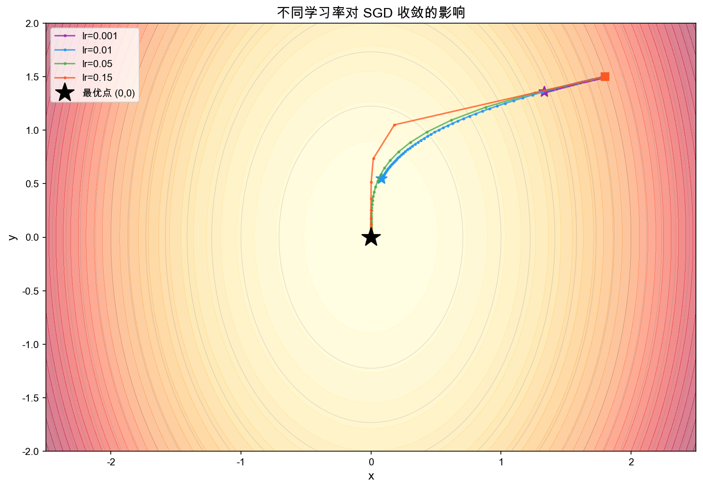
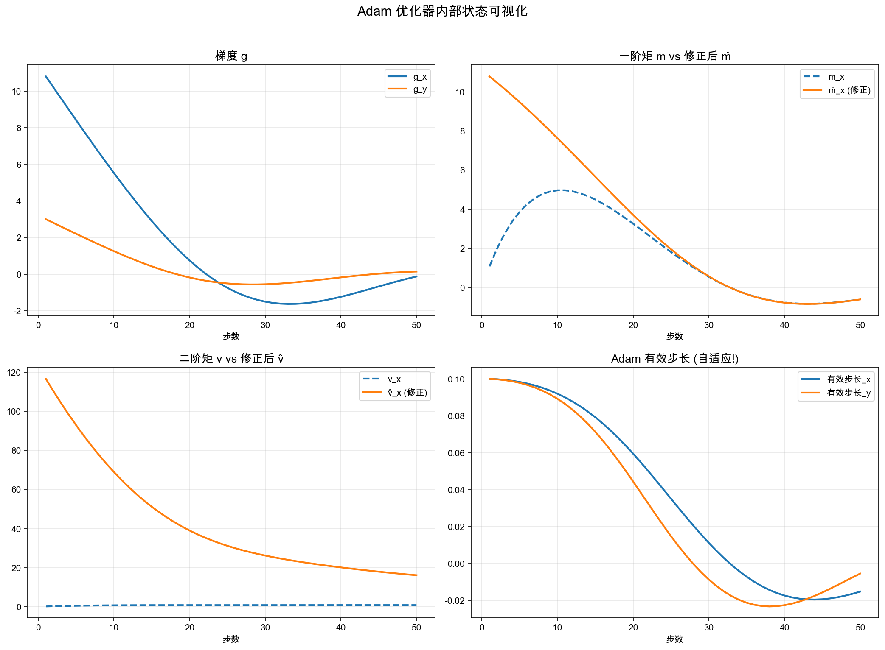
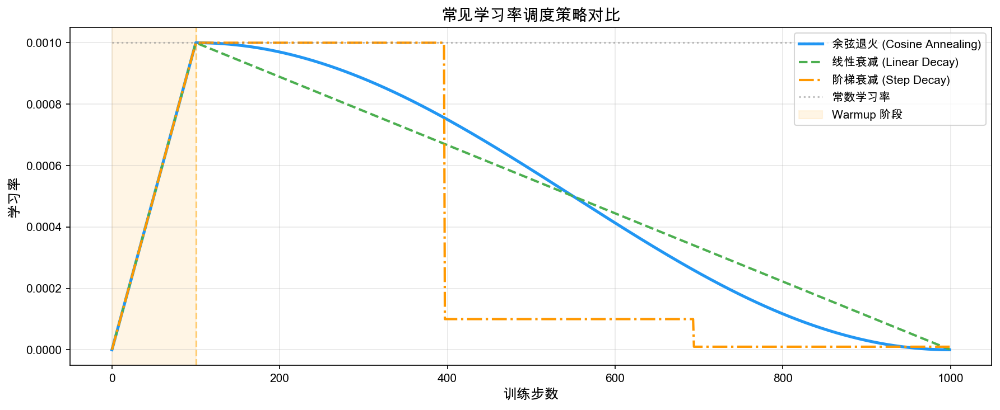
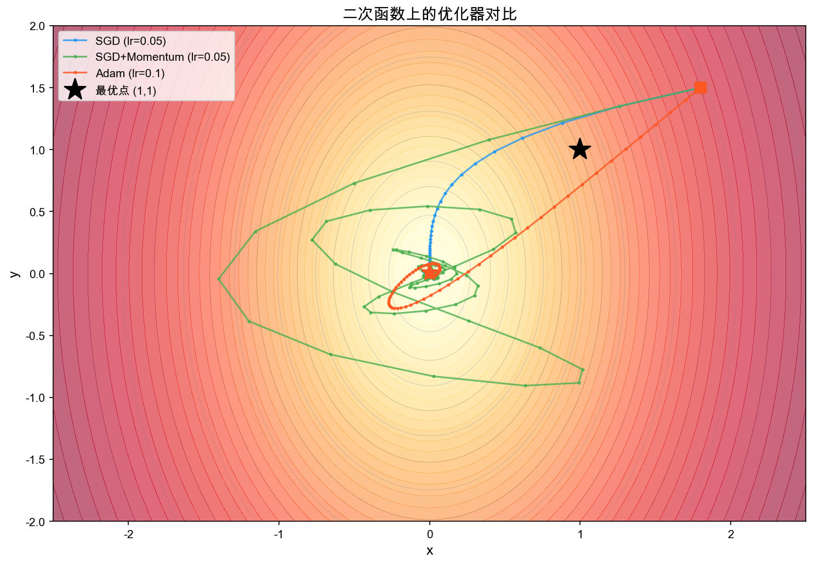
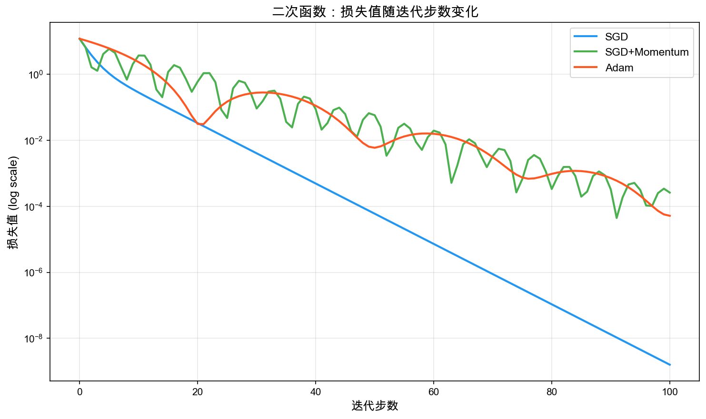
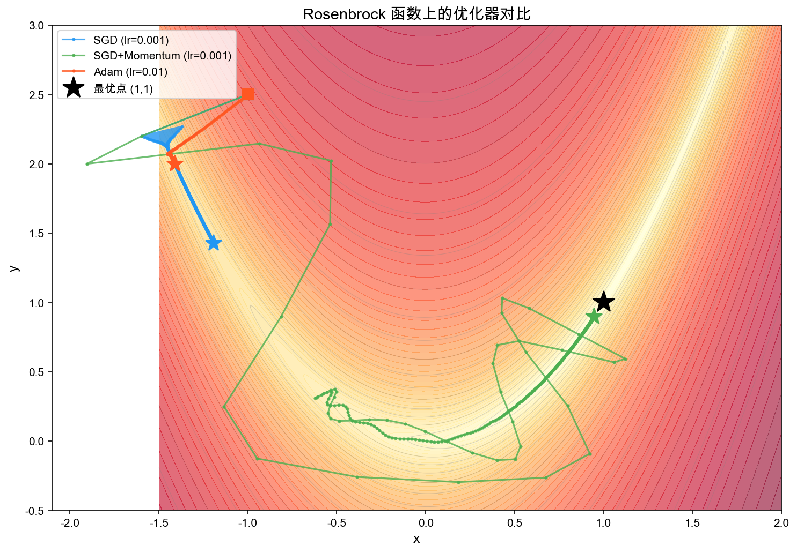
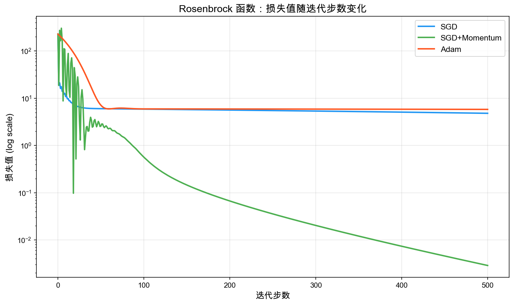

# 第五章：优化理论 — 让模型越练越强的秘密

> 🌱 **一句话概括**：优化理论是模型训练的核心引擎——它告诉我们如何一步步调整参数，让损失函数从"很差"变成"很好"。

> **前置知识**：Ch2 微积分（梯度）+ Ch4（矩阵求导）

---

## 🎯 本章目标 + 在 LLM 中的位置

### 你将学会什么

| 完成本章后，你能... | |
|---|---|
| 理解优化问题的数学形式化 | 目标函数、约束、全局最优 vs 局部最优 |
| 掌握梯度下降（GD）的原理 | 每一步在做什么，为什么能收敛 |
| 理解 SGD 和小批量训练 | 为什么不用全部数据，反而更好 |
| 掌握动量法和 Adam | 它们如何加速训练、自适应调整 |
| 理解学习率调度 | Warmup、余弦退火，为什么训练初期要小心 |
| 建立凸优化直觉 | 凸问题为什么好解，非凸问题为什么难 |

### 在 LLM 中的位置

```
数据 → Tokenization → [嵌入表示] → [注意力机制] → [Transformer架构]
                                                      ↓
                                              定义损失函数
                                                      ↓
                                            ✨ 优化器求解 ✨  ← 你在这里
                                                      ↓
                                              训练出好的模型
```

训练 LLM 的本质就是一个**超大规模优化问题**：找到一组参数 $\theta$，使得在训练数据上的损失函数 $L(\theta)$ 尽可能小。GPT-4 有上万亿参数——这意味着我们在一个**上万亿维的空间**里做优化。没有好的优化理论和算法，这根本不可能。

---

## 📝 概念讲解

### 1. 优化问题形式化

#### 什么是优化问题？

想象你在一片山地里找最低的谷底。你能看到脚下的坡度（梯度），但看不到整座山全貌。你只能一步一步往下走。

数学上，**无约束优化问题**写成：

$$\min_{\theta} \; L(\theta)$$

其中：
- $\theta$ 是模型参数（我们要找的"位置"）
- $L(\theta)$ 是损失函数（"海拔高度"）
- 我们要找到让 $L$ 最小的 $\theta^*$

#### 有约束的优化

有时候我们还有约束条件，比如参数不能太大：

$$\min_{\theta} L(\theta) \quad \text{s.t.} \quad \|\theta\| \leq C$$

> 💡 **暂停想想**：为什么正则化（L2、L1）可以看作给优化加约束？它们对应的约束分别是什么形式？

#### 全局最优 vs 局部最优

- **全局最优** $\theta^*$：整个参数空间中 $L(\theta^*)$ 最小
- **局部最优** $\theta_L$：在 $\theta_L$ 附近一个区域内最小的点

区分这两者就像：
- **全局最优** = 整座山的最低谷
- **局部最优** = 一个小坑洼，虽然比周围低，但不是全山最低

对于**凸函数**，局部最优 = 全局最优（这是凸优化的核心优势！）。
对于**非凸函数**（比如神经网络的损失函数），可能有很多局部最优。

### 2. 梯度下降（Gradient Descent）

> **核心** 梯度下降是所有优化算法的基石，务必理解更新规则和学习率的影响。

#### 核心思想

**沿梯度反方向走，函数值下降最快。**

想象你站在山坡上，闭着眼睛想往山下走。你会怎么做？**用脚感受哪个方向最陡，往那个方向走一步。** 这就是梯度下降！

#### 更新规则

$$\theta_{t+1} = \theta_t - \eta \cdot \nabla_\theta L(\theta_t)$$

其中：
- $\eta$ 是学习率（步长）
- $\nabla_\theta L(\theta_t)$ 是损失函数在当前参数处的梯度

> 📖 **符号小课堂：$\nabla$（nabla，读作"纳布拉"）**
>
> $\nabla$ 是希腊字母 nabla，形状像一个倒三角 ▽。在数学里它代表**梯度算子**——用来计算多元函数在每个方向上的变化率。
>
> $\nabla_\theta L(\theta_t)$ 的意思是：**对参数 $\theta$ 求损失函数 $L$ 的梯度**，也就是在参数空间的每个维度上，算出函数值增长最快的方向。
>
> 🎯 **山坡比喻**：想象你站在山坡上，$\nabla_\theta L$ 就像你脚下的坡度计——它指向"最陡的上坡方向"。所以公式里我们**减去**它，也就是往**最陡的下坡方向**走一步。步子迈多大？由 $\eta$（学习率）决定。

> 🎯 **直觉**：梯度指向函数增长最快的方向，所以"减去梯度"就是往函数值减小的方向走。

#### 学习率 $\eta$ 的影响

学习率就像你下山时**每一步迈多大**：

| 学习率 | 情况 | 类比 |
|--------|------|------|
| 太小 | 收敛极慢，像婴儿步挪下山 | 蚂蚁爬行 🐜 |
| 合适 | 平稳快速到达谷底 | 正常下台阶 🚶 |
| 太大 | 震荡甚至发散，在山谷两边跳来跳去 | 飞跳失控 🦘 |



#### 收敛性

对于**凸函数**且学习率合适时，梯度下降保证收敛到全局最优。收敛速度：

- 固定学习率：$L(\theta_t) - L(\theta^*) = O(1/t)$
- 精心调节的学习率：可以加速到 $O(1/t^2)$（Nesterov 加速梯度）

> 📖 **什么是 $O(\cdot)$ 大O记号？**
>
> 大O记号用来描述函数增长的"量级"或"速度"。$f(t) = O(g(t))$ 的含义是：当 $t$ 足够大时，$f(t)$ 不会超过 $g(t)$ 的常数倍。
>
> 举个例子：$O(1/t)$ 意味着误差和迭代次数成**反比**——迭代次数翻倍，误差大约减半。$O(1/t^2)$ 更快——迭代翻倍，误差减到四分之一。
>
> | 记号 | 增长速度 | 直觉 |
> |------|----------|------|
> | $O(1)$ | 常数，不增长 | 不管输入多大，值固定 |
> | $O(\log t)$ | 非常慢 | 翻倍才增加一点 |
> | $O(t)$ | 线性增长 | 输入翻倍，值翻倍 |
> | $O(1/t)$ | 反比衰减 | $t$ 越大，值越小 |
> | $O(1/t^2)$ | 快速衰减 | 比 $O(1/t)$ 消失得更快 |
>
> 在优化里，我们用大O来衡量"收敛有多快"——$O(1/t^2)$ 比 $O(1/t)$ 收敛更快，也就是用更少的步数达到同样的精度。

### 3. 随机梯度下降（SGD）

> **核心** SGD 是实际训练中最基础的方法，理解「为什么用小批量」和「为什么噪声是好事」。

#### 问题：梯度下降太慢！

计算 $\nabla_\theta L(\theta)$ 需要遍历**所有训练数据**。如果训练集有 10 亿条数据，每走一步就要算 10 亿次前向传播——太慢了！

#### SGD 的想法

**每次只用一条（或一小批）数据来估计梯度：**

$$\theta_{t+1} = \theta_t - \eta \cdot \nabla_\theta \ell(\theta_t; x_i, y_i)$$

其中 $(x_i, y_i)$ 是随机抽取的一条训练数据。

#### 小批量 SGD（Mini-batch SGD）

实际中，我们用一小批数据（batch）的平均梯度：

$$\theta_{t+1} = \theta_t - \eta \cdot \frac{1}{B} \sum_{i=1}^{B} \nabla_\theta \ell(\theta_t; x_i, y_i)$$

其中 $B$ 是 batch size（通常 32、64、256 等）。

#### 为什么 SGD 有效？

你可能会想：用少量数据估计的梯度不准确，为什么还能工作？

1. **无偏估计**：小批量梯度的期望等于真实梯度 $E[\hat{g}] = \nabla L$
2. **噪声反而是好事**：梯度噪声帮助"跳出"局部最优和鞍点
3. **计算效率**：每次更新只需 $B$ 条数据，速度快 $N/B$ 倍
4. **泛化性更好**：适度的噪声有隐式正则化效果

> 💡 **一个有趣的类比**：梯度下降像一个精确的科学家，每次都仔细测量后走一步；SGD 像一个冲动的探险家，快速估算方向就冲——但正因如此，它反而能更快探索更多地方。

### 4. 动量法（Momentum）

#### 物理类比

想象一个球从山坡滚下。普通 SGD 每步独立决策，而**动量法**像给球加上了惯性和速度：

$$v_{t+1} = \beta v_t - \eta \nabla L(\theta_t)$$
$$\theta_{t+1} = \theta_t + v_{t+1}$$

其中：
- $v_t$ 是"速度"（历史梯度的指数加权平均）
- $\beta$ 是动量系数（通常 0.9），控制惯性大小

#### 为什么动量有帮助？

| 问题 | 动量法怎么解决 |
|------|---------------|
| 损失曲面有"沟壑"，来回震荡 | 沟壑方向梯度来回变，平均后抵消；沿沟壑方向梯度一致，累积加速 |
| 遇到平坦区域，梯度极小 | 惯性让球"滑过"平坦区 |
| 局部最优 | 惯性让球有可能"冲过"小坑洼 |

> 🎯 **直觉**：动量就像给优化过程加了一个"加速器"——方向一致就加速，方向来回变就减速。

### 5. Adam 优化器 — 当今深度学习的默认选择

> **核心** Adam 是 LLM 训练的标配，重点理解「动量 + 自适应 + 偏差修正」三件事。

> **深入** Adam 的五步推导和偏差修正的手算验证，时间充裕时细读。

#### Adam = Adaptive + Momentum

Adam（**Ad**aptive **M**oment Estimation）结合了两件事：
1. **动量**（一阶矩）：记住梯度的方向
2. **自适应学习率**（二阶矩）：根据梯度大小自动调整每一步的大小

#### 完整更新公式（不跳步推导）

**初始化**：$m_0 = 0$，$v_0 = 0$，$t = 0$

**每一步**：

**Step 1：计算梯度**

$$g_t = \nabla_\theta L(\theta_{t-1})$$

**Step 2：更新一阶矩（梯度的指数加权平均，即"动量"）**

$$m_t = \beta_1 \cdot m_{t-1} + (1 - \beta_1) \cdot g_t$$

> 💡 这是梯度的"记忆"。$\beta_1 = 0.9$ 意味着当前梯度占 10%，历史占 90%。

**🌱 手算演示：指数加权平均到底怎么算？**

设 $\beta_1 = 0.9$，梯度依次为 $g_1 = 2,\; g_2 = 3,\; g_3 = 1$，初始 $m_0 = 0$：

$$m_1 = 0.9 \times 0 + 0.1 \times 2 = 0.2$$

$$m_2 = 0.9 \times 0.2 + 0.1 \times 3 = 0.18 + 0.3 = 0.48$$

$$m_3 = 0.9 \times 0.48 + 0.1 \times 1 = 0.432 + 0.1 = 0.532$$

| 步数 $t$ | 梯度 $g_t$ | $m_t$（指数加权平均） | 直觉 |
>|---|---|---|---|
>| 1 | 2 | 0.2 | 初值 $m_0=0$ 拖了后腿，偏小 |
>| 2 | 3 | 0.48 | 开始追上来了，但还是偏小 |
>| 3 | 1 | 0.532 | 历史梯度 2、3 的"惯性"让它没完全跟着降到 1 |

> 🎯 **关键观察**：前几步 $m_t$ 明显被 $m_0 = 0$ 拉向了零，这就是为什么需要**偏差修正**（Step 4）！

**Step 3：更新二阶矩（梯度平方的指数加权平均）**

$$v_t = \beta_2 \cdot v_{t-1} + (1 - \beta_2) \cdot g_t^2$$

> 💡 这衡量梯度有多"大"。频繁出现的大梯度 → $v_t$ 大 → 有效学习率小。不常出现的小梯度 → $v_t$ 小 → 有效学习率大。

**Step 4：偏差修正（关键！）**

$$\hat{m}_t = \frac{m_t}{1 - \beta_1^t}, \quad \hat{v}_t = \frac{v_t}{1 - \beta_2^t}$$

为什么要修正？因为 $m_0 = 0$，所以前几步 $m_t$ 被拉向零。除以 $1 - \beta^t$ 把它"拉回来"。当 $t$ 很大时 $\beta^t \to 0$，修正自动消失。

**🌱 手算演示：偏差修正的效果（$\beta_1 = 0.9,\; \beta_2 = 0.999$）**

沿用上面 $m_t$ 的计算结果，加上对应的 $v_t$（设 $g_1 = 2, g_2 = 3, g_3 = 1$，$v_0 = 0$）：

$v_t$ 的逐步计算（$v_t = 0.999 \cdot v_{t-1} + 0.001 \cdot g_t^2$）：
- $v_1 = 0.001 \times 2^2 = 0.004$
- $v_2 = 0.999 \times 0.004 + 0.001 \times 3^2 = 0.003996 + 0.009 = 0.013$
- $v_3 = 0.999 \times 0.013 + 0.001 \times 1^2 = 0.012987 + 0.001 = 0.022$

| $t$ | $g_t$ | $m_t$ | $\hat{m}_t = \frac{m_t}{1-0.9^t}$ | $g_t^2$ | $v_t$ | $\hat{v}_t = \frac{v_t}{1-0.999^t}$ |
>|---|---|---|---|---|---|---|
>| 1 | 2 | 0.2 | $\frac{0.2}{1-0.9} = \frac{0.2}{0.1} = \mathbf{2.0}$ | 4 | 0.004 | $\frac{0.004}{1-0.999} = \frac{0.004}{0.001} = \mathbf{4.0}$ |
>| 2 | 3 | 0.48 | $\frac{0.48}{1-0.81} = \frac{0.48}{0.19} \approx \mathbf{2.53}$ | 9 | 0.013 | $\frac{0.013}{1-0.998} \approx \frac{0.013}{0.002} = \mathbf{6.5}$ |
>| 3 | 1 | 0.532 | $\frac{0.532}{1-0.729} = \frac{0.532}{0.271} \approx \mathbf{1.96}$ | 1 | 0.022 | $\frac{0.022}{1-0.997} \approx \frac{0.022}{0.003} \approx \mathbf{7.33}$ |

> 🎯 **对比结论**：
> - $m_1 = 0.2$ 看起来远小于梯度 2，但修正后 $\hat{m}_1 = 2.0$，**完美恢复了真实梯度！**
> - 随着步数增加，修正系数 $1/(1 - \beta^t)$ 越来越接近 1，到 $t=100$ 时几乎可以忽略。
> - 这就是偏差修正的价值：让训练初期的估计不被零初始化"污染"。

**Step 5：参数更新**

$$\theta_t = \theta_{t-1} - \eta \cdot \frac{\hat{m}_t}{\sqrt{\hat{v}_t} + \epsilon}$$

其中 $\epsilon = 10^{-8}$ 是防止除零的小常数。

#### 为什么 Adam 是默认选择？

| 特性 | 好处 |
|------|------|
| 自适应学习率 | 不同参数自动获得不同的有效学习率 |
| 对学习率不敏感 | 默认 $\eta = 0.001$ 在大多数任务上工作良好 |
| 结合动量 | 在沟壑和鞍点处表现好 |
| 偏差修正 | 训练初期也稳定 |



> 💡 看"有效步长"那张子图——x 和 y 方向的有效步长是**不同的**！这就是"自适应"的含义。梯度大的方向步子小一些，梯度小的方向步子大一些，实现一种自动平衡。

### 6. 学习率调度

> **深入** 学习率调度的具体公式细节，Warmup 和余弦退火的思想是核心。

#### 为什么不一直用固定的学习率？

训练不同阶段需要不同的策略：

| 阶段 | 需求 | 类比 |
|------|------|------|
| 初期 | 参数随机，梯度不稳定，大学习率会"乱跑" | 刚进陌生城市，先慢慢走摸清方向 |
| 中期 | 可以加快学习 | 知道方向了，加速跑 |
| 后期 | 需要精细调整，小学习率帮助收敛到最优 | 快到了，放慢脚步精确找到入口 |

#### Warmup（预热）

训练初期使用很小的学习率，逐步增大到目标学习率：

$$\eta_t = \eta_{\max} \cdot \frac{t}{T_{\text{warmup}}}, \quad t \leq T_{\text{warmup}}$$

> 🎯 **LLM 训练的 Warmup**：训练 GPT 时通常 warmup 走总步数的 1-2%。比如训练 100 万步，前 1 万步做 warmup。

为什么需要？初期参数随机，梯度可能非常大或非常不稳定。大学习率会导致参数大幅跳变，模型不稳定。

#### 余弦退火（Cosine Annealing）

Warmup 之后，学习率按余弦曲线缓慢衰减：

$$\eta_t = \eta_{\min} + \frac{1}{2}(\eta_{\max} - \eta_{\min})\left(1 + \cos\left(\frac{t - T_{\text{warmup}}}{T_{\text{total}} - T_{\text{warmup}}} \cdot \pi\right)\right)$$

为什么余弦？因为它在训练后期衰减得**更平缓**，让模型有更多时间在好的参数附近精细调整。



### 7. 凸优化基础

> 💡 **为什么要学凸优化？**
>
> 在前面的讨论中，我们反复提到"凸函数的局部最优就是全局最优"。这一节咱们把这个结论说清楚。虽然神经网络的损失函数不是凸的，但理解凸优化能给我们一个"理想情况"的基准线——知道什么情况下优化是"容易的"，才能理解为什么非凸优化是"难的"。

#### 直觉铺垫：什么是"凸"？

在讲数学定义之前，先建立直觉：

**想象一个碗。** 碗的内壁是什么形状？——不管你把一个小球放在碗里的哪个位置，它都会滚到碗底。碗底就是唯一的最低点（全局最小值）。这就是"凸"的直觉。

反过来，想象一片起伏的山地——有很多小谷底，球可能停在某个小坑里出不来。这就是"非凸"。

**凸** = 碗形 = 只有一个谷底 = 优化容易
**非凸** = 山地 = 很多谷底 = 优化困难

#### 凸函数

一个函数 $f$ 是**凸函数**，如果对任意 $x, y$ 和 $\lambda \in [0, 1]$：

$$f(\lambda x + (1-\lambda)y) \leq \lambda f(x) + (1-\lambda)f(y)$$

直觉：**函数图像上任意两点的连线，都在函数图像上方。** 像一个碗。

**🌱 这公式在说什么？手算验证**

用最简单的凸函数 $f(x) = x^2$ 来验证：

取 $x = 1,\; y = 3,\; \lambda = 0.5$：

- 左边：$f(\lambda x + (1-\lambda)y) = f(0.5 \times 1 + 0.5 \times 3) = f(2) = 2^2 = 4$
- 右边：$\lambda f(x) + (1-\lambda)f(y) = 0.5 \times 1 + 0.5 \times 9 = 5$

$4 \leq 5$ ✅ 成立！函数值（4）确实在连线值（5）的下方。

> 🎯 **$\lambda$ 的含义**：$\lambda$ 是一个"混合比例"。$\lambda = 0.5$ 表示取 $x$ 和 $y$ 的中点；$\lambda = 0.1$ 表示取靠近 $y$ 的点。不管怎么取，凸函数在中间点的值都不会超过两端函数值的线性插值——这就是"碗形"的数学表达。

#### 凸集

一个集合 $C$ 是凸集，如果对任意 $x, y \in C$，连线也在 $C$ 内。
直觉：没有"凹陷"的区域。

#### 为什么凸问题好解？

**凸函数的任何局部最小值都是全局最小值！**

证明非常简单（反证法）：
1. 假设 $x^*$ 是局部最小但不是全局最小，存在 $y$ 使得 $f(y) < f(x^*)$
2. 考虑连线 $z(\lambda) = \lambda y + (1-\lambda)x^*$，由凸性 $f(z(\lambda)) \leq \lambda f(y) + (1-\lambda)f(x^*) < f(x^*)$
3. 当 $\lambda \to 0$ 时，$z(\lambda) \to x^*$，但 $f(z(\lambda)) < f(x^*)$
4. 这与 $x^*$ 是局部最小矛盾！ ∎

所以，在凸优化中，梯度下降找到的任何"谷底"都是"最低的谷底"。

#### 非凸问题的挑战

神经网络的损失函数几乎都是**非凸的**：

| 挑战 | 描述 |
|------|------|
| 多个局部最优 | 很多谷底，不一定是最低的 |
| 鞍点 | 梯度为零但不是最小值（某些方向下降、某些方向上升） |
| 平坦区域 | 梯度几乎为零，优化器"走不动" |
| 悬崖 | 梯度突然极大，参数跳到很远的地方 |

> 💡 高维空间中，**鞍点比局部最优多得多的**。好消息是，SGD 的噪声能帮助逃离鞍点。

---

## 🔢 关键公式总结

### 梯度下降

$$\theta_{t+1} = \theta_t - \eta \cdot \nabla_\theta L(\theta_t)$$

### 小批量 SGD

$$\theta_{t+1} = \theta_t - \eta \cdot \frac{1}{B}\sum_{i=1}^{B} \nabla_\theta \ell(\theta_t; x_i, y_i)$$

### SGD + 动量

$$v_{t+1} = \beta v_t - \eta \nabla L(\theta_t)$$
$$\theta_{t+1} = \theta_t + v_{t+1}$$

### Adam（完整版）

$$\begin{aligned}
g_t &= \nabla_\theta L(\theta_{t-1}) \\
m_t &= \beta_1 m_{t-1} + (1-\beta_1) g_t \\
v_t &= \beta_2 v_{t-1} + (1-\beta_2) g_t^2 \\
\hat{m}_t &= m_t / (1-\beta_1^t) \\
\hat{v}_t &= v_t / (1-\beta_2^t) \\
\theta_t &= \theta_{t-1} - \eta \cdot \hat{m}_t / (\sqrt{\hat{v}_t} + \epsilon)
\end{aligned}$$

**默认超参数**：$\beta_1 = 0.9$，$\beta_2 = 0.999$，$\epsilon = 10^{-8}$，$\eta = 0.001$

---

## 💻 代码验证

### 从零实现 SGD 和 Adam

```python
import numpy as np

def sgd(grad_fn, w0, lr=0.01, steps=200):
    """Vanilla SGD"""
    w = w0.copy()
    path = [w.copy()]
    for _ in range(steps):
        g = grad_fn(w)
        w = w - lr * g          # 核心：沿梯度反方向走一步
        path.append(w.copy())
    return np.array(path)

def adam(grad_fn, w0, lr=0.01, beta1=0.9, beta2=0.999, eps=1e-8, steps=200):
    """Adam：自适应学习率 + 动量"""
    w = w0.copy()
    m = np.zeros_like(w)        # 一阶矩（梯度平均）
    v = np.zeros_like(w)        # 二阶矩（梯度平方平均）
    path = [w.copy()]
    for t in range(1, steps + 1):
        g = grad_fn(w)
        m = beta1 * m + (1 - beta1) * g              # 更新一阶矩
        v = beta2 * v + (1 - beta2) * g ** 2          # 更新二阶矩
        m_hat = m / (1 - beta1 ** t)                  # 偏差修正
        v_hat = v / (1 - beta2 ** t)                  # 偏差修正
        w = w - lr * m_hat / (np.sqrt(v_hat) + eps)   # 自适应更新
        path.append(w.copy())
    return np.array(path)
```

### 优化器收敛轨迹对比





*图：三个优化器在二次函数上的损失值变化。Adam 收敛最快最稳。*





> 🎯 **观察**：在简单的二次函数上，三个优化器都能收敛；但在非凸的 Rosenbrock 函数上，Adam 明显更快更稳——自适应学习率的优势体现出来了。

完整代码见 `scripts/visualize_optimizers.py`，包含：
- SGD、SGD+Momentum、Adam 的从零实现
- 5 组可视化实验（二次函数对比、Rosenbrock 对比、学习率影响、Adam 内部状态、学习率调度）

---

> **核心** 掌握标准：学完本章你应该能做到：
> 1. 手算简单的梯度下降（写出更新步骤）
> 2. 解释 SGD 和 GD 的区别（为什么用小批量）
> 3. 理解 Adam 的核心思想（动量 + 自适应学习率 + 偏差修正）
> 4. 画出学习率太大/太小/刚好时的收敛曲线
> 5. 解释为什么 LLM 训练需要 Warmup

## 🎯 LLM 关联：训练 Transformer 的优化策略

### GPT 系列的优化配置

| 配置 | GPT-2 | GPT-3 | GPT-4 (推测) |
|------|-------|-------|-------------|
| 优化器 | Adam | Adam (AdamW) | AdamW |
| 学习率 | 2.5e-4 | 峰值 6e-5 | 类似 |
| 调度 | 余弦退火 | 余弦退火 | 余弦退火 |
| Warmup | ~2000 步 | ~375M tokens | 类似 |
| Batch size | 512 seq | 3.2M tokens | 更大 |
| Weight decay | 0.01 | 0.1 | 0.1 |
| 梯度裁剪 | 1.0 | 1.0 | 1.0 |

### 关键实践

**1. AdamW 而非 Adam**

标准 Adam 把 weight decay 实现为 L2 正则化，和自适应学习率耦合在一起。AdamW 把 weight decay **解耦**出来，直接衰减参数：

$$\theta_t = (1 - \lambda)\theta_{t-1} - \eta \cdot \frac{\hat{m}_t}{\sqrt{\hat{v}_t} + \epsilon}$$

这在 LLM 训练中效果明显更好。

**2. 梯度裁剪（Gradient Clipping）**

防止梯度爆炸：

$$g_t = \begin{cases} g_t & \text{if } \|g_t\| \leq c \\ c \cdot g_t / \|g_t\| & \text{otherwise} \end{cases}$$

通常 $c = 1.0$。这在 Transformer 训练中**必不可少**——注意力机制的梯度可能突然变得非常大。

**3. 混合精度训练**

用 FP16/BF16 做前向和梯度计算，FP32 做参数更新。好处：
- 内存减半 → 可以用更大的 batch
- 计算更快 → GPU 的 FP16 吞吐是 FP32 的 2-8 倍
- 关键：用 FP32 做 Adam 的 $m$ 和 $v$ 更新（精度很重要）

**4. 学习率调度的 "_TRANSFORMER 专用配方_"**

典型模式：
```
Warmup（线性增长） → 余弦退火（缓慢衰减） → 衰减到峰值学习率的 10% 左右
```

这几乎成了训练 Transformer 的标准配置，在几乎所有大规模 LLM 训练中都被采用。

---

### ⚠️ 常见卡点

#### 卡点 1：Adam 的 bias correction 在修什么？

**直觉**：Adam 的 $m_t$ 是梯度的「记忆」——但一开始 $m_0 = 0$，就像一个刚失忆的人，前几步的判断都被「空白记忆」拉低了。偏差修正就是把被 0 拉低的值「补偿回来」。

**正确理解**：$m_t = \beta_1 \cdot m_{t-1} + (1-\beta_1) \cdot g_t$，当 $m_0 = 0$ 时，$m_1 = 0.1 g_1$（如果 $\beta_1 = 0.9$），远小于真实梯度。除以 $(1-\beta_1^t)$ 补偿回来：$\hat{m}_1 = \frac{0.1 g_1}{1-0.9} = g_1$，完美恢复。随着 $t$ 增大，$\beta_1^t \to 0$，修正自动消失。

#### 卡点 2：为什么不直接用 GD？

**直觉**：GD 就像要把全班同学的考试成绩都统计一遍才决定下一步怎么教——100 亿条数据，一步都走不动。SGD 是「抽查几个同学就调整教学方案」——快得多，而且抽查的随机性反而有助于跳出局部最优。

**正确理解**：GD 每步需要遍历全部 $N$ 条数据计算梯度。GPT-4 的训练数据有数万亿 token，一步 GD 要做数万亿次前向传播——根本算不完。SGD 每步只用几十到几千条数据（batch），速度快 $N/B$ 倍，而且梯度噪声有隐式正则化效果，泛化性反而更好。

## ❓ 思考题

### 题 1（理解）

> Adam 的偏差修正为什么只在训练初期重要？试计算 $t = 1$ 时 $\hat{m}_1$ 和 $m_1$ 的差异（设 $\beta_1 = 0.9$）。

<details>
<summary>📝 参考答案</summary>

**解题思路**：偏差修正补偿的是零初始化 $m_0=0$ 带来的系统性偏差。随着训练步数 $t$ 增大，$\beta^t \to 0$，修正因子 $1/(1-\beta^t) \to 1$，修正自然消失。

**完整解答**：

Adam 初始化 $m_0 = 0$，所以：

$$m_1 = \beta_1 m_0 + (1-\beta_1) g_1 = (1-\beta_1) g_1$$

而修正后的估计为：

$$\hat{m}_1 = \frac{m_1}{1 - \beta_1^1} = \frac{(1-\beta_1) g_1}{1 - \beta_1} = g_1$$

以 $\beta_1 = 0.9$ 为例：
- $m_1 = 0.1\,g_1$，而 $\hat{m}_1 = \frac{0.1\,g_1}{1-0.9} = g_1$。偏差修正将估计放大了 10 倍，完美恢复了真实梯度。

当 $t = 10$ 时：修正因子 $= 1/(1-0.9^{10}) = 1/(1-0.349) \approx 1.54$，仍有明显修正。

当 $t = 100$ 时：$0.9^{100} \approx 2.66 \times 10^{-5}$，修正因子 $\approx 1.000027$，几乎可以忽略。

**本质原因**：修正因子为 $1/(1-\beta^t)$。当 $t$ 足够大时 $\beta^t \to 0$，因子趋于 1，修正自然消失。对于 $\beta_1=0.9$，大约 $t > 50$ 后修正已微乎其微；$\beta_2 = 0.999$ 则需要 $t > 5000$ 才能忽略。所以偏差修正只在训练初期重要，且对二阶矩的影响持续更久。

**⚠️ 常见错误**：
1. 忘记二阶矩 $v_t$ 也需要偏差修正，且因为 $\beta_2 = 0.999$ 更接近 1，其偏差持续更久。
2. 误以为"初期"是前 2-3 步——实际上对 $\beta_2$ 而言，前几百步都有不可忽略的偏差。

</details>

### 题 2（分析）

> 为什么 SGD 的泛化性能往往比 Adam 好（在充分调参的情况下）？Adam 的自适应学习率可能带来什么"副作用"？

<details>
<summary>📝 参考答案</summary>

**解题思路**：SGD 的梯度噪声具有隐式正则化效果，倾向于收敛到"宽而平"的极小值，这种极小值泛化性更好。Adam 的自适应学习率会消除这种噪声，加速收敛但可能收敛到"窄而尖"的极小值。

**完整解答**：

**1. SGD 的噪声是隐式正则化**

SGD 每步使用小批量梯度 $\hat{g}_t$，它是对真实梯度的有噪估计：

$$\hat{g}_t = \nabla L(\theta_t) + \xi_t, \quad \mathbb{E}[\xi_t] = 0$$

这种噪声使得 SGD 在极小值附近不断"震荡"，倾向于逃离**尖锐（narrow）的极小值**，最终停留在**宽平（flat）的极小值**。研究表明，宽平的极小值对应的解泛化性更好——因为参数的小扰动不会导致损失剧烈变化。

**2. Adam 的自适应学习率的"副作用"**

Adam 通过 $v_t$（二阶矩）对每个参数自适应地调整学习率：

$$\eta_{\text{eff},i} = \frac{\eta}{\sqrt{\hat{v}_{t,i}} + \epsilon}$$

这带来了几个问题：
- **抹平了梯度的噪声结构**：自适应缩放使得不同参数方向的梯度噪声被归一化，削弱了 SGD 噪声的隐式正则化效果。
- **可能收敛到尖锐极小值**：因为自适应机制会"配合"当前损失曲面的形状，更容易滑入附近最近的（可能是尖锐的）极小值。
- **有效步长递减**：随着 $v_t$ 累积增大，有效步长 $\eta/\sqrt{v_t}$ 不断减小，导致 Adam 在后期几乎"走不动"，可能陷入次优解。

**3. 实践中的折中**

| 优化器 | 优势 | 劣势 | 适用场景 |
|--------|------|------|----------|
| SGD+Momentum | 泛化好、收敛到宽平极小值 | 对学习率敏感、收敛慢 | 充分调参、追求极致性能 |
| Adam | 收敛快、对超参数鲁棒 | 泛化可能稍差 | 快速实验、LLM 预训练 |
| AdamW | Adam 的优点 + 解耦 weight decay | 仍不如 SGD 泛化 | LLM 训练标配 |

很多实践采用"Adam 预训练 + SGD 微调"的策略。

**⚠️ 常见错误**：
1. 认为"Adam 一定比 SGD 好"——在充分调参下 SGD 往往泛化更好（如 ResNet、ViT 的 SOTA 结果）。
2. 忽略学习率调度的影响——SGD 需要更精心的学习率调度才能发挥优势。

</details>

### 题 3（推导）

> 证明：对于凸函数 $f$，如果 $\nabla f(x^*) = 0$，则 $x^*$ 是全局最小值。（提示：利用凸函数的一阶条件 $f(y) \geq f(x) + \nabla f(x)^T(y - x)$。）

<details>
<summary>📝 参考答案</summary>

**解题思路**：利用凸函数的一阶条件，结合 $\nabla f(x^*)=0$ 的假设，直接推出 $f(y) \geq f(x^*)$ 对所有 $y$ 成立。

**完整解答**：

**已知条件**：
- $f$ 是凸函数，满足一阶条件：对任意 $x, y$，有 $f(y) \geq f(x) + \nabla f(x)^T(y - x)$
- $\nabla f(x^*) = 0$

**证明**：

在凸函数的一阶条件中，令 $x = x^*$：

$$f(y) \geq f(x^*) + \nabla f(x^*)^T(y - x^*)$$

因为 $\nabla f(x^*) = 0$，所以 $\nabla f(x^*)^T(y - x^*) = 0$，代入得：

$$f(y) \geq f(x^*) + 0 = f(x^*)$$

即对**任意** $y$，都有 $f(y) \geq f(x^*)$。

这正是全局最小值的定义：$x^*$ 使 $f$ 在整个定义域上取到最小值。$\blacksquare$

**进一步理解**：
- 这个结论的逆也成立：如果 $x^*$ 是凸函数的全局最小值，则 $\nabla f(x^*) = 0$。
- 对于非凸函数，$\nabla f(x^*)=0$ 只保证 $x^*$ 是**驻点**（可能是局部最小、局部最大或鞍点）。
- 凸优化的"魔力"就在于：只要找到驻点，就找到了全局最优。

**⚠️ 常见错误**：
1. 混淆"一阶条件"和"定义"——一阶条件 $f(y) \geq f(x) + \nabla f(x)^T(y-x)$ 是凸函数的**等价刻画**（对可微凸函数），比定义 $f(\lambda x + (1-\lambda)y) \leq \lambda f(x) + (1-\lambda)f(y)$ 更直接可用。
2. 忘记说明"对任意 $y$"——全局最小值要求对**所有**点都成立，不能只对局部邻域。

</details>

### 题 4（实践）

> 在训练 LLM 时，如果不做 Warmup 直接用大学习率开始训练，可能会发生什么？请从梯度的角度分析。

<details>
<summary>📝 参考答案</summary>

**解题思路**：训练初期参数随机，模型输出接近均匀分布，此时梯度可能很大且极不稳定。大学习率会导致参数剧烈跳变，破坏训练稳定性。

**完整解答**：

**1. 初期梯度的特点**

训练刚开始时，参数 $\theta_0$ 是随机初始化的（如 Xavier/He 初始化）。此时：
- 模型输出近似均匀分布（对词汇表中每个 token 给出相近概率）
- 但某些参数方向上的梯度可能**非常大**（特别是在深层 Transformer 中）
- 不同层、不同参数的梯度量级可能差几个数量级（梯度不稳定）

**2. 大学习率的后果**

直接使用大学习率 $\eta$（如 $6 \times 10^{-5}$），更新步为：

$$\theta_1 = \theta_0 - \eta \cdot \nabla L(\theta_0)$$

可能出现以下问题：

**a) 参数跳变（parameter explosion）**
- 大梯度 × 大学习率 = 参数大幅跳变
- 一两步就可能把参数推到激活函数的极端区域（如 softmax 饱和区），导致后续梯度消失或爆炸
- 损失函数值可能突然飙升（spike）

**b) Adam 状态污染**
- Adam 的 $m_t$ 和 $v_t$ 初始化为零，前几步的估计不稳定
- 如果此时梯度异常大，$v_t$ 会被这些异常值"污染"，后续的自适应学习率可能失效
- 偏差修正在前几步虽然有补偿，但如果初始梯度本身就是噪声，补偿反而放大了噪声

**c) 训练不可恢复**
- 一旦参数跳到远离最优的区域，后续的梯度可能持续很大或很小
- 形成"恶性循环"：大梯度 → 参数跳变 → 更大的梯度 → 更大的跳变
- 最终可能导致 loss 变成 NaN（数值溢出）

**3. Warmup 的解决方案**

Warmup 在前 $T_{\text{warmup}}$ 步将学习率从 0 线性增大到 $\eta_{\max}$：

$$\eta_t = \eta_{\max} \cdot \frac{t}{T_{\text{warmup}}}, \quad t \leq T_{\text{warmup}}$$

这给 Adam 的 $m_t$、$v_t$ 足够的时间"热身"——在前几步用小学习率谨慎探索，让自适应机制建立合理的梯度统计，然后再逐步加速。

**⚠️ 常见错误**：
1. 认为"Warmup 只是让收敛慢一点"——实际上不用 Warmup 可能导致训练直接崩溃（loss 爆炸或 NaN）。
2. 忽略 Warmup 对 Adam 内部状态的影响——即使梯度不大，$v_t$ 的零初始化也需要时间积累。

</details>

### 题 5（综合）

> Adam 和 SGD+Momentum 都使用了"动量"的概念，但它们的动量有什么本质区别？在什么场景下你会选择其中一个而不是另一个？

<details>
<summary>📝 参考答案</summary>

**解题思路**：SGD+Momentum 的动量是全局统一的速度向量，所有参数共享同一个学习率。Adam 的动量被二阶矩归一化，为每个参数自适应地调整有效步长。这是最本质的区别。

**完整解答**：

**1. SGD+Momentum 的动量**

$$v_{t+1} = \beta v_t + \eta \nabla L(\theta_t)$$
$$\theta_{t+1} = \theta_t - v_{t+1}$$

- 动量 $v_t$ 是历史梯度的**指数加权平均**
- 所有参数使用**相同的学习率** $\eta$
- 更新方向由历史梯度的"惯性"决定
- 有效步长和梯度大小成正比

**2. Adam 的动量**

$$m_t = \beta_1 m_{t-1} + (1-\beta_1) g_t$$
$$\theta_t = \theta_{t-1} - \eta \cdot \frac{\hat{m}_t}{\sqrt{\hat{v}_t} + \epsilon}$$

- 动量 $m_t$ 同样是历史梯度的指数加权平均
- **关键区别**：更新时除以 $\sqrt{\hat{v}_t}$（二阶矩的平方根），实现了**逐参数自适应学习率**
- 有效步长 $\approx \eta / \sqrt{v_t}$，与梯度的**量级解耦**——梯度大的方向步子反而小，梯度小的方向步子反而大

**3. 本质区别对比**

| 维度 | SGD+Momentum | Adam |
|------|-------------|------|
| 动量含义 | 累积的"速度"向量 | 累积的"方向"信号（被归一化） |
| 有效学习率 | 全局统一 $\eta$ | 每个参数不同 $\eta/\sqrt{v_t}$ |
| 对梯度量级的敏感度 | 高（大梯度→大步） | 低（自适应归一化） |
| 偏差修正 | 无 | 有（$m_0=0$ 导致初期偏差） |
| 收敛速度 | 较慢（需要精细调参） | 较快（对超参数鲁棒） |

**4. 场景选择**

- **选 Adam**：LLM 预训练（参数量大、损失曲面复杂、需要快速收敛）、快速原型验证（不想花太多时间调学习率）
- **选 SGD+Momentum**：计算机视觉任务（追求极致泛化）、有充足时间调参、训练数据质量高且分布均匀
- **混合策略**：用 Adam 做预训练快速收敛，切换到 SGD 做精调以获得更好的泛化（实践中有效）

**⚠️ 常见错误**：
1. 认为 Adam 的动量"更强"——实际上两者的动量系数 $\beta$ 含义相同，区别在于 Adam 做了自适应归一化。
2. 忽略 Adam 的 $\hat{m}_t$ 是有偏差修正的，而 SGD+Momentum 没有——这意味着 Adam 在训练初期更稳定。

---

## 📚 延伸阅读

1. **Adam 原始论文**：Kingma & Ba, "Adam: A Method for Stochastic Optimization" (ICLR 2015)
2. **AdamW**：Loshchilov & Hutter, "Decoupled Weight Decay Regularization" (ICLR 2019)
3. **为什么 SGD 泛化好**：Keskar et al., "On Large-Batch Training for Deep Learning" (ICLR 2017)
4. **学习率调度**：Loshchilov & Hutter, "SGDR: Stochastic Gradient Descent with Warm Restarts" (ICLR 2017)
5. **优化理论教材**：Boyd & Vandenberghe, "Convex Optimization"（免费在线版）

---

> 🌱 **本章小结**：优化理论是模型训练的引擎。梯度下降是基础，SGD 让它在大数据上可用，动量法加速收敛，Adam 用自适应学习率让它更鲁棒，学习率调度让训练更稳定。在训练 LLM 这个万亿维度的优化问题中，这些技术的每一个都是不可或缺的。

## 📚 下一章预告

梯度下降、Adam、学习率调度——模型训练的引擎就绪！下一章我们进入 **[第六章：信息论](../chapter06-information-theory/)**——熵、交叉熵、KL 散度，理解语言模型损失函数背后的信息论含义。📊
