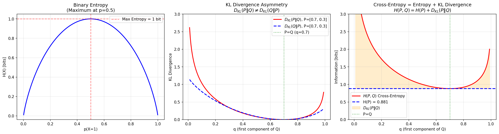
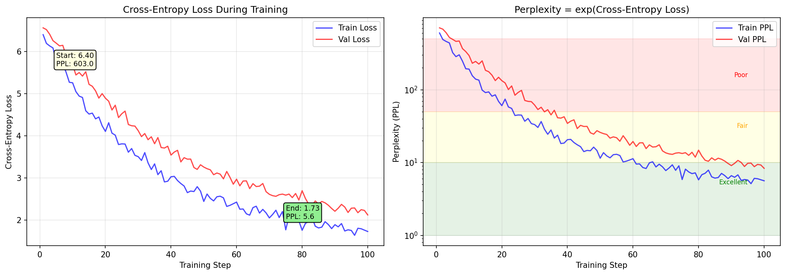

# 第六章：信息论 —— LLM 的"度量衡"

## 🎯 本章目标

学完这一章，咱们要能回答这几个问题：

1. **信息量**到底是什么？为什么用"对数"来衡量？
2. **信息熵**在度量什么？它和最大熵原理有什么关系？
3. **交叉熵**为什么是 LLM 最常用的损失函数？
4. **KL 散度**和交叉熵是什么关系？为什么它不是"距离"？
5. **困惑度（Perplexity）**怎么评估语言模型的好坏？
6. **互信息**又是什么？和前几个概念什么关系？

### 在 LLM 中的位置

信息论是 LLM 的**度量系统**——就像尺子量长度、秤称重量，信息论给我们一套工具来度量"信息"、"不确定性"、"两个分布有多像"。

```
训练 LLM 的核心循环：

  真实文本（P） ──→ 模型预测（Q） ──→ 交叉熵损失 ──→ 反向传播 ──→ 更新参数
                         ↑                    ↑
                    信息论的核心概念        信息论的核心应用
```

**关键联系：**
- **损失函数** = 交叉熵（Cross-Entropy Loss）
- **模型评估** = 困惑度（Perplexity）
- **RLHF / DPO** = KL 散度约束（防止模型跑偏）

---

## 📝 概念讲解

### 1. 信息量（自信息）：一个事件带来多少"惊喜"

想象一下这两个场景：

- 🌞 朋友告诉你："明天太阳会从东边升起"——你的反应："这不是废话吗？"
- ☄️ 朋友告诉你："明天有陨石会砸中你家"——你的反应："！！！真的假的？！"

**越不可能发生的事，一旦发生，带来的信息量越大。** 这就是信息量的直觉。

反过来想：确定性事件没有信息量（"太阳从东边升起"没有信息），极其罕见的事件信息量巨大。

那怎么量化呢？假设事件发生的概率是 $p$，信息量 $I$ 应该满足：

- $p$ 越小 → $I$ 越大（越稀奇越有信息）
- $p = 1$ → $I = 0$（确定性事件没信息）
- 两个独立事件同时发生 → 信息量应该相加（$I(A \cap B) = I(A) + I(B)$）

> 🤔 **暂停思考**：什么数学运算能把乘法变成加法？
>
> ——对数！$\log(ab) = \log a + \log b$

所以信息量（自信息）的定义是：

$$I(x) = -\log p(x)$$

**为什么有个负号？** 因为 $0 < p(x) \leq 1$，所以 $\log p(x) \leq 0$，加个负号让信息量为正——符合直觉：信息量是非负的。

> 💡 **关于底数**：通常用自然对数 $\ln$（单位：nat），或 $\log_2$（单位：bit）。在 LLM 中，用哪个都行，只差一个常数倍。

**举个例子：**

- 公平硬币正面朝上：$p = 0.5$，$I = -\log_2(0.5) = 1$ bit
- 掷骰子点数为 6：$p = 1/6$，$I = -\log_2(1/6) \approx 2.58$ bit
- 中彩票（概率百万分之一）：$I = -\log_2(10^{-6}) \approx 19.93$ bit

概率越小，信息量越大——完全符合直觉！

---

### 2. 信息熵：随机变量的"平均惊喜"

信息量衡量的是**单个事件**的惊喜程度。但很多时候我们关心的是一个**随机变量整体**的不确定性——这就要用到**熵**。

**熵 = 信息量的期望（平均值）：**

$$H(X) = \mathbb{E}[I(X)] = -\sum_{x} p(x) \log p(x)$$

**直观理解：** 熵是"你平均需要多少信息才能确定这个随机变量的值"。

**三个经典例子：**

| 随机变量 | 分布 | 熵 |
|---------|------|-----|
| 确定性事件 | $p = 1$（某个结果） | $H = 0$（完全确定） |
| 公平硬币 | $p = 0.5, 0.5$ | $H = 1$ bit |
| 公平骰子 | $p = 1/6$ × 6 | $H = \log_2 6 \approx 2.58$ bit |

**关键洞察：等概率分布的熵最大。**

> 🤔 **暂停检查**：为什么等概率时熵最大？
>
> 因为等概率意味着最不确定——你没有任何理由偏向某个结果。确定性最高→熵最小；不确定性最高→熵最大。

这就是**最大熵原理**：在满足已知约束的条件下，选择熵最大的分布。在 LLM 中，我们希望模型在训练数据之外保持"最大的不确定性"——不过度自信。

**最大熵原理的一个简单应用：**
- 已知随机变量有 $n$ 个等可能结果 → 猜均匀分布（$p = 1/n$）
- 已知均值和方差 → 猜正态分布
- 已知均值（正值）→ 猜指数分布

这些分布都是在各自约束下熵最大的分布，也就是说：**它们做了最少的额外假设**。



---

### 3. 交叉熵：用"错误的码本"编码的平均长度

这里我要用一个比喻，请跟紧我 🎯

**比喻：密码本**

假设你要用 0-1 编码来传输天气信息。真实天气分布是 $P$（晴天 70%，雨天 20%，阴天 10%），但你以为分布是 $Q$（晴天 33%，雨天 33%，阴天 34%）。

你会按照 $Q$ 来设计编码方案——给"晴天"分配较长的码（因为你以为它只有 33%），给"雨天"较短的码。

但实际天气是按 $P$ 出现的！所以**用 $Q$ 的编码来传输 $P$ 的数据**，平均需要的码长就是**交叉熵**：

$$H(P, Q) = -\sum_{x} p(x) \log q(x)$$

注意：$\log$ 里面是 $q(x)$（你用的编码），求期望用的是 $p(x)$（真实分布）。

**关键关系：**

$$H(P, Q) = H(P) + D_{KL}(P \| Q)$$

交叉熵 = 真实熵 + KL 散度

这告诉我们：**交叉熵永远 ≥ 真实熵**。只有当 $P = Q$ 时，交叉熵才等于真实熵（这时 $D_{KL} = 0$）。

> 🤔 **暂停思考**：为什么交叉熵是 LLM 的损失函数？
>
> 在训练 LLM 时：
> - $P$ = 真实数据的分布（真实下一个 token 的概率，one-hot）
> - $Q$ = 模型预测的分布（模型给每个 token 的概率）
> - 最小化 $H(P, Q)$ ⟺ 最小化 $D_{KL}(P \| Q)$ ⟺ 让 $Q$ 尽可能接近 $P$
>
> 因为 $H(P)$ 是常数（真实数据的熵不变），最小化交叉熵就等于最小化 KL 散度，也就是让模型预测尽量接近真实分布！



---

### 4. KL 散度：两个分布之间的"差距"

KL 散度（Kullback-Leibler divergence）直接度量两个分布之间的差异：

$$D_{KL}(P \| Q) = \sum_{x} p(x) \log \frac{p(x)}{q(x)} = -\sum_{x} p(x) \log \frac{q(x)}{p(x)}$$

可以理解为：**用 $Q$ 近似 $P$ 时，平均多出来的信息量**。

**KL 散度的三个重要性质：**

1. **非负性**：$D_{KL}(P \| Q) \geq 0$，当且仅当 $P = Q$ 时为 0
2. **非对称性**：$D_{KL}(P \| Q) \neq D_{KL}(Q \| P)$（一般情况）
3. **不是距离**：因为不对称，所以 KL 散度不是数学意义上的"距离"

> 🤔 **为什么不对称？直觉理解**
>
> - $D_{KL}(P \| Q)$：假设 $P$ 是真相，用 $Q$ 去近似 $P$ 的代价
> - $D_{KL}(Q \| P)$：假设 $Q$ 是真相，用 $P$ 去近似 $Q$ 的代价
>
> 这两个代价一般不一样！
>
> **具体例子**：$P$ 是均匀分布，$Q$ 是尖峰分布。
> - $D_{KL}(P \| Q)$：用尖峰 $Q$ 去近似均匀 $P$——代价很高，因为 $Q$ 在很多地方概率接近 0，$\log(q/p)$ 会非常大
> - $D_{KL}(Q \| P)$：用均匀 $P$ 去近似尖峰 $Q$——代价较低，$P$ 到处都有非零概率

**在 LLM 中的应用：RLHF / DPO 中的 KL 约束**

在 RLHF（基于人类反馈的强化学习）中，我们用强化学习微调模型，但不能让模型跑偏太远。所以损失函数中加了一项 KL 散度惩罚：

$$\mathcal{L} = -\mathbb{E}[\text{奖励}] + \beta \cdot D_{KL}(\pi_\theta \| \pi_{\text{ref}})$$

其中 $\pi_\theta$ 是当前策略，$\pi_{\text{ref}}$ 是参考模型（通常是 SFT 后的模型）。$\beta$ 控制"不要离参考模型太远"的程度。

---

### 5. 困惑度（Perplexity）：模型到底有多"困惑"

**困惑度 = 交叉熵的指数：**

$$\text{PPL} = 2^{H(P, Q)} \quad (\text{以 2 为底时})$$

或者用自然对数：

$$\text{PPL} = e^{H(P, Q)}$$

**直观理解：困惑度 = 模型在每个位置上"平均犹豫在多少个候选词之间"。**

- PPL = 1：模型完全确定，没有任何犹豫（过拟合的信号？）
- PPL = 10：模型平均在 10 个词之间犹豫
- PPL = 100：模型非常不确定
- PPL 越低越好（但太低可能是过拟合）

**计算公式（在 token 级别）：**

$$\text{PPL} = \exp\left(-\frac{1}{N}\sum_{i=1}^{N} \log q(x_i)\right)$$

其中 $N$ 是序列长度，$q(x_i)$ 是模型给第 $i$ 个真实 token 的概率。

> 🤔 **暂停思考**：为什么 GPT-4 的困惑度比 GPT-2 低得多？
>
> 因为 GPT-4 更"确定"——它在每个位置上给真实 token 的概率更高，所以 $-\log q(x_i)$ 更小，PPL 更低。它更"不困惑"。

**参考值（英语文本）：**
| 模型 | 困惑度（约） |
|------|-------------|
| GPT-2 | 30-40 |
| GPT-3 | 15-20 |
| GPT-4 | ~10 或更低 |
| 人类 | ~10-15 |

---

### 6. 互信息：两个随机变量之间的"信息共享"

**互信息**衡量两个随机变量之间共享了多少信息：

$$I(X; Y) = H(X) - H(X | Y) = H(Y) - H(Y | X)$$

**直觉：** "知道 $Y$ 之后，$X$ 的不确定性减少了多少？"

也可以写成 KL 散度的形式：

$$I(X; Y) = D_{KL}(P_{XY} \| P_X \times P_Y)$$

即：联合分布与边缘分布乘积之间的 KL 散度。如果 $X$ 和 $Y$ 独立，则 $P_{XY} = P_X \times P_Y$，互信息为 0。

**文氏图理解：**

```
    H(X)          H(Y)
  ┌─────────┐  ┌─────────┐
  │         │  │         │
  │   I(X;Y)│  │         │
  │  ┌──────┼──┼──────┐  │
  │  │共享区 │  │      │  │
  │  └──────┼──┼──────┘  │
  │H(X|Y)   │  │ H(Y|X) │
  └─────────┘  └─────────┘
```

**在 LLM 中的应用：**
- **特征选择**：互信息可以帮助选择哪些特征和目标最相关
- **信息瓶颈理论**：模型需要在压缩输入和保留与输出相关信息之间取得平衡

---

## 🔢 公式推导（不跳步）

### 推导 1：交叉熵 ≥ 真实熵（用 Jensen 不等式）

**目标：** 证明 $H(P, Q) \geq H(P)$，即 $D_{KL}(P \| Q) \geq 0$

**步骤：**

$$D_{KL}(P \| Q) = \sum_{x} p(x) \log \frac{p(x)}{q(x)}$$

$$= -\sum_{x} p(x) \log \frac{q(x)}{p(x)}$$

因为 $-\log(\cdot)$ 是凸函数（convex），由 **Jensen 不等式**：

$$-\sum_{x} p(x) \log \frac{q(x)}{p(x)} \geq -\log\left(\sum_{x} p(x) \cdot \frac{q(x)}{p(x)}\right)$$

$$= -\log\left(\sum_{x} q(x)\right)$$

$$= -\log(1) = 0$$

因此 $D_{KL}(P \| Q) \geq 0$，等号成立当且仅当 $p(x) = q(x)$ 对所有 $x$ 成立。

再由 $H(P, Q) = H(P) + D_{KL}(P \| Q)$，得 $H(P, Q) \geq H(P)$。 ∎

### 推导 2：交叉熵损失的具体形式

在 LLM 训练中，真实分布 $P$ 是 one-hot 的——即对于位置 $i$，真实 token 是 $x_i$（一个确定的 token），所以 $p(x_i) = 1$，其余 token 概率为 0。

$$H(P, Q) = -\sum_{x} p(x) \log q(x)$$

由于 $p(x_i) = 1$，其余为 0：

$$H(P, Q) = -1 \cdot \log q(x_i) = -\log q(x_i)$$

对于整个序列（$N$ 个 token），平均交叉熵损失：

$$\mathcal{L} = -\frac{1}{N} \sum_{i=1}^{N} \log q(x_i)$$

这就是 **负对数似然损失（NLL Loss）**，也就是 PyTorch 中的 `CrossEntropyLoss`！

> 💡 **这就是为什么信息论如此重要：LLM 的损失函数直接来自信息论的核心概念。**

### 推导 3：互信息与熵的关系

$$I(X; Y) = \sum_{x,y} p(x,y) \log \frac{p(x,y)}{p(x)p(y)}$$

展开：

$$= \sum_{x,y} p(x,y) \log p(x,y) - \sum_{x,y} p(x,y) \log p(x) - \sum_{x,y} p(x,y) \log p(y)$$

$$= -H(X,Y) + H(X) + H(Y)$$

$$= H(X) - H(X|Y) = H(Y) - H(Y|X)$$

**互信息的对称性：** $I(X; Y) = I(Y; X)$（与 KL 散度不同，互信息是对称的！）

---

## 💻 代码验证

### 代码 1：计算交叉熵损失（模拟 LLM 训练）

```python
import numpy as np
import matplotlib
matplotlib.use('Agg')
import matplotlib.pyplot as plt

# === 模拟一个简单的 LLM 预测 ===
# 词汇表大小 = 5，模型对下一个 token 的预测分布
vocab = ["我", "爱", "吃", "苹", "果"]

# 模型预测的 logits（未经 softmax 的原始输出）
logits = np.array([2.0, 1.0, 0.5, 0.3, 0.2])

# Softmax 转换为概率
def softmax(x):
    e_x = np.exp(x - np.max(x))  # 数值稳定
    return e_x / e_x.sum()

q = softmax(logits)
print("模型预测分布 Q:", dict(zip(vocab, q.round(4))))

# 真实 token 是 "我"（index=0）
true_token_idx = 0
p = np.zeros(5)
p[true_token_idx] = 1.0  # one-hot

# 手动计算交叉熵损失
cross_entropy = -np.sum(p * np.log(q))
print(f"交叉熵损失: {cross_entropy:.4f}")
print(f"等价于: -log(q[真token]) = -log({q[true_token_idx]:.4f}) = {-np.log(q[true_token_idx]):.4f}")

# 计算困惑度
ppl = np.exp(cross_entropy)
print(f"困惑度 (PPL): {ppl:.4f}")

# === 不同预测质量对比 ===
print("\n--- 不同预测质量的对比 ---")
scenarios = {
    "完美预测 (logits=[100,0,0,0,0])": np.array([100, 0, 0, 0, 0]),
    "较好预测": np.array([2.0, 1.0, 0.5, 0.3, 0.2]),
    "随机预测": np.array([0.1, 0.1, 0.1, 0.1, 0.1]),
    "反向预测 (真token概率最低)": np.array([0.1, 0.2, 0.3, 0.5, 2.0]),
}

for name, logits in scenarios.items():
    q = softmax(logits)
    loss = -np.log(q[true_token_idx])
    ppl = np.exp(loss)
    print(f"{name}: 损失={loss:.4f}, PPL={ppl:.4f}")
```

### 代码 2：可视化熵、KL 散度和交叉熵

```python
import numpy as np
import matplotlib
matplotlib.use('Agg')
import matplotlib.pyplot as plt

# === 图1: 二元分布的熵 ===
fig, axes = plt.subplots(1, 3, figsize=(18, 5))

# 二元分布 P = [p, 1-p] 的熵
p_vals = np.linspace(0.001, 0.999, 1000)
entropy = -p_vals * np.log2(p_vals) - (1 - p_vals) * np.log2(1 - p_vals)

axes[0].plot(p_vals, entropy, 'b-', linewidth=2)
axes[0].axhline(y=1, color='r', linestyle='--', alpha=0.5, label='最大熵 = 1 bit')
axes[0].axvline(x=0.5, color='r', linestyle='--', alpha=0.5)
axes[0].set_xlabel('p(X=1)')
axes[0].set_ylabel('H(X) [bits]')
axes[0].set_title('二元随机变量的熵\n（p=0.5 时熵最大）')
axes[0].legend()
axes[0].grid(True, alpha=0.3)

# === 图2: KL 散度的非对称性 ===
# P = [p, 1-p] 固定, Q = [q, 1-q] 变化
p_true = 0.7  # 固定 P
q_vals = np.linspace(0.01, 0.99, 200)

# D_KL(P || Q)
kl_pq = p_true * np.log(p_true / q_vals) + (1-p_true) * np.log((1-p_true) / (1-q_vals))

# D_KL(Q || P)
kl_qp = q_vals * np.log(q_vals / p_true) + (1-q_vals) * np.log((1-q_vals) / (1-p_true))

axes[1].plot(q_vals, kl_pq, 'r-', linewidth=2, label=f'D_KL(P‖Q), P=[0.7, 0.3]')
axes[1].plot(q_vals, kl_qp, 'b--', linewidth=2, label=f'D_KL(Q‖P), P=[0.7, 0.3]')
axes[1].axvline(x=p_true, color='g', linestyle=':', alpha=0.7, label=f'P=Q 时 (q={p_true})')
axes[1].set_xlabel('q (Q 分布的第一个分量)')
axes[1].set_ylabel('KL 散度')
axes[1].set_title('KL 散度的非对称性\n（D_KL(P‖Q) ≠ D_KL(Q‖P)）')
axes[1].legend()
axes[1].set_ylim(0, 3)
axes[1].grid(True, alpha=0.3)

# === 图3: 交叉熵 vs 真实熵 vs KL 散度 ===
# P = [0.7, 0.3] 固定
p_true_arr = np.array([0.7, 0.3])
q_vals2 = np.linspace(0.01, 0.99, 200)

H_P = -np.sum(p_true_arr * np.log2(p_true_arr))  # 真实熵（常数）
cross_ent = np.array([
    -np.sum(p_true_arr * np.log2(np.array([q, 1-q])))
    for q in q_vals2
])
kl_div = cross_ent - H_P

axes[2].plot(q_vals2, cross_ent, 'r-', linewidth=2, label='交叉熵 H(P,Q)')
axes[2].axhline(y=H_P, color='b', linestyle='--', linewidth=2, label=f'真实熵 H(P) = {H_P:.3f}')
axes[2].fill_between(q_vals2, H_P, cross_ent, alpha=0.2, color='orange', label='KL 散度 D_KL(P‖Q)')
axes[2].axvline(x=0.7, color='g', linestyle=':', alpha=0.7, label='P=Q 时')
axes[2].set_xlabel('q (Q 分布的第一个分量)')
axes[2].set_ylabel('信息量 [bits]')
axes[2].set_title('交叉熵 = 真实熵 + KL 散度\n（H(P,Q) = H(P) + D_KL(P‖Q)）')
axes[2].legend()
axes[2].set_ylim(0, 3)
axes[2].grid(True, alpha=0.3)

plt.tight_layout()
plt.savefig('/tmp/llm-math-foundations/chapter06-information-theory/images/entropy-binary.png', dpi=150, bbox_inches='tight')
print("图1已保存: entropy-binary.png")
```

### 代码 3：LLM 训练中的交叉熵损失可视化

```python
import numpy as np
import matplotlib
matplotlib.use('Agg')
import matplotlib.pyplot as plt

# === 模拟训练过程中损失和困惑度的变化 ===
fig, axes = plt.subplots(1, 2, figsize=(14, 5))

# 模拟训练步骤
steps = np.arange(1, 101)

# 模拟损失下降（带噪声）
np.random.seed(42)
base_loss = 5.0 * np.exp(-0.03 * steps) + 1.5
noise = np.random.normal(0, 0.1, len(steps))
train_loss = base_loss + noise

# 计算困惑度
train_ppl = np.exp(train_loss)

# 模拟验证损失
val_loss = 5.0 * np.exp(-0.025 * steps) + 1.8 + np.random.normal(0, 0.08, len(steps))
val_ppl = np.exp(val_loss)

# 图1: 交叉熵损失
axes[0].plot(steps, train_loss, 'b-', alpha=0.7, label='训练损失')
axes[0].plot(steps, val_loss, 'r-', alpha=0.7, label='验证损失')
axes[0].set_xlabel('训练步数')
axes[0].set_ylabel('交叉熵损失')
axes[0].set_title('LLM 训练中的交叉熵损失变化')
axes[0].legend()
axes[0].grid(True, alpha=0.3)
axes[0].annotate(f'初始损失: {train_loss[0]:.2f}\nPPL: {train_ppl[0]:.1f}',
                 xy=(5, train_loss[5]), fontsize=9,
                 bbox=dict(boxstyle='round', facecolor='lightyellow'))
axes[0].annotate(f'最终损失: {train_loss[-1]:.2f}\nPPL: {train_ppl[-1]:.1f}',
                 xy=(75, train_loss[-1]+0.3), fontsize=9,
                 bbox=dict(boxstyle='round', facecolor='lightgreen'))

# 图2: 困惑度（对数刻度）
axes[1].plot(steps, train_ppl, 'b-', alpha=0.7, label='训练 PPL')
axes[1].plot(steps, val_ppl, 'r-', alpha=0.7, label='验证 PPL')
axes[1].set_xlabel('训练步数')
axes[1].set_ylabel('困惑度 (PPL)')
axes[1].set_title('困惑度 = exp(交叉熵损失)')
axes[1].set_yscale('log')
axes[1].legend()
axes[1].grid(True, alpha=0.3)

# 标注关键区间
axes[1].axhspan(1, 10, alpha=0.1, color='green', label='优秀 (PPL<10)')
axes[1].axhspan(10, 50, alpha=0.1, color='yellow', label='一般 (10<PPL<50)')
axes[1].axhspan(50, 500, alpha=0.1, color='red', label='较差 (PPL>50)')

plt.tight_layout()
plt.savefig('/tmp/llm-math-foundations/chapter06-information-theory/images/cross-entropy-kl.png', dpi=150, bbox_inches='tight')
print("图2已保存: cross-entropy-kl.png")
```

### 运行所有脚本

```bash
cd /tmp/llm-math-foundations/chapter06-information-theory/scripts
python cross_entropy_demo.py
python visualize_entropy.py
python training_loss_viz.py
```

---

## 🎯 LLM 关联：信息论在 LLM 中的三大应用

### 应用 1：交叉熵损失函数（训练的核心）

```python
import torch
import torch.nn as nn

# 模型输出: batch_size=2, vocab_size=5
logits = torch.tensor([[2.0, 1.0, 0.5, 0.3, 0.2],
                        [0.5, 2.5, 0.1, 0.2, 0.3]])

# 真实 token ID
targets = torch.tensor([0, 1])  # "我", "爱"

# PyTorch 的 CrossEntropyLoss = LogSoftmax + NLLLoss
criterion = nn.CrossEntropyLoss()
loss = criterion(logits, targets)
print(f"交叉熵损失: {loss.item():.4f}")

# 等价手动计算:
import torch.nn.functional as F
log_probs = F.log_softmax(logits, dim=-1)
manual_loss = F.nll_loss(log_probs, targets)
print(f"手动计算:   {manual_loss.item():.4f}")
```

**为什么 LLM 不用 MSE（均方误差）？**

因为语言模型输出的是**概率分布**（多项分布），交叉熵是概率分布之间最自然的"距离"。MSE 适合连续值回归，但对概率分布效果差（梯度信号弱、不满足概率论性质）。

### 应用 2：Perplexity 评估

```python
def compute_perplexity(model_losses):
    """从每个 token 的交叉熵损失计算困惑度"""
    avg_loss = np.mean(model_losses)
    ppl = np.exp(avg_loss)
    return ppl

# 示例：GPT-2 在某数据集上每个 token 的平均损失约 3.5
avg_loss = 3.5
ppl = np.exp(avg_loss)
print(f"平均交叉熵损失: {avg_loss}")
print(f"困惑度 PPL: {ppl:.1f}")  # 约 33.1
```

### 应用 3：KL 散度在 RLHF / DPO 中的应用

在 DPO（Direct Preference Optimization）中，损失函数的核心就是 KL 散度：

$$\mathcal{L}_{DPO} = -\mathbb{E}\left[\log \sigma\left(\beta \log \frac{\pi_\theta(y_w | x)}{\pi_{ref}(y_w | x)} - \beta \log \frac{\pi_\theta(y_l | x)}{\pi_{ref}(y_l | x)}\right)\right]$$

其中 $y_w$ 是人类偏好的回答，$y_l$ 是不偏好的回答，$\pi_{ref}$ 是参考模型。$\log \frac{\pi_\theta}{\pi_{ref}}$ 正是 KL 散度中的一个项。

**为什么需要 KL 约束？**

没有约束的话，模型可能通过生成极端文本来"欺骗"奖励模型。KL 散度确保模型不会偏离参考模型太远——就像一根弹性绳，可以拉长但不能拉断。

---

## ❓ 思考题

### 题 1（概念理解）
如果一个语言模型在某个 token 位置给真实 token 的概率为 1.0，这个位置的交叉熵损失是多少？困惑度是多少？这在实际中可能吗？为什么？

<details>
<summary>💡 提示</summary>

$-\log(1.0) = 0$，PPL = $e^0 = 1$。在实际中几乎不可能，因为 softmax 输出不会精确到 1.0，而且训练数据总有噪声。
</details>

### 题 2（公式推导）
证明：对于离散随机变量，如果 $P = Q$，则 $D_{KL}(P \| Q) = 0$。

<details>
<summary>💡 提示</summary>

当 $P = Q$ 时，$\frac{p(x)}{q(x)} = 1$，所以 $\log(1) = 0$，求和为 0。
</details>

### 题 3（实际应用）
假设模型 A 在测试集上的困惑度是 20，模型 B 是 25。哪个模型更好？模型 A 在每个位置上平均"犹豫在多少个词之间"？

<details>
<summary>💡 提示</summary>

PPL 越低越好，所以模型 A 更好。模型 A 平均在每个位置上犹豫在约 20 个词之间。
</details>

### 题 4（深度思考）
为什么 KL 散度不是对称的？在 RLHF 中，我们用 $D_{KL}(\pi_\theta \| \pi_{ref})$ 而不是 $D_{KL}(\pi_{ref} \| \pi_\theta)$，为什么？

<details>
<summary>💡 提示</summary>

$D_{KL}(\pi_\theta \| \pi_{ref})$ 衡量的是"当前策略相比参考策略多了多少信息"。当 $\pi_\theta$ 在某个位置给高概率但 $\pi_{ref}$ 给低概率时，KL 值会很大——这正是我们想惩罚的"模型跑偏"。反过来，$D_{KL}(\pi_{ref} \| \pi_\theta)$ 在 $\pi_\theta$ 给低概率的地方惩罚大，可能会导致模型不敢探索。
</details>

### 题 5（综合应用）
给定一个公平骰子（6 面），计算它的信息熵。如果有人告诉你"点数大于 3"（即 4、5、6），你获得了多少信息？之后剩余的熵是多少？

<details>
<summary>💡 提示</summary>

原始熵：$H = \log_2 6 \approx 2.58$ bit。

知道"点数 > 3"后，剩下 3 个等概率结果，条件熵：$H(X | X > 3) = \log_2 3 \approx 1.58$ bit。

获得的信息量 = $2.58 - 1.58 = 1$ bit（恰好是原来 2 个等概率事件的信息量：是否大于 3）。
</details>

---

## 📚 本章小结

| 概念 | 公式 | 直觉 | LLM 应用 |
|------|------|------|---------|
| 信息量 | $I(x) = -\log p(x)$ | 事件的"惊喜度" | — |
| 信息熵 | $H(P) = -\sum p \log p$ | 分布的"不确定性" | 最大熵原理 |
| 交叉熵 | $H(P,Q) = -\sum p \log q$ | 用 Q 编码 P 的代价 | **损失函数** |
| KL 散度 | $D_{KL} = \sum p \log(p/q)$ | 两个分布的"差距" | **RLHF 约束** |
| 困惑度 | $PPL = e^{H(P,Q)}$ | 模型有多"困惑" | **模型评估** |
| 互信息 | $I(X;Y) = H(X) - H(X\|Y)$ | 两个变量的"信息共享" | 特征选择 |

**一句话记住它们的关系：**

$$\boxed{H(P, Q) = \underbrace{H(P)}_{\text{真实熵}} + \underbrace{D_{KL}(P \| Q)}_{\text{KL散度}}} \quad \text{PPL} = e^{H(P,Q)}$$

交叉熵 = 真实熵 + KL 散度，困惑度 = 交叉熵取指数。

训练 LLM = 最小化交叉熵 = 最小化 KL 散度 = 让模型分布逼近真实分布。

🌱 信息论就是 LLM 的"度量衡"——有了它，我们才知道模型好不好，以及怎么让它更好！

---

[← 第五章：概率分布](../chapter05-probability-distributions/README.md) | [第七章：最优化 →](../chapter07-optimization/README.md)
