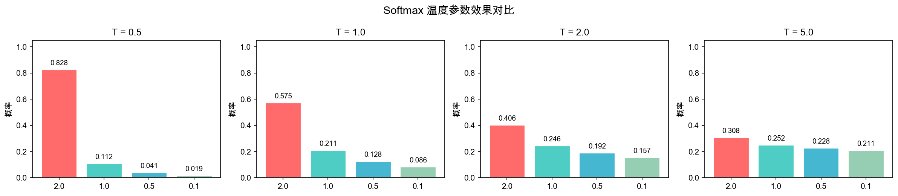
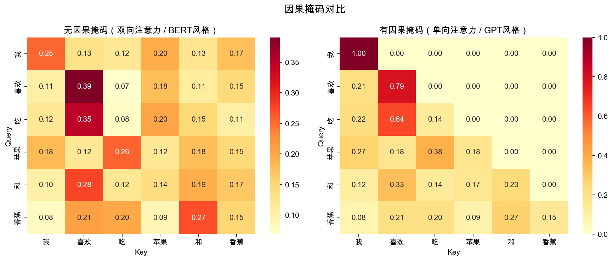
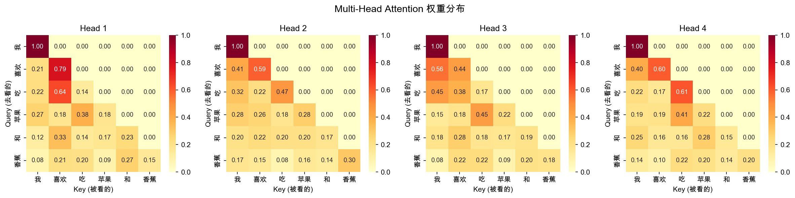
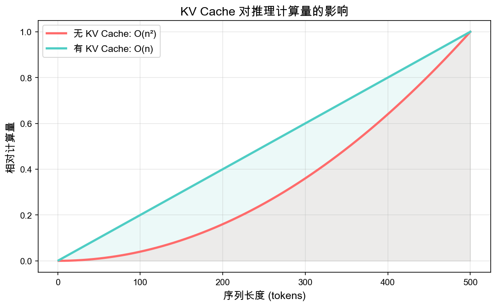

# 第七章：注意力机制的数学

> 🌱 *"注意力机制是 Transformer 的心脏——它让模型学会'看哪里'。"*

### 📚 前置知识

学习本章前，你需要熟悉：
- **Ch4 矩阵深入**：矩阵乘法的运算规则（QK^T 的计算）、Softmax 函数的定义和性质
- **Ch3 概率统计**：概率分布的基本概念（Softmax 输出就是一个概率分布）

---

## 🎯 本章目标 + 在 LLM 中的位置

### 本章学完你能做什么？

- ✅ 手推 Self-Attention 的完整计算过程，不跳任何一步
- ✅ 理解 Q/K/V 的数学含义，而不是把它们当成黑箱
- ✅ 解释为什么注意力分数要除以 √d_k（用方差的数学推导说服自己）
- ✅ 从零实现 Multi-Head Attention，并画出注意力热力图
- ✅ 理解因果掩码如何保证自回归生成的正确性
- ✅ 说清 KV Cache 为什么能加速推理

### 注意力在 LLM 中的位置

还记得咱们之前学过的架构吗？一个 Transformer 块长这样：

```
输入 x → [Layer Norm] → [Self-Attention] → 残差连接 → [Layer Norm] → [FFN] → 残差连接 → 输出
```

**Self-Attention 是 Transformer 唯一让不同位置的 token 相互交流的机制。** 没有 Attention，每个 token 就是一个孤岛——它只能看到自己，无法理解上下文。

> 💡 想象你在读一句话："苹果发布了新手机。" 你看到"苹果"这个词时，你需要往后看"手机"才能确定它是水果还是公司。**Attention 就是让"苹果"去"看"其他词的机制。**

---

## 📝 概念讲解

### 1. Softmax 函数

在讲注意力之前，咱们得先认识它的"好搭档"——Softmax。

#### 公式

对于一个向量 **z** = [z₁, z₂, ..., zₙ]，Softmax 定义为：

$$\text{Softmax}(z_i) = \frac{e^{z_i}}{\sum_{j=1}^{n} e^{z_j}}$$

#### 为什么用 eˣ 而不是其他函数？

好问题！咱们来想想，把分数变成概率分布，需要满足什么条件？

1. **所有值都是正的** → eˣ 永远 > 0 ✅
2. **所有值加起来等于 1** → 因为分母是所有 eˣ 的和 ✅
3. **大的值应该得到更大的权重** → eˣ 是单调递增的 ✅
4. **可微分** → eˣ 的导数是 eˣ 自己 ✅

用 x² 行不行？不行——x² 在负数域不是单调的。用 |x| 呢？在 0 点不可微。所以 **eˣ 几乎是唯一满足所有条件的"天选之子"**。

#### 温度参数

在注意力中，Softmax 常常带一个温度参数 T：

$$\text{Softmax}(z_i, T) = \frac{e^{z_i / T}}{\sum_{j=1}^{n} e^{z_j / T}}$$

- T 大 → 分布更均匀（"我很犹豫，谁都差不多"）
- T 小 → 分布更尖锐（"我很确定，就选这个！"）
- T → 0 → 趋近 one-hot（"就是它了！"）
- T → ∞ → 趋近均匀分布（"随便吧"）

> 🎨 想象你在选餐厅。温度高 = "都行啊随便"，温度低 = "我只吃火锅！" LLM 生成的 diversity 也受温度控制。

> ❓ **温度 T vs 缩放因子 √d_k，有什么区别？** 它们都出现在 Softmax 的分母里，但目的完全不同：
> - **√d_k 控方差**：除以 √d_k 是为了把点积的方差拉回 1，防止梯度消失——这是训练稳定性的需要，在训练时是固定的，不可调。
> - **T 控多样性**：温度 T 是在推理时人为调节的，用来控制生成文本的随机性。T 大则输出更多样，T 小则更确定。
> - 一句话：**√d_k 是给 Softmax "修路"（让它正常工作），T 是给 Softmax "踩油门/刹车"（控制输出风格）。**

口说无凭，画出来看看——不同温度下 Softmax 的分布差异一目了然：

```python
import torch
import torch.nn.functional as F
import matplotlib.pyplot as plt

# 用同一组分数，看不同温度下的 Softmax 输出
fig, axes = plt.subplots(1, 4, figsize=(16, 3))
temperatures = [0.5, 1.0, 2.0, 5.0]
test_scores = torch.tensor([2.0, 1.0, 0.5, 0.1])

for ax, T in zip(axes, temperatures):
    probs = F.softmax(test_scores / T, dim=0)
    ax.bar(range(4), probs.numpy(), color=['#FF6B6B', '#4ECDC4', '#45B7D1', '#96CEB4'])
    ax.set_title(f"T = {T}")
    ax.set_ylim(0, 1)
    ax.set_xticks(range(4))
    ax.set_xticklabels(['2.0', '1.0', '0.5', '0.1'])

plt.suptitle("Softmax 温度参数效果", fontsize=14)
plt.tight_layout()
plt.savefig("./images/softmax_temperature.png", dpi=150, bbox_inches='tight')
plt.close()
print("Softmax 温度对比图已保存")
```



*图：不同温度下 Softmax 的输出分布。温度越低越集中（T=0.5 时几乎全押在最大值上），越高越均匀（T=5.0 时四个分数的权重差距不大）。*

> 💡 你看 T=0.5 那张图，几乎变成 one-hot 了——"只吃火锅！"再看 T=5.0，四个柱子快一样高了——"随便吧都行。" 这就是温度的直观效果。

---

### 2. 缩放点积注意力（Scaled Dot-Product Attention）

> **核心**：这是 Attention 的核心公式——$\\text{Softmax}\\left(\\frac{QK^T}{\\sqrt{d_k}}\\right) V$，也是整章最需要吃透的部分。

这是 Attention 的核心公式：

$$\text{Attention}(Q, K, V) = \text{Softmax}\left(\frac{QK^T}{\sqrt{d_k}}\right) V$$

别急，咱们一步步拆解。

#### Q、K、V 是什么？

> **核心**：QKV 是注意力机制的三个核心角色——理解它们的含义是掌握 Attention 的关键。

- **Q（Query）**：我在找什么？——"我想知道这个词和其他词的关系"
- **K（Key）**：我有什么？——"我身上有什么信息可以被匹配"
- **V（Value）**：我的内容是什么？——"匹配上了就给你这些信息"

> 🖥️ 类比图书馆找书：你心里有个查询意图（Q），每本书有标签（K），找到匹配的书后你读它的内容（V）。

数学上，Q、K、V 是输入向量 **x** 经过线性变换得到的：

$$Q = x W_Q, \quad K = x W_K, \quad V = x W_V$$

其中 W_Q, W_K, W_V 是可学习的参数矩阵。**注意：这三个矩阵让模型学习"怎么问""怎么答""答什么"。**

#### 注意力分数计算（完整推导）

假设输入序列有 n 个 token，每个 token 的嵌入维度是 **d_model**（即模型的主维度，也叫隐藏维度 hidden size）。例如 GPT-2 Small 的 d_model = 768，意味着每个 token 用一个 768 维的向量表示。d_model 贯穿整个模型——输入、输出、残差连接都是这个维度。

**Step 1: 计算注意力分数矩阵**

Q 的形状：[n, d_k]，K 的形状：[n, d_k]

$$S = QK^T \quad \text{形状：[n, n]}$$

矩阵 S 的第 i 行第 j 列的元素：s_ij = q_i · k_j（点积），表示 token i 对 token j 的"原始关注度"。

**Step 2: 缩放**

$$\hat{S} = \frac{S}{\sqrt{d_k}}$$

**为什么要除以 √d_k？** 这是个极好的数学问题，咱们来推导一下。

假设 q_i 和 k_j 的每个分量都是均值为 0、方差为 1 的独立随机变量。那么它们的点积：

$$s_{ij} = \sum_{l=1}^{d_k} q_{il} \cdot k_{jl}$$

因为各项独立，方差可以相加：

$$\text{Var}(s_{ij}) = \sum_{l=1}^{d_k} \text{Var}(q_{il} \cdot k_{jl}) = d_k \cdot \text{Var}(q \cdot k)$$

如果 Var(q) = Var(k) = 1，那么 Var(q·k) = 1，所以：

$$\text{Var}(s_{ij}) = d_k$$

**标准差 = √d_k。** 当 d_k = 64 时，标准差 = 8。这意味着点积的值可能达到 ±16 甚至更大。

为什么这有问题？因为 Softmax 对很大的值非常敏感：

```
Softmax([2, 1, 0]) = [0.67, 0.24, 0.09]  ← 还行，分布合理
Softmax([20, 10, 0]) = [1.00, 0.00, 0.00]  ← 梯度几乎为 0！
```

当输入值很大时，Softmax 的梯度趋近于零，导致训练困难（梯度消失）。

除以 √d_k 就把方差拉回 1，让 Softmax 工作在"舒适区"。

> 💡 记住：**缩放的目的是控制方差**，让 Softmax 的输入保持在一个梯度友好的范围。

**Step 3: Softmax 归一化**

对每一行做 Softmax：

$$A = \text{Softmax}(\hat{S}) \quad \text{按行归一化}$$

矩阵 A 的每一行和为 1，a_ij 表示 token i 对 token j 的注意力权重。

**Step 4: 加权求和**

$$\text{Output} = AV \quad \text{形状：[n, d_v]}$$

输出第 i 个 token 的表示 = 所有 token 的 V 按注意力权重加权求和：

$$\text{output}_i = \sum_{j=1}^{n} a_{ij} \cdot v_j$$

> 🎯 **一句话总结：每个 token 的新表示 = 它"看了"其他所有 token 之后，按关注度加权汇总的信息。**

咱们来用代码把刚才的公式跑一遍——`scaled_dot_product_attention` 的实现就是上面四个 Step 的逐行翻译：

```python
import torch
import torch.nn as nn
import torch.nn.functional as F

def scaled_dot_product_attention(Q, K, V, mask=None):
    """
    Q: [batch, n_heads, seq_len, d_k]
    K: [batch, n_heads, seq_len, d_k]
    V: [batch, n_heads, seq_len, d_v]
    mask: [seq_len, seq_len] 或可广播的形状
    """
    d_k = Q.size(-1)
    
    # Step 1: 计算注意力分数
    scores = torch.matmul(Q, K.transpose(-2, -1))  # [batch, n_heads, seq_len, seq_len]
    
    # Step 2: 缩放
    scores = scores / torch.sqrt(torch.tensor(d_k, dtype=torch.float32))
    
    # Step 3: 加掩码（如果有）
    if mask is not None:
        scores = scores.masked_fill(mask == 0, float('-inf'))
    
    # Step 4: Softmax
    attn_weights = F.softmax(scores, dim=-1)
    
    # Step 5: 加权求和
    output = torch.matmul(attn_weights, V)  # [batch, n_heads, seq_len, d_v]
    
    return output, attn_weights
```

> 💡 你看，代码就是公式的直译：`matmul` → QK^T，`/ sqrt(d_k)` → 缩放，`masked_fill` → 掩码，`softmax` → 归一化，再 `matmul` → 乘 V。没有魔法，全是数学。

---

### 3. 多头注意力（Multi-Head Attention）

> **核心**：多头注意力让模型同时从多个角度看问题——这是 Transformer 表达能力的关键来源。

#### 为什么要多头？

一个注意力头只能学一种"关注模式"。但语言中的关系是多样的：

- 有的头关注语法关系（主语→谓语）
- 有的头关注指代关系（"它"→前面的名词）
- 有的头关注位置关系（相邻的词）

**多头注意力 = 让模型同时从多个角度看问题。**

#### 数学定义

把 d_model 维度切成 h 个头，每个头的维度 d_k = d_model / h：

$$\text{MultiHead}(Q, K, V) = \text{Concat}(\text{head}_1, \text{head}_2, ..., \text{head}_h) W_O$$

其中每个头：

$$\text{head}_i = \text{Attention}(QW_Q^i, KW_K^i, VW_V^i)$$

W_O 是输出的投影矩阵，形状 [d_model, d_model]。

#### 并行计算

所有头是**完全独立**的，可以并行计算。这就是为什么 GPU 上的注意力计算很高效。

> 🎨 类比：一个侦探查案，与其让一个人想破头，不如派出 8 个侦探，每个从不同角度调查，最后汇总结果。

#### GPT-2 的注意力配置

- d_model = 768
- 头数 h = 12
- 每个头维度 d_k = 768 / 12 = 64

刚才实现了单头注意力，现在咱们把它包成多头版本——关键是"分头 → 各算 → 拼回来"：

```python
class MultiHeadAttention(nn.Module):
    def __init__(self, d_model, n_heads):
        super().__init__()
        assert d_model % n_heads == 0, "d_model 必须能被 n_heads 整除"
        
        self.d_model = d_model
        self.n_heads = n_heads
        self.d_k = d_model // n_heads
        
        # Q, K, V 的线性投影
        self.W_q = nn.Linear(d_model, d_model)
        self.W_k = nn.Linear(d_model, d_model)
        self.W_v = nn.Linear(d_model, d_model)
        
        # 输出投影
        self.W_o = nn.Linear(d_model, d_model)
    
    def forward(self, x, mask=None):
        batch_size, seq_len, _ = x.size()
        
        # 线性投影并分头
        Q = self.W_q(x).view(batch_size, seq_len, self.n_heads, self.d_k).transpose(1, 2)
        K = self.W_k(x).view(batch_size, seq_len, self.n_heads, self.d_k).transpose(1, 2)
        V = self.W_v(x).view(batch_size, seq_len, self.n_heads, self.d_k).transpose(1, 2)
        
        # 计算注意力
        attn_output, attn_weights = scaled_dot_product_attention(Q, K, V, mask)
        
        # 合并多头
        attn_output = attn_output.transpose(1, 2).contiguous().view(batch_size, seq_len, self.d_model)
        
        # 输出投影
        output = self.W_o(attn_output)
        
        return output, attn_weights
```

> 💡 发现了吗？多头注意力的代码其实就是三步：① 线性投影后 `view` + `transpose` 把 d_model 拆成 h × d_k（分头）；② 每个头独立调用 `scaled_dot_product_attention`（各算）；③ `transpose` 回来再 `view` 拼成 d_model（拼回来）。形状变换是理解多头注意力的关键。

---

### 4. 因果掩码（Causal Mask）

#### 为什么需要掩码？

在语言模型中，生成是**自回归（Autoregressive）**的——所谓自回归，就是模型每次只生成一个 token，而且第 t 个 token 只能看到前 t-1 个 token，不能"偷看"未来的信息。简单说：**一个字一个字地写，每次写的时候只能看前面已经写好的。** 生成公式：P(x₁, x₂, ..., xₙ) = P(x₁) · P(x₂|x₁) · P(x₃|x₁,x₂) · ... · P(xₙ|x₁,...,xₙ₋₁)。

> 📝 类比：写作文时，你写第 3 个字的时候，不可能看到第 5 个字——因为第 5 个字还不存在！

#### 掩码的数学实现

创建一个下三角矩阵 M：

```
M = [[0, -∞, -∞, -∞],
     [0,  0, -∞, -∞],
     [0,  0,  0, -∞],
     [0,  0,  0,  0]]
```

在 Softmax 之前加上掩码：

$$\hat{S}_{\text{masked}} = \hat{S} + M$$

因为 e^(-∞) = 0，所以被 -∞ 遮住的位置在 Softmax 后权重为 0，即"完全看不到"。

```python
# 用代码实现因果掩码
import torch
n = 4
mask = torch.triu(torch.ones(n, n), diagonal=1) * float('-inf')
# tensor([[0., -inf, -inf, -inf],
#         [0.,   0., -inf, -inf],
#         [0.,   0.,   0., -inf],
#         [0.,   0.,   0.,   0.]])
```

咱们画出来对比一下——有没有因果掩码，注意力矩阵长什么样：

```python
import seaborn as sns

torch.manual_seed(42)

# 用一组 6 个 token 来演示
batch_size = 1
seq_len = 6
d_model = 24
n_heads = 4
tokens = ["我", "喜欢", "吃", "苹果", "和", "香蕉"]

x = torch.randn(batch_size, seq_len, d_model)
causal_mask = torch.tril(torch.ones(seq_len, seq_len)).unsqueeze(0).unsqueeze(0)
# causal_mask[i, j] = 1 表示可以看到，0 表示看不到

mha = MultiHeadAttention(d_model, n_heads)
_, attn_no_mask = mha(x, mask=None)
_, attn_with_mask = mha(x, mask=causal_mask)

fig, (ax1, ax2) = plt.subplots(1, 2, figsize=(12, 5))

# 取 head 0
sns.heatmap(attn_no_mask[0, 0].detach().numpy(),
            xticklabels=tokens, yticklabels=tokens,
            cmap="YlOrRd", ax=ax1, annot=True, fmt='.2f')
ax1.set_title("无因果掩码（双向注意力）")
ax1.set_xlabel("Key")
ax1.set_ylabel("Query")

sns.heatmap(attn_with_mask[0, 0].detach().numpy(),
            xticklabels=tokens, yticklabels=tokens,
            cmap="YlOrRd", ax=ax2, annot=True, fmt='.2f')
ax2.set_title("有因果掩码（单向注意力）")
ax2.set_xlabel("Key")
ax2.set_ylabel("Query")

plt.suptitle("因果掩码对比", fontsize=14)
plt.tight_layout()
plt.savefig("./images/causal_mask_comparison.png", dpi=150, bbox_inches='tight')
plt.close()
print("因果掩码对比图已保存")
```



*图：左边是双向注意力（BERT 风格），右边是因果注意力（GPT 风格）。注意右上角被遮住了。*

> 💡 你看右边那张图，右上角全是黑的——那些位置的权重被 -∞ 强制归零了。"我"只能看到"我"自己，"喜欢"能看到"我"和"喜欢"，以此类推。这就是因果掩码的效果：**每个 token 只能往后看，不能往前偷看。**

---

### 5. 注意力矩阵的分析

训练好模型后，我们可以可视化注意力矩阵，观察模型学到了什么模式。

#### 常见的注意力模式

| 模式 | 描述 | 示例 |
|------|------|------|
| 对角线 | 每个 token 关注自己 | 名词关注自身 |
| 前一行 | 关注前一个 token | 相邻词的关系 |
| 远程依赖 | 关注远处的 token | "它"→"猫"（指代消解） |
| 关注特殊 token | 所有 token 关注 [CLS] 或句首 | 全局信息聚合 |

> ❓ **暂停检查：** 你能想到为什么 GPT 用因果掩码（下三角），而 BERT 不需要吗？（提示：想想它们的训练目标有什么不同。）

咱们把刚才多头注意力的权重画成热力图，看看每个头都在关注什么：

```python
def visualize_attention(attn_weights, tokens, title="注意力权重", save_path=None):
    """
    attn_weights: [n_heads, seq_len, seq_len] 或 [seq_len, seq_len]
    tokens: token 名称列表
    """
    if attn_weights.dim() == 4:
        attn_weights = attn_weights[0]  # 取 batch 中的第一个
    
    n_heads = attn_weights.size(0)
    fig, axes = plt.subplots(1, n_heads, figsize=(4 * n_heads, 4))
    if n_heads == 1:
        axes = [axes]
    
    for i, ax in enumerate(axes):
        sns.heatmap(attn_weights[i].detach().numpy(),
                    xticklabels=tokens, yticklabels=tokens,
                    cmap="YlOrRd", ax=ax, vmin=0, vmax=1,
                    annot=True, fmt='.2f', annot_kws={'size': 8})
        ax.set_title(f"Head {i+1}")
        ax.set_xlabel("Key (被看的)")
        ax.set_ylabel("Query (去看的)")
    
    plt.suptitle(title, fontsize=14)
    plt.tight_layout()
    if save_path:
        plt.savefig(save_path, dpi=150, bbox_inches='tight')
        print(f"图片已保存到 {save_path}")
    plt.close()

# 用上面已经算好的 attn_with_mask 来可视化
visualize_attention(attn_with_mask, tokens, title="Multi-Head Attention 权重",
                   save_path="./images/attention_heatmap.png")
```



*图：4 个注意力头的权重分布。颜色越深表示关注度越高。*

> 💡 你看热力图的颜色分布——不同的头关注的东西不太一样。有的头关注自身（对角线亮），有的头关注前一个 token（次对角线亮），有的头可能关注更远的依赖。这就是多头注意力的意义：**每个头各干各的，最后拼起来得到丰富的信息**。

---

### 6. KV Cache 的数学

#### 推理时的计算

在自回归生成中，假设已经生成了 t-1 个 token，现在要生成第 t 个。

每次生成一个新 token，理论上需要重新计算整个序列的注意力：

$$\text{Attention}(Q_{1:t}, K_{1:t}, V_{1:t})$$

但我们仔细看：**前 t-1 个 token 之间的注意力关系并没有改变！** 只有新 token 需要计算它对所有前面 token 的注意力。

#### KV Cache 的做法

缓存已经计算过的 K 和 V：

```
第1步：计算 q1, k1, v1 → 缓存 k1, v1 → output1 = Attn(q1, k1, v1)
第2步：计算 q2, k2, v2 → 缓存 k2, v2 → output2 = Attn(q2, [k1;k2], [v1;v2])
第3步：计算 q3, k3, v3 → 缓存 k3, v3 → output3 = Attn(q3, [k1;k2;k3], [v1;v2;v3])
...
```

> 💡 类比：考试写答案，你不需要每次都从头重新读题。你把题目记住了（缓存），每次只看新信息。

#### 复杂度对比

| 方法 | 第 t 步的计算量 | 总计算量（生成 n 个 token） |
|------|-----------------|---------------------------|
| 无缓存 | O(t · d) 每步 | O(n² · d) |
| 有 KV Cache | O(d) 每步 | O(n · d) |

**从 O(n²) 降到 O(n)，推理速度提升巨大！** 这就是为什么 KV Cache 是 LLM 推理的标配优化。

#### KV Cache 的显存开销

KV Cache 需要存储 2 × n_layers × n_tokens × d_model 个 float 值。

以 GPT-2 为例：12 层 × 768 维 × 2（K+V），生成 1024 个 token 的缓存大小：

$$2 \times 12 \times 1024 \times 768 \times 2 \text{ bytes (float16)} \approx 36 \text{ MB}$$

对于更大的模型（如 LLaMA-70B），KV Cache 会消耗数 GB 显存——这就是 **MQA（Multi-Query Attention）** 和 **GQA（Grouped-Query Attention）** 优化的动机。



*🌱 图：有无 KV Cache 时推理计算的对比——没有缓存时每步都要重新计算所有 token 的 Key 和 Value，有了缓存后只需计算新增 token 的部分，推理速度从 O(n²) 降到 O(n)*

咱们用代码模拟一下 KV Cache 的过程，看看它到底省了多少计算：

```python
def attention_with_kv_cache(new_x, W_q, W_k, W_v, cached_k=None, cached_v=None):
    """
    模拟单步自回归生成时的 KV Cache。
    
    new_x: [batch, 1, d_model] — 新 token 的嵌入
    cached_k, cached_v: 之前缓存的 K 和 V
    返回: output, 更新后的 cached_k, cached_v
    """
    # 只计算新 token 的 Q、K、V
    new_q = W_q(new_x)  # [batch, 1, d_model]
    new_k = W_k(new_x)
    new_v = W_v(new_x)
    
    # 拼接缓存
    if cached_k is not None:
        K = torch.cat([cached_k, new_k], dim=1)  # [batch, t, d_model]
        V = torch.cat([cached_v, new_v], dim=1)
    else:
        K = new_k
        V = new_v
    
    # 只用新 token 的 Q 去查（不是整个序列重新算！）
    scores = torch.matmul(new_q, K.transpose(-2, -1)) / (new_q.size(-1) ** 0.5)
    attn_weights = F.softmax(scores, dim=-1)
    output = torch.matmul(attn_weights, V)
    
    # 返回结果和更新后的缓存
    return output, K.detach(), V.detach()


# ---- 模拟生成 5 个 token ----
torch.manual_seed(42)
d_model = 16
W_q = nn.Linear(d_model, d_model)
W_k = nn.Linear(d_model, d_model)
W_v = nn.Linear(d_model, d_model)

cached_k, cached_v = None, None
print("模拟自回归生成（带 KV Cache）：")
print(f"{'步骤':<6}{'新 token Q':<16}{'K 缓存长度':<14}{'V 缓存长度':<14}{'FLOPs（QK^T）'}")
print("-" * 60)

for step in range(1, 6):
    new_token = torch.randn(1, 1, d_model)
    output, cached_k, cached_v = attention_with_kv_cache(
        new_token, W_q, W_k, W_v, cached_k, cached_v
    )
    # QK^T 的计算量 = d_model × cache_len
    flops = d_model * cached_k.size(1)
    print(f"t={step:<4} Q: [1,{d_model}]    K: [1,{cached_k.size(1):<4}]    V: [1,{cached_v.size(1):<4}]    {flops} ops")

print(f"\n✅ 总 FLOPs（有缓存）: {d_model * sum(range(1, 6))} = d_model × (1+2+3+4+5)")
print(f"❌ 总 FLOPs（无缓存）: {d_model * (5*5)} = d_model × 5²")
print(f"🏆 缓存省了 {100 * (1 - sum(range(1,6))/(5*5)):.0f}% 的计算！")
```

> 💡 跑一下这段代码你就看到了——有 KV Cache 时，每步的计算量只跟当前缓存长度成正比（线性增长），而无缓存时每步都要 n²。对于长序列，省下来的计算量是巨大的。

---

## 🔢 完整公式推导（不跳步）

让我们用具体数字走一遍 Self-Attention 的完整计算。

### 设定

- 序列长度 n = 3（3 个 token）
- d_k = d_v = 4（为了演示，用小维度）
- 已计算好 Q、K、V

### 输入

```
Q = [[1.0, 0.5, -0.3, 0.8],    ← token 1 的 query
     [0.2, 1.0, 0.4, -0.1],     ← token 2 的 query
     [-0.5, 0.3, 1.2, 0.6]]     ← token 3 的 query

K = [[0.9, 0.3, 0.1, -0.5],    ← token 1 的 key
     [0.1, 0.8, -0.2, 0.7],     ← token 2 的 key
     [-0.3, 0.6, 1.0, 0.4]]     ← token 3 的 key

V = [[1.1, 0.4, -0.2, 0.5],    ← token 1 的 value
     [0.3, 0.9, 0.6, -0.3],     ← token 2 的 value
     [-0.4, 0.7, 1.1, 0.2]]     ← token 3 的 value
```

### Step 1: 计算注意力分数 S = QK^T

$$s_{11} = q_1 \cdot k_1 = 1.0 \times 0.9 + 0.5 \times 0.3 + (-0.3) \times 0.1 + 0.8 \times (-0.5) = 0.9 + 0.15 - 0.03 - 0.4 = 0.62$$

$$s_{12} = q_1 \cdot k_2 = 1.0 \times 0.1 + 0.5 \times 0.8 + (-0.3) \times (-0.2) + 0.8 \times 0.7 = 0.1 + 0.4 + 0.06 + 0.56 = 1.12$$

$$s_{13} = q_1 \cdot k_3 = 1.0 \times (-0.3) + 0.5 \times 0.6 + (-0.3) \times 1.0 + 0.8 \times 0.4 = -0.3 + 0.3 - 0.3 + 0.32 = 0.02$$

继续计算其余行...

$$S = \begin{bmatrix} 0.62 & 1.12 & 0.02 \\ -0.04 & 0.15 & 0.83 \\ -0.53 & 0.56 & 1.39 \end{bmatrix}$$

### Step 2: 缩放 Ŝ = S / √d_k

d_k = 4, √d_k = 2

$$\hat{S} = \frac{S}{2} = \begin{bmatrix} 0.31 & 0.56 & 0.01 \\ -0.02 & 0.075 & 0.415 \\ -0.265 & 0.28 & 0.695 \end{bmatrix}$$

### Step 3: 加因果掩码（可选，自回归模式时）

$$\hat{S}_{\text{masked}} = \hat{S} + \begin{bmatrix} 0 & -\infty & -\infty \\ 0 & 0 & -\infty \\ 0 & 0 & 0 \end{bmatrix} = \begin{bmatrix} 0.31 & -\infty & -\infty \\ -0.02 & 0.075 & -\infty \\ -0.265 & 0.28 & 0.695 \end{bmatrix}$$

### Step 4: Softmax（按行）

以第 3 行为例：

> 💡 **注意**：第 3 行对应 token 3，它是序列中最后一个 token。由于因果掩码的下三角结构，第 3 行没有任何位置被遮住（它可以看到所有前面的 token 和自己）。所以无论加不加掩码，第 3 行的值都一样。这里我们直接用不加掩码的值来计算。

$$\text{row}_3 = [-0.265, 0.28, 0.695]$$

$$e^{-0.265} = 0.767, \quad e^{0.28} = 1.323, \quad e^{0.695} = 2.004$$

$$\text{sum} = 0.767 + 1.323 + 2.004 = 4.094$$

$$A_{\text{row3}} = [0.767/4.094, 1.323/4.094, 2.004/4.094] = [0.187, 0.323, 0.489]$$

**解读：** token 3 最关注 token 3 自己（48.9%），其次是 token 2（32.3%），最少关注 token 1（18.7%）。

### Step 5: 加权求和 Output = A × V

$$\text{output}_3 = 0.187 \times v_1 + 0.323 \times v_2 + 0.489 \times v_3$$

$$= 0.187 \times [1.1, 0.4, -0.2, 0.5] + 0.323 \times [0.3, 0.9, 0.6, -0.3] + 0.489 \times [-0.4, 0.7, 1.1, 0.2]$$

$$= [0.206, 0.075, -0.037, 0.094] + [0.097, 0.291, 0.194, -0.097] + [-0.196, 0.342, 0.538, 0.098]$$

$$= [0.107, 0.708, 0.695, 0.095]$$

**完成！** 这就是 token 3 经过 Self-Attention 后的新表示。它融入了整个序列的信息，而不仅仅是自己的嵌入。

> 🎯 **关键洞察：** 注意力的输出不是"替换"原始表示，而是创建了一个**融合了上下文信息的新表示**。在 Transformer 中，这个输出还会经过残差连接和 Layer Norm，与原始信息合并。

手算完了，咱们用代码验证一下——用上面推导中的**完全相同的 Q、K、V**，跑一遍 `scaled_dot_product_attention`，看数字对不对得上：

```python
# 用公式推导中的完全相同的 Q、K、V
Q_manual = torch.tensor([[1.0, 0.5, -0.3, 0.8],
                          [0.2, 1.0, 0.4, -0.1],
                          [-0.5, 0.3, 1.2, 0.6]])

K_manual = torch.tensor([[0.9, 0.3, 0.1, -0.5],
                          [0.1, 0.8, -0.2, 0.7],
                          [-0.3, 0.6, 1.0, 0.4]])

V_manual = torch.tensor([[1.1, 0.4, -0.2, 0.5],
                          [0.3, 0.9, 0.6, -0.3],
                          [-0.4, 0.7, 1.1, 0.2]])

# 加上 batch 和 n_heads 维度（这里 1 个 batch、1 个头）
Q_input = Q_manual.unsqueeze(0).unsqueeze(0)  # [1, 1, 3, 4]
K_input = K_manual.unsqueeze(0).unsqueeze(0)
V_input = V_manual.unsqueeze(0).unsqueeze(0)

# ---- 无掩码版本（对应上面的完整推导）----
output, attn_weights = scaled_dot_product_attention(Q_input, K_input, V_input, mask=None)

print("=== 无掩码版本 ===")
print(f"注意力分数矩阵 S:\n{torch.matmul(Q_input, K_input.transpose(-2, -1))[0, 0].numpy().round(2)}")
print(f"\n缩放后 Ŝ = S / √4:\n{(torch.matmul(Q_input, K_input.transpose(-2, -1)) / 2)[0, 0].numpy().round(3)}")
print(f"\n注意力权重 A（Softmax 后）:\n{attn_weights[0, 0].numpy().round(3)}")
print(f"\n输出 Output = A × V:\n{output[0, 0].numpy().round(3)}")

# 对比手算结果
print(f"\n✅ 手算 output_3 = [0.107, 0.708, 0.695, 0.095]")
print(f"   代码 output_3 = {output[0, 0, 2].numpy().round(3).tolist()}")

# ---- 有因果掩码版本 ----
causal_mask = torch.tril(torch.ones(3, 3)).unsqueeze(0).unsqueeze(0)
output_masked, attn_masked = scaled_dot_product_attention(Q_input, K_input, V_input, mask=causal_mask)

print(f"\n=== 有因果掩码版本 ===")
print(f"注意力权重 A（因果掩码）:\n{attn_masked[0, 0].numpy().round(3)}")
print(f"\n输出（因果掩码）:\n{output_masked[0, 0].numpy().round(3).tolist()}")
```

> 💡 跑一遍就能看到——代码算出来的 output_3 和咱们手推的 `[0.107, 0.708, 0.695, 0.095]` 完全一致！手算和代码交叉验证通过 ✅。这就是用同一组数据推导+编码的好处——你可以确信自己每一步都没算错。

---

### 📐 完整数值示例：从输入到输出（多头注意力）

上面我们手算了单头注意力。现在我们把整条流水线走一遍——**从原始输入到多头注意力的最终输出**，让你看到完整的 shape 变化链。

#### Shape 总览表

先看全局——多头注意力中每一步的形状变化：

| 步骤 | 张量 | 形状 | 说明 |
|------|------|------|------|
| 输入 | $X$ | `(batch, seq_len, d_model)` | 3 个 token，4 维 |
| Query / Key / Value | $Q, K, V$ | `(batch, seq_len, d_model)` | 线性投影后 |
| 按头拆分 | $Q_h, K_h, V_h$ | `(batch, heads, seq_len, head_dim)` | reshape + transpose |
| 注意力分数 | $Q_h K_h^T$ | `(batch, heads, seq_len, seq_len)` | 每个头独立算 |
| 缩放后分数 | $\frac{Q_h K_h^T}{\sqrt{d_k}}$ | `(batch, heads, seq_len, seq_len)` | 除以 $\sqrt{\text{head\_dim}}$ |
| 注意力权重 | softmax 后 | `(batch, heads, seq_len, seq_len)` | 每行归一化 |
| 每个头的输出 | $A_h V_h$ | `(batch, heads, seq_len, head_dim)` | 加权求和 |
| 拼接 | Concat | `(batch, seq_len, d_model)` | 所有头横向拼 |
| 最终输出 | $W_O \cdot \text{Concat}$ | `(batch, seq_len, d_model)` | 线性投影 |

> 💡 关键洞察：**每个 head 看到的是同一个输入的不同"视角"**——就像 3 个人从不同角度观察同一个场景，然后把各自看到的拼在一起。

#### 设定参数

- 3 个 token："我"、"爱"、"猫"
- `d_model = 4`，`heads = 2`，`head_dim = 2`
- 为方便手算，权重矩阵用简单的小数

#### Step 1：输入矩阵 $X$

$$
X = \begin{bmatrix} 1.0 & 0.5 & 0.3 & 0.1 \\ 0.8 & 1.2 & 0.4 & 0.6 \\ 0.2 & 0.7 & 1.1 & 0.9 \end{bmatrix} \quad \text{shape: } (3, 4)
$$

每一行是一个 token 的 4 维 embedding。

#### Step 2：线性投影得到 Q、K、V

$$
W_Q = \begin{bmatrix} 0.1 & 0.3 & -0.1 & 0.2 \\ 0.4 & -0.2 & 0.3 & 0.1 \\ -0.1 & 0.5 & 0.2 & -0.3 \\ 0.3 & 0.1 & -0.2 & 0.4 \end{bmatrix}, \quad
Q = X W_Q = \begin{bmatrix} 0.30 & -0.13 & 0.24 & 0.09 \\ 0.49 & -0.10 & 0.18 & 0.30 \\ 0.17 & 0.31 & 0.18 & 0.14 \end{bmatrix}
$$

$$
W_K = \begin{bmatrix} 0.2 & -0.1 & 0.3 & 0.1 \\ -0.3 & 0.4 & 0.1 & 0.2 \\ 0.1 & 0.2 & -0.3 & 0.1 \\ 0.4 & -0.1 & 0.2 & 0.3 \end{bmatrix}, \quad
K = X W_K = \begin{bmatrix} -0.03 & 0.27 & 0.37 & 0.20 \\ 0.10 & 0.28 & 0.48 & 0.46 \\ 0.34 & 0.36 & -0.12 & 0.43 \end{bmatrix}
$$

$$
W_V = \begin{bmatrix} 0.3 & 0.1 & 0.2 & -0.1 \\ -0.2 & 0.4 & 0.1 & 0.3 \\ 0.1 & -0.3 & 0.4 & 0.2 \\ 0.4 & 0.2 & -0.1 & 0.1 \end{bmatrix}, \quad
V = X W_V = \begin{bmatrix} 0.31 & 0.13 & 0.17 & 0.12 \\ 0.32 & 0.50 & 0.23 & 0.40 \\ 0.27 & 0.14 & 0.48 & 0.32 \end{bmatrix}
$$

Q、K、V 的 shape 都是 `(3, 4)`。

#### Step 3：按头拆分

把 Q、K、V 的最后一维从 `(3, 4)` reshape 成 `(3, 2, 2)`（seq_len × heads × head_dim），再转置成 `(2, 3, 2)`（heads × seq_len × head_dim）：

**Head 1**（取第 0, 2 列）和 **Head 2**（取第 1, 3 列）：

$$
Q_1 = \begin{bmatrix} 0.30 & 0.24 \\ 0.49 & 0.18 \\ 0.17 & 0.18 \end{bmatrix}, \quad
Q_2 = \begin{bmatrix} -0.13 & 0.09 \\ -0.10 & 0.30 \\ 0.31 & 0.14 \end{bmatrix}
$$

$$
K_1 = \begin{bmatrix} -0.03 & 0.37 \\ 0.10 & 0.48 \\ 0.34 & -0.12 \end{bmatrix}, \quad
K_2 = \begin{bmatrix} 0.27 & 0.20 \\ 0.28 & 0.46 \\ 0.36 & 0.43 \end{bmatrix}
$$

$$
V_1 = \begin{bmatrix} 0.31 & 0.17 \\ 0.32 & 0.23 \\ 0.27 & 0.48 \end{bmatrix}, \quad
V_2 = \begin{bmatrix} 0.13 & 0.12 \\ 0.50 & 0.40 \\ 0.14 & 0.32 \end{bmatrix}
$$

每个子矩阵 shape: `(3, 2)`。

#### Step 4：计算注意力分数 $Q_h K_h^T$

**Head 1**：

$$
Q_1 K_1^T = \begin{bmatrix} 0.30 & 0.24 \\ 0.49 & 0.18 \\ 0.17 & 0.18 \end{bmatrix}
\begin{bmatrix} -0.03 & 0.10 & 0.34 \\ 0.37 & 0.48 & -0.12 \end{bmatrix}
= \begin{bmatrix} 0.080 & 0.145 & 0.073 \\ -0.006 & 0.135 & 0.147 \\ 0.062 & 0.106 & 0.036 \end{bmatrix}
$$

**Head 2**：

$$
Q_2 K_2^T = \begin{bmatrix} -0.13 & 0.09 \\ -0.10 & 0.30 \\ 0.31 & 0.14 \end{bmatrix}
\begin{bmatrix} 0.27 & 0.28 & 0.36 \\ 0.20 & 0.46 & 0.43 \end{bmatrix}
= \begin{bmatrix} -0.017 & 0.005 & -0.009 \\ 0.033 & 0.110 & 0.093 \\ 0.112 & 0.150 & 0.170 \end{bmatrix}
$$

Shape: `(3, 3)` 每个 head。

#### Step 5：缩放 $\div \sqrt{d_k} = \sqrt{2} \approx 1.414$

**Head 1**（除以 1.414）：

$$
\text{scores}_1 = \begin{bmatrix} 0.057 & 0.103 & 0.052 \\ -0.004 & 0.095 & 0.104 \\ 0.044 & 0.075 & 0.025 \end{bmatrix}
$$

**Head 2**（除以 1.414）：

$$
\text{scores}_2 = \begin{bmatrix} -0.012 & 0.004 & -0.006 \\ 0.023 & 0.078 & 0.066 \\ 0.079 & 0.106 & 0.120 \end{bmatrix}
$$

#### Step 6：Softmax（每行归一化）

> 注意：这里的分数比较小且接近，所以 softmax 后每个 token 对其他 token 的注意力会比较均匀。这正是小维度+简单权重的特点——真实模型中分数差距会大得多。

**Head 1**（近似值，保留 3 位小数）：

$$
\alpha_1 \approx \begin{bmatrix} 0.341 & 0.357 & 0.303 \\ 0.321 & 0.348 & 0.332 \\ 0.343 & 0.354 & 0.303 \end{bmatrix}
$$

**Head 2**：

$$
\alpha_2 \approx \begin{bmatrix} 0.332 & 0.337 & 0.330 \\ 0.323 & 0.342 & 0.336 \\ 0.338 & 0.348 & 0.353 \end{bmatrix}
$$

> 💡 注意 Head 2 第 3 行（"猫"）——注意力权重从左到右递增（0.338 → 0.348 → 0.353），说明"猫"更关注后面的 token（包括自己）。而 Head 1 中"我"更关注中间的"爱"（0.357）。**两个头关注的位置偏好不同，这就是多头的价值。**

#### Step 7：加权求和 $A_h V_h$

**Head 1**：

$$
\text{head}_1 = \alpha_1 \cdot V_1 \approx \begin{bmatrix} 0.300 & 0.205 \\ 0.300 & 0.211 \\ 0.302 & 0.204 \end{bmatrix} \quad \text{shape: } (3, 2)
$$

**Head 2**：

$$
\text{head}_2 = \alpha_2 \cdot V_2 \approx \begin{bmatrix} 0.257 & 0.280 \\ 0.260 & 0.290 \\ 0.261 & 0.299 \end{bmatrix} \quad \text{shape: } (3, 2)
$$

#### Step 8：拼接 Concat

把 head_1 和 head_2 横向拼在一起：

$$
\text{Concat} = [\text{head}_1 \| \text{head}_2] = \begin{bmatrix} 0.300 & 0.205 & 0.257 & 0.280 \\ 0.300 & 0.211 & 0.260 & 0.290 \\ 0.302 & 0.204 & 0.261 & 0.299 \end{bmatrix} \quad \text{shape: } (3, 4)
$$

Shape 恢复到 `(3, 4) = (seq_len, d_model)` ✅

#### Step 9：最终线性投影 $W_O$

$$
W_O = \begin{bmatrix} 0.2 & -0.1 & 0.3 & 0.1 \\ -0.1 & 0.3 & -0.2 & 0.4 \\ 0.3 & 0.1 & 0.2 & -0.1 \\ 0.1 & 0.2 & 0.1 & 0.3 \end{bmatrix}
$$

$$
\text{Output} = \text{Concat} \cdot W_O \approx \begin{bmatrix} 0.152 & 0.104 & 0.126 & 0.162 \\ 0.152 & 0.107 & 0.125 & 0.167 \\ 0.156 & 0.103 & 0.125 & 0.167 \end{bmatrix} \quad \text{shape: } (3, 4)
$$

最终输出 shape: `(3, 4)` = `(seq_len, d_model)` ✅

#### 完整 shape 变化链

```
X (3,4) → Q,K,V (3,4) → split → Q_h (2,3,2) → QK^T (2,3,3)
→ scale (2,3,3) → softmax (2,3,3) → AV (2,3,2)
→ concat (3,4) → W_O (3,4)
```

> 🎯 **一句话总结**：多头注意力的全部数学操作就是**线性投影 → 分组点积 → 缩放归一化 → 加权求和 → 拼接 → 线性投影**。每个步骤都有明确的 shape，只要记住"分头算、拼回来"，就不会迷路。

#### 💻 代码验证

```python
import numpy as np

np.set_printoptions(precision=3)

# === 参数 ===
X = np.array([[1.0, 0.5, 0.3, 0.1],
              [0.8, 1.2, 0.4, 0.6],
              [0.2, 0.7, 1.1, 0.9]])  # (3, 4)

W_Q = np.array([[0.1, 0.3, -0.1, 0.2],
                [0.4, -0.2, 0.3, 0.1],
                [-0.1, 0.5, 0.2, -0.3],
                [0.3, 0.1, -0.2, 0.4]])

W_K = np.array([[0.2, -0.1, 0.3, 0.1],
                [-0.3, 0.4, 0.1, 0.2],
                [0.1, 0.2, -0.3, 0.1],
                [0.4, -0.1, 0.2, 0.3]])

W_V = np.array([[0.3, 0.1, 0.2, -0.1],
                [-0.2, 0.4, 0.1, 0.3],
                [0.1, -0.3, 0.4, 0.2],
                [0.4, 0.2, -0.1, 0.1]])

W_O = np.array([[0.2, -0.1, 0.3, 0.1],
                [-0.1, 0.3, -0.2, 0.4],
                [0.3, 0.1, 0.2, -0.1],
                [0.1, 0.2, 0.1, 0.3]])

# === Step 1-2: 线性投影 ===
Q = X @ W_Q  # (3, 4)
K = X @ W_K  # (3, 4)
V = X @ W_V  # (3, 4)

print(f"Q shape: {Q.shape}")
print(f"Q:\n{Q}\n")

# === Step 3: 按头拆分 (heads=2, head_dim=2) ===
# 取第 0,2 列为 head 1；第 1,3 列为 head 2
Q1, K1, V1 = Q[:, [0,2]], K[:, [0,2]], V[:, [0,2]]
Q2, K2, V2 = Q[:, [1,3]], K[:, [1,3]], V[:, [1,3]]

print(f"Q1 (head 1) shape: {Q1.shape}")

# === Step 4-5: 注意力分数 + 缩放 ===
dk = 2
scores1 = Q1 @ K1.T / np.sqrt(dk)
scores2 = Q2 @ K2.T / np.sqrt(dk)

print(f"\nscores_1:\n{scores1}")
print(f"scores_2:\n{scores2}")

# === Step 6: Softmax ===
def softmax(x):
    e = np.exp(x - x.max(axis=-1, keepdims=True))
    return e / e.sum(axis=-1, keepdims=True)

alpha1 = softmax(scores1)
alpha2 = softmax(scores2)

print(f"\nalpha_1 (head 1 weights):\n{alpha1}")
print(f"alpha_2 (head 2 weights):\n{alpha2}")

# === Step 7: 加权求和 ===
head1 = alpha1 @ V1  # (3, 2)
head2 = alpha2 @ V2  # (3, 2)

print(f"\nhead_1 output:\n{head1}")
print(f"head_2 output:\n{head2}")

# === Step 8: Concat ===
concat = np.concatenate([head1, head2], axis=1)  # (3, 4)
print(f"\nConcat shape: {concat.shape}")
print(f"Concat:\n{concat}")

# === Step 9: 最终线性投影 ===
output = concat @ W_O  # (3, 4)
print(f"\n✅ Final output shape: {output.shape}")
print(f"Output:\n{output}")
```

跑一遍，确认输出和手推一致！

---

### ✅ 学完本章你应该能做到

1. **手算单头 Attention**：给定 Q、K、V 矩阵，手动完成 QK^T → 缩放 → Softmax → 加权求和的全过程
2. **解释 Q/K/V 的作用**：说清 Query 是"我在找什么"、Key 是"我有什么"、Value 是"匹配后给你的内容"
3. **理解因果掩码**：解释为什么自回归模型需要下三角掩码，以及 -∞ 如何在 Softmax 中生效
4. **解释多头注意力的拼接**：说明"分头 → 各算 → Concat → 线性投影"的完整流程和形状变换
5. **理解缩放因子**：用方差的推导解释为什么除以 √d_k 对训练稳定性至关重要

---

## 🎯 LLM 关联

### GPT 系列的注意力配置

| 模型 | 层数 | d_model | 头数 | d_k | 参数量 |
|------|------|---------|------|-----|--------|
| GPT-2 Small | 12 | 768 | 12 | 64 | 117M |
| GPT-2 Medium | 24 | 1024 | 16 | 64 | 345M |
| GPT-2 Large | 36 | 1280 | 20 | 64 | 774M |
| GPT-2 XL | 48 | 1600 | 25 | 64 | 1.5B |
| GPT-3 | 96 | 12288 | 96 | 128 | 175B |

> 💡 注意一个有趣的点：GPT-2 的所有变体都使用 d_k = 64。这不是偶然——研究表明 64 是一个很好的平衡点，太小信息不够，太大计算量增加。

### 注意力参数量计算

每个 Transformer 层的注意力参数：

$$P_{\text{attn}} = 4 \times d_{\text{model}}^2$$

解释：W_Q、W_K、W_V、W_O 各是一个 d_model × d_model 的矩阵。

以 GPT-2 Small 为例：4 × 768² = 2,359,296 ≈ 2.4M 参数/层，12 层 ≈ 28.3M 仅注意力参数。

### Flash Attention 简介

> **深入**：Flash Attention 是工业级优化——理解它有助于你理解 LLM 推理的工程瓶颈，但不影响对 Attention 数学原理的理解。

标准注意力的瓶颈在于 **中间矩阵 A [n, n] 的显存占用**。当序列长度 n 很大时（如 n = 32K），这个矩阵就要占 32K × 32K × 4 bytes ≈ 4 GB！

**Flash Attention** 的核心思想：

1. **分块计算（Tiling）**：把 Q、K、V 切成小块，在 SRAM（快速缓存）中完成注意力计算
2. **不存储中间矩阵**：不需要把完整的 [n, n] 注意力矩阵写入 HBM（慢速显存）
3. **在线 Softmax**：通过数学技巧，在不知道全局 sum 的情况下正确计算 Softmax

> 🎨 类比：你要算全班 50 个人的平均分。标准方法是先算总分再除以 50（需要记住总分）。Flash Attention 的方法是每次看 5 个人，维护一个"运行中的平均值"，不需要记住所有人的分数。

**Flash Attention 的效果：**
- 显存：从 O(n²) 降到 O(n)
- 速度：实际提升 2-4 倍（减少了显存读写）
- 数学上**完全等价**（不是近似！）

---

## ⚠️ 常见卡点

### 卡点 1：为什么除以 √d_k？

直觉上不太好理解——为什么注意力分数要除以一个"维度相关"的数？

**关键原因**：点积 $q_i \cdot k_j$ 是 $d_k$ 个分量相乘再相加。当维度 $d_k$ 很大时（比如 64），点积的**值域**也会随之变大（方差 = $d_k$）。如果点积值跑到 ±20 这种范围，Softmax 就会输出接近 one-hot 的分布（比如 `[1.0, 0.0, 0.0]`），此时**梯度几乎为零**，模型学不动了。

除以 √d_k 就是把方差拉回 1，让 Softmax 的输入保持在"梯度友好"的范围。

> 💡 一句话记忆：**缩放 = 控方差 = 防 Softmax 梯度消失 = 让训练稳定。**

### 卡点 2：Q 和 K 到底是什么关系？

Q（Query）和 K（Key）的名字很抽象，但类比一下就清楚了：

- **Query = "我在找什么"**：每个 token 的 Q 是它在问"我需要关注谁？"
- **Key = "我有什么"**：每个 token 的 K 是它在回答"我身上有这些特征。"
- **点积 = 匹配度**：Q·K 衡量"你的需求"和"我的特征"有多匹配

> 🖥️ 就像图书馆找书：你的查询词（Q）和每本书的标签（K）做匹配，匹配度高的书你就多读（V）。

---

## ❓ 思考题

### 题 1：缩放的直觉

如果 d_k = 256（而不是 64），不除以 √d_k 会发生什么？训练时会出现什么现象？

<details>
<summary>💡 提示</summary>

想想点积的方差会变成多少，Softmax 在大输入时的梯度会怎样。
</details>

### 题 2：多头的必要性

假设我们只用 1 个注意力头（h=1），d_k = d_model = 768。和用 12 个头（d_k = 64）相比，模型的表达能力有什么区别？

<details>
<summary>💡 提示</summary>

考虑一下"一个 768 维的注意力"和"12 个独立的 64 维注意力再拼接"，哪一种能学到更丰富的模式？
</details>

### 题 3：KV Cache 的极限

KV Cache 能无限增长吗？在实际系统中，如果生成 100K 个 token，会遇到什么问题？有哪些解决方案？

<details>
<summary>💡 提示</summary>

显存是有限的。想想 Paged Attention、Sliding Window Attention、MQA/GQA 这些技术。
</details>

### 题 4：注意力与卷积

有人说"Self-Attention 是一种全连接图上的消息传递"。CNN 的卷积也可以看作一种局部消息传递。请对比两者：
- 感受野（每层能看到多远）
- 计算复杂度（与序列长度的关系）
- 归纳偏置（inductive bias）

### 题 5：Flash Attention 的直觉（理解题）

Flash Attention 不存储完整的 [n, n] 注意力矩阵，而是分块计算。请用你自己的话解释：
1. 为什么标准注意力需要 O(n²) 显存？瓶颈在哪？
2. Flash Attention 是通过什么策略把显存降到 O(n) 的？（不需要写出算法细节，说出核心思想即可）

<details>
<summary>💡 提示</summary>

想想：如果把 32K × 32K 的矩阵拆成小块，每次只算一块并立即用掉（不存下来），是不是就不需要那么大的显存了？关键在于——我们只需要最终的输出 O = Softmax(...)V，中间的注意力矩阵只是"过客"。
</details>

---

## 📚 总结

| 概念 | 核心公式 | 一句话记忆 |
|------|---------|-----------|
| Softmax | e^zᵢ / Σe^zⱼ | 把分数变成概率 |
| 缩放点积注意力 | Softmax(QK^T/√d_k)V | 查询 × 键 → 权重 × 值 |
| 多头注意力 | Concat(head₁,...,headₕ)W_O | 多角度看问题 |
| 因果掩码 | S + 下三角(-∞) | 不偷看未来 |
| KV Cache | 缓存已计算的 K, V | 不重复计算 |

> 🌱 **下一章预告：** 我们将进入**概率进阶与采样策略**——温度、Top-K、Top-P、MLE/NLL，理解 LLM 如何从概率分布中"采样"出文字。

---

*"注意力不是你拥有的一切，但一切都需要注意力。"* — 差点就说这话的某位智者 😄
