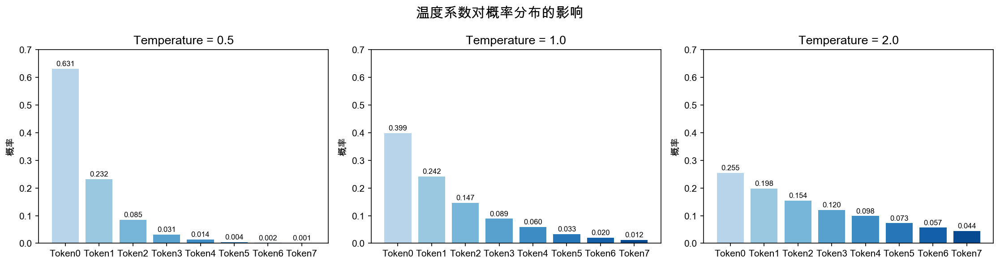
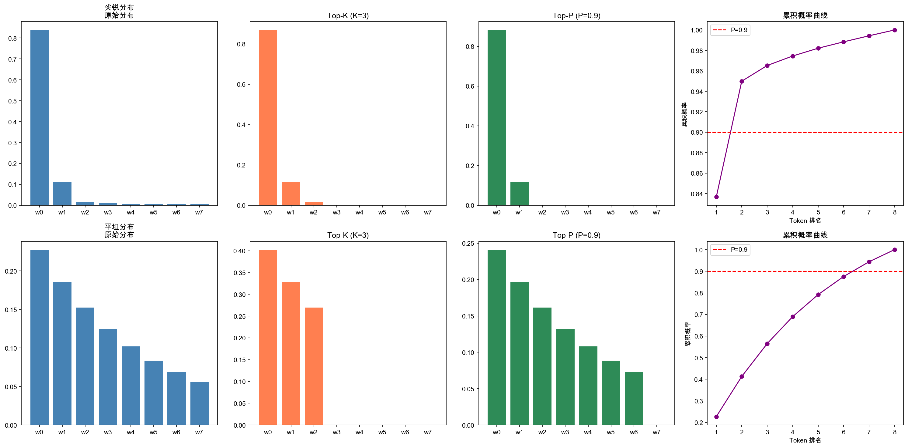
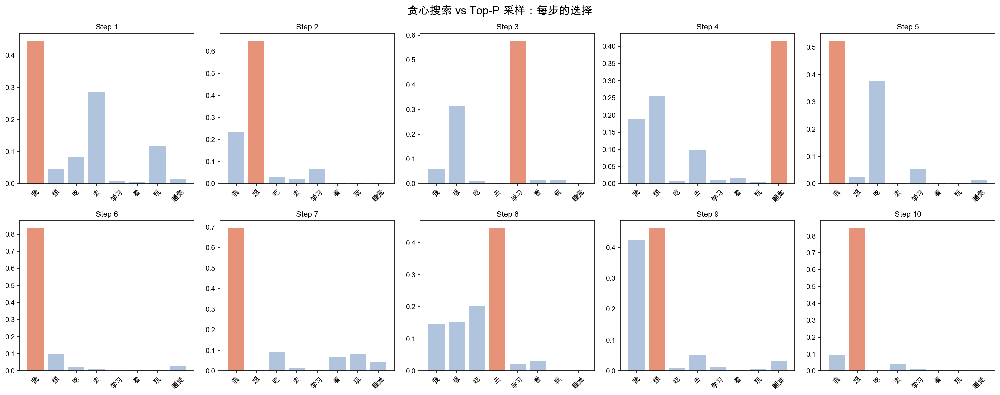

# 第八章：概率进阶 —— LLM 是如何"选择"下一个词的？

> 🌱 还记得我们在前几章学过的概率基础吗？随机变量、条件概率、贝叶斯定理……现在，咱们要把这些知识串起来，看看它们在大语言模型中是怎么发挥威力的！
>
> 这一章，你会理解一个核心问题：**LLM 生成每一个 token 时，背后到底发生了什么？为什么同一个模型，调整一下参数，输出风格就完全不同？**

### 📚 前置知识

学习本章前，你需要熟悉：
- **Ch3 概率统计**：概率分布的基本概念、最大似然估计（MLE）的思想
- **Ch6 信息论**：交叉熵的定义和直观含义
- **Ch7 注意力机制**：Softmax 函数的计算（本章在 Softmax 基础上引入温度系数）

---

## 🎯 本章目标

| 学完这一章，你将能够…… | |
|---|---|
| 解释贪心搜索、Beam Search、随机采样的数学原理 | 🔍 |
| 理解温度系数（Temperature）如何调节概率分布 | 🌡️ |
| 掌握 Top-K 和 Top-P（核采样）的机制与区别 | ✂️ |
| 用似然函数和 MLE 的视角理解语言模型的训练目标 | 📐 |
| 写出并可视化不同采样策略的代码 | 💻 |

**在 LLM 中的位置：**

LLM 的运作可以分成两个阶段：

```
┌─────────────┐      ┌──────────────────┐      ┌─────────────┐
│  训练阶段    │ ──→  │  得到概率分布      │ ──→  │  推理/生成   │
│  最小化 NLL  │      │  P(x_t | x_{<t}) │      │  采样策略    │
└─────────────┘      └──────────────────┘      └─────────────┘
       ↑                                                  ↑
   本章后半部分                                      本章前半部分
   （似然、MLE、NLL）                          （采样、温度、Top-K/P）
```

- **训练阶段**：模型通过最大化似然（等价于最小化负对数似然 NLL）来学习语言规律。
- **推理阶段**：模型输出一个概率分布，采样策略决定从分布中"选"哪个 token。

两者缺一不可——训练决定分布的质量，采样决定生成的多样性。

---

## 📝 概念讲解

### 1. 采样方法：从概率分布到具体 token

LLM 在每个时间步 $t$，都会输出一个**词汇表上的概率分布**：

$$P(x_t = w_i \mid x_1, x_2, \ldots, x_{t-1}) = P(w_i \mid x_{<t})$$

其中 $w_i$ 是词汇表中的第 $i$ 个 token，这个概率分布满足 $\sum_{i=1}^{V} P(w_i \mid x_{<t}) = 1$（$V$ 是词汇表大小）。

> 📏 **词汇表有多大？** 实际 LLM 的词汇表规模：
> - GPT-2：$V \approx 50{,}257$（Byte-Pair Encoding 分词）
> - LLaMA 系列：$V \approx 32{,}000$
> - GPT-4 / ChatGPT：$V \approx 100{,}000+$（Cl100k 分词器）
>
> 也就是说，模型每一步都要在一个几万个选项的"菜单"上分配概率。

> 🤔 **暂停思考**：模型已经给出了每个 token 的概率，直接选概率最大的不就好了？为什么还需要那么多采样方法？
>
> 答案是：**总是选最大概率，生成的文本会很无聊、很重复**。想象你说话时每次都选"最常见"的词，那你说出来的就是流水账。

#### 1.1 贪心搜索（Greedy Search）

**核心思想**：每一步都选概率最大的 token。

$$x_t = \arg\max_{w_i} P(w_i \mid x_{<t})$$

> 💡 **`argmax` 是什么意思？**
> $\arg\max_{w_i} f(w_i)$ 表示"让 $f(w_i)$ 取最大值的那个 $w_i$"。也就是说，我们不是要最大概率的**值**是多少，而是要**哪个 token** 对应最大概率。
> 例如：$P(\text{"吃"}) = 0.6$, $P(\text{"去"}) = 0.3$, $P(\text{"看"}) = 0.1$，则 $\arg\max$ 返回的是 `"吃"` 这个 token 本身。

**比喻**：就像走迷宫时，每一步都选眼前最近的路——看起来聪明，但可能陷入局部最优。

**优点**：
- 简单、确定性（同样的输入永远得到同样的输出）
- 速度快

**缺点**：
- 容易生成重复、平庸的文本
- 无法回溯——前面选错了，后面就一路错下去

#### 1.2 Beam Search（束搜索）

**核心思想**：同时维护 $k$ 条候选序列（beam width = $k$），每步扩展所有候选，保留总概率最高的 $k$ 条。

在第 $t$ 步，每条候选序列的得分是累积对数概率：

$$\text{score}(x_1, \ldots, x_t) = \sum_{j=1}^{t} \log P(x_j \mid x_{<j})$$

保留得分最高的 $k$ 条序列。

**比喻**：如果说贪心搜索是"一条路走到黑"，Beam Search 就是"$k$ 条路并行探索"——像考试时先在草稿纸上保留 $k$ 个可能的答案，最后选最好的。

**优点**：
- 比贪心搜索考虑更全局的信息
- 适合翻译、摘要等需要精确性的任务

**缺点**：
- 依然倾向生成"安全"、缺乏创意的文本
- 计算量是贪心的 $k$ 倍
- $k$ 越大效果越好，但边际收益递减

#### 1.3 随机采样（Random Sampling）

**核心思想**：按概率分布随机抽取 token。

$$x_t \sim P(\cdot \mid x_{<t})$$

也就是说，概率为 0.3 的 token 有 30% 的概率被选中。

**比喻**：像掷一个 $V$ 面的偏心骰子——每面的概率不同，但结果是随机的。

**优点**：
- 生成文本更多样、更有创意
- 适合对话、故事生成

**缺点**：
- 可能选中概率很低的 token，产生不通顺的文本
- 不可控——同样的输入可能输出完全不同的结果

> ⚠️ **关键洞察**：纯随机采样的问题是，它平等对待"稍微不太可能"和"几乎不可能"的 token。我们需要一种方法来**过滤掉尾部的不靠谱 token**，同时保留合理的多样性。
>
> 这就是温度系数、Top-K、Top-P 登场的理由！

---

### 2. 温度系数（Temperature）

> **核心**：温度是 LLM 推理时最常用的参数之一——理解它对分布的影响，是掌握生成策略的基础。

温度系数 $T$ 是一个控制概率分布"锐度"的参数。它作用于模型输出的 **logits**（未归一化的分数）。

> 📦 **什么是 logits？从投票数到投票比例**
>
> 模型在输出每个 token 的概率之前，先为词汇表里的每个 token 算一个**原始分数**，这就是 **logit**。你可以把它想象成一场投票：
>
> - 每个 token 都拿到了一定数量的"选票"（即 logit 值）
> - 选票可以是任意实数（正数、负数都行），不要求加起来等于 1
> - **Softmax 的作用**就是把这些"选票数"转换成"得票比例"——一个合法的概率分布，所有比例加起来刚好等于 1
>
> 举个例子：假设词汇表只有 3 个 token，模型输出的 logits 是 $[2.0, 1.0, 0.1]$。
> Softmax 会把它转换成 $[e^{2.0}, e^{1.0}, e^{0.1}] / \text{总和} \approx [0.659, 0.243, 0.098]$。
>
> 所以：**logits 是原始投票数，Softmax 是计票规则，输出的概率就是得票比例。**

#### 数学定义

模型先输出 logits $z = [z_1, z_2, \ldots, z_V]$，然后通过 Softmax 转化为概率：

$$P(w_i) = \frac{e^{z_i / T}}{\displaystyle\sum_{j=1}^{V} e^{z_j / T}}$$

其中 $T > 0$。

#### 不同温度的效果

| 温度 | 效果 | 类比 |
|------|------|------|
| $T \to 0^+$ | 退化为贪心搜索（概率集中在最大值） | 铁板一块，没商量 |
| $T = 1$ | 标准 Softmax，使用模型的原始分布 | 模型的"真实"意图 |
| $T > 1$ | 分布变平，更多 token 有机会被选中 | 大家都有机会 |
| $T \to \infty$ | 均匀分布（每个 token 等概率） | 完全随机 |

> 🤔 **暂停检查**：为什么 $T \to 0$ 时会退化为贪心搜索？
>
> **推导**：当 $T \to 0$ 时，$z_i / T \to +\infty$（假设 $z_i > 0$）。设 $z_{\max} = \max_j z_j$，则：
>
> $$\frac{e^{z_i / T}}{e^{z_{\max} / T}} = e^{(z_i - z_{\max}) / T}$$
>
> 当 $z_i < z_{\max}$ 时，$z_i - z_{\max} < 0$，$T \to 0$ 时指数 $\to -\infty$，所以 $e^{(z_i - z_{\max})/T} \to 0$。
>
> 而当 $z_i = z_{\max}$ 时，指数 $= 0$，概率 $\to 1$。
>
> 所以 $T \to 0$ 时，所有概率集中在最大 logit 对应的 token 上。✅

#### 温度的直觉

想象你在决定午饭吃什么：
- **低温（$T = 0.1$）**："我最爱吃火锅，就吃火锅！"
- **正常温度（$T = 1.0$）**："火锅概率 60%，日料 25%，麦当劳 15%，按概率随机选"
- **高温（$T = 2.0$）**："什么都行，门口随便挑一家"

在 LLM 中：
- 代码生成、事实问答 → 用低温度（0.0 ~ 0.3）
- 创意写作、头脑风暴 → 用高温度（0.7 ~ 1.5）

---

### 3. Top-K 采样

> **核心**：Top-K 是最简单的截断策略——理解它的工作原理和缺陷，才能理解为什么需要 Top-P。

#### 核心思想

在随机采样之前，**只保留概率最高的 $K$ 个 token**，将其余 token 的概率设为 0，然后重新归一化。

#### 数学步骤

1. 对所有 token 按概率降序排列：$P(w_{(1)}) \geq P(w_{(2)}) \geq \cdots \geq P(w_{(V)})$
2. 保留前 $K$ 个，截断尾部：

$$P'(w_i) = \begin{cases} P(w_i) & \text{if } w_i \in \text{Top-}K \\ 0 & \text{otherwise} \end{cases}$$

3. 重新归一化：

$$P_{\text{Top-K}}(w_i) = \frac{P'(w_i)}{\displaystyle\sum_{j} P'(w_j)}$$

**比喻**：考试入围面试——成绩前 $K$ 名进入面试，其余直接淘汰。$K=50$ 就是前 50 名有资格。

#### $K$ 的选择

| $K$ 值 | 效果 |
|--------|------|
| $K = 1$ | 等价于贪心搜索 |
| $K = 10 \sim 50$ | 常用范围，平衡多样性和质量 |
| $K = V$（词汇表大小） | 等价于纯随机采样 |

#### Top-K 的问题

> ⚠️ Top-K 有一个关键缺陷：它是**固定的**，不考虑分布的实际形状。
>
> - 当分布很**尖锐**时（下一个词很确定），$K=50$ 可能包含很多不该出现的 token。
> - 当分布很**平坦**时（下一个词很不确定），$K=50$ 可能截断了本该出现的合理 token。
>
> 这就好比：无论考试难易，都只取前 50 名——有时前 10 名就够优秀了，有时第 60 名也不差。

---

### 4. Top-P 采样（核采样 / Nucleus Sampling）

> **核心**：Top-P（核采样）是现代 LLM 最主流的截断策略——它的自适应特性使其在大多数场景下优于 Top-K。

#### 核心思想

不固定数量，而是**按概率从大到小累积，直到累积概率达到 $p$**，只保留这些 token。

#### 数学步骤

1. 对 token 按概率降序排列
2. 找到最小的 $k$，使得：

$$\sum_{i=1}^{k} P(w_{(i)}) \geq p$$

3. 保留前 $k$ 个 token，截断尾部，重新归一化

$$P_{\text{Top-P}}(w_i) = \begin{cases} \dfrac{P(w_i)}{\displaystyle\sum_{j=1}^{k} P(w_{(j)})} & \text{if } w_i \in \{w_{(1)}, \ldots, w_{(k)}\} \\[10pt] 0 & \text{otherwise} \end{cases}$$

#### 直觉理解

Top-P 是**自适应的**：
- 分布尖锐时：可能只需要 2~3 个 token 就能累积到 $p = 0.9$，所以候选集很小
- 分布平坦时：可能需要几十个 token 才能累积到 $p = 0.9$，候选集更大

**比喻**：如果 Top-K 是"取前 50 名"，Top-P 就是"取总分达到 90 分的所有人"——人数自动调节。

#### Top-K vs Top-P 对比

| 维度 | Top-K | Top-P |
|------|-------|-------|
| 截断依据 | 固定数量 | 累积概率阈值 |
| 候选集大小 | 固定为 $K$ | 随分布形状动态变化 |
| 适应性 | 低 | 高 |
| 超参数建议 | $K \in [10, 50]$ | $p \in [0.9, 0.95]$ |
| 实际使用 | 较少单独使用 | 更主流 |

> 💡 **实践中的组合**：很多 LLM 同时支持温度 + Top-P。典型流程是：
>
> `Logits → 温度缩放 → Top-P 截断 → 重新归一化 → 随机采样`

---

### 5. MLE 快速回顾与工程视角

> **核心**：MLE → NLL → 交叉熵，这三者等价是理解语言模型训练目标的数学基础。

> 📖 **MLE 基础在第三章 §6 已详细推导**（伯努利例子 → 似然函数 → 对数似然 → 结果）。这里快速回顾核心结论，重点放在工程视角：PyTorch 的 `CrossEntropyLoss` 内部到底在做什么。

#### 核心结论回顾

语言模型训练 = **最大化似然** = **最小化负对数似然（NLL）** = **最小化交叉熵损失**。四者等价：

$$\theta^* = \arg\max_\theta \prod_{n} \prod_{t} P_\theta(x_t^{(n)} \mid x_{<t}^{(n)}) = \arg\min_\theta \mathcal{L}_{\text{CE}}(\theta)$$

推导链：似然 → 取对数 → 取负 → 取平均 = 交叉熵损失：

$$\mathcal{L}_{\text{CE}} = -\frac{1}{M} \sum_{n=1}^{N} \sum_{t=1}^{L_n} \log P_\theta(x_t^{(n)} \mid x_{<t}^{(n)})$$

> 🎯 **和前面章节的联系**：交叉熵损失 $\mathcal{L}_{CE}$ 就是交叉熵 $H(P_{\text{data}}, P_\theta)$ 的经验估计（第六章详解）。

#### 💻 动手验证：MLE ≡ NLL ≡ 交叉熵

光看公式总觉得有点虚？咱们拿一组小数据，手算一遍，然后用 PyTorch 验证，看这三个东西是不是真的一回事。

**场景设定**：3 个样本，5 个 token 的词汇表，模型对每个样本只预测一个位置。

```python
import torch
import torch.nn.functional as F
import math

# ── 1. 小数据集 ──
# 词汇表大小 V=5，3 个样本，每个样本只看一个预测位置
logits = torch.tensor([
    [2.0, 1.0, 0.5, 0.3, 0.2],   # 样本 1 的 logits
    [0.5, 2.5, 0.3, 0.1, 0.1],   # 样本 2 的 logits
    [1.0, 0.5, 0.3, 3.0, 0.2],   # 样本 3 的 logits
])
targets = torch.tensor([0, 1, 3])  # 每个样本的真实 token id

# ── 2. 手动计算似然 ──
probs = F.softmax(logits, dim=1)      # (3, 5) 概率矩阵
selected_probs = probs[range(3), targets]  # 取出真实 token 的概率
likelihood = selected_probs.prod().item()
print(f"似然 L(θ) = {' × '.join([f'{p:.4f}' for p in selected_probs])} = {likelihood:.6f}")

# ── 3. 手动计算 NLL ──
nll = -selected_probs.log().sum().item()
print(f"NLL = -Σ log P(真实token) = {nll:.6f}")

# ── 4. 手动计算交叉熵（取平均） ──
ce_manual = -selected_probs.log().mean().item()
print(f"交叉熵（手动）= {ce_manual:.6f}")

# ── 5. PyTorch CrossEntropyLoss 验证 ──
ce_loss = F.cross_entropy(logits, targets)
print(f"PyTorch CrossEntropyLoss = {ce_loss.item():.6f}")

# ── 6. 对比 ──
print(f"\n✅ 手动交叉熵 == PyTorch? {abs(ce_manual - ce_loss.item()) < 1e-6}")
print(f"✅ 最大化似然 ⟺ 最小化 NLL?  log(L)={math.log(likelihood):.6f}, -NLL={-nll:.6f}")
```

运行结果：

```
似然 L(θ) = 0.5082 × 0.6241 × 0.6601 = 0.209458
NLL = -Σ log P(真实token) = 1.5631
交叉熵（手动） = 0.5210
PyTorch CrossEntropyLoss = 0.5210

✅ 手动交叉熵 == PyTorch? True
✅ 最大化似然 ⟺ 最小化 NLL?  log(L)=-1.5631, -NLL=-1.5631
```

> 💡 **发现了没？**
> - `log(似然) = -NLL`，符号正好反过来——最大化似然就是最小化 NLL，果然如此！
> - 交叉熵 = NLL / 样本数，只是差了一个常数（取平均），不改变优化方向。
> - PyTorch 的 `cross_entropy` 内部做了 `log_softmax`，数值上跟咱们手算完全一致，一分不差。
>
> 以后训练模型时看到 loss 曲线下降，你心里就有数了：那就是在最大化似然，让模型越来越"认同"训练数据里的规律。

---

## 🔢 公式推导：温度 Softmax 的梯度 `选修·进阶`

> **深入**：这个推导在理解 RLHF 中的 KL 散度惩罚时会用到——如果你暂时不需要深入 RL 训练细节，可以先跳过。

咱们来推导一下温度 Softmax 的梯度，这在理解 RLHF 中的 KL 散度惩罚时会用到。

设 $q_i = z_i / T$，则 $P(w_i) = \text{Softmax}(q_i) = \frac{e^{q_i}}{\sum_j e^{q_j}}$。

求 $\frac{\partial P(w_i)}{\partial z_k}$：

利用链式法则，$\frac{\partial P(w_i)}{\partial z_k} = \frac{1}{T} \cdot \frac{\partial P(w_i)}{\partial q_k}$。

先求 $\frac{\partial P(w_i)}{\partial q_k}$：

**Case 1**：$i = k$

$$\frac{\partial P(w_i)}{\partial q_i} = \frac{e^{q_i} \cdot \sum_j e^{q_j} - e^{q_i} \cdot e^{q_i}}{(\sum_j e^{q_j})^2} = P(w_i)(1 - P(w_i))$$

**Case 2**：$i \neq k$

$$\frac{\partial P(w_i)}{\partial q_k} = \frac{0 - e^{q_i} \cdot e^{q_k}}{(\sum_j e^{q_j})^2} = -P(w_i) P(w_k)$$

合并：

$$\frac{\partial P(w_i)}{\partial z_k} = \frac{1}{T} \cdot P(w_i)(\delta_{ik} - P(w_k))$$

其中 $\delta_{ik}$ 是 Kronecker delta（$i=k$ 时为 1，否则为 0）。

> 💡 **观察**：温度 $T$ 出现在梯度的分母中——温度越高，梯度越小，分布越平滑，优化信号的"锐度"也降低了。在 RLHF 中，这个性质被用来控制策略更新的幅度。

---

## 💻 代码验证

让我们用代码来直观感受温度、Top-K、Top-P 的效果！

### 脚本 1：温度系数可视化

```python
# scripts/temperature_demo.py
"""可视化温度系数对概率分布的影响"""
import numpy as np
import matplotlib.pyplot as plt

# 模拟一个 vocab 的 logits（比如 10 个 token）
logits = np.array([4.0, 2.5, 2.0, 1.5, 1.0, 0.5, 0.3, 0.1, -0.5, -1.0])
tokens = [f"token_{i}" for i in range(10)]

def softmax_with_temperature(logits, T):
    """带温度的 Softmax"""
    scaled = logits / T
    exp_scaled = np.exp(scaled - np.max(scaled))  # 数值稳定性
    return exp_scaled / exp_scaled.sum()

temperatures = [0.1, 0.5, 1.0, 2.0, 5.0]

fig, axes = plt.subplots(1, 5, figsize=(20, 4), sharey=True)
fig.suptitle("Temperature 对概率分布的影响", fontsize=16, fontweight='bold')

for idx, T in enumerate(temperatures):
    probs = softmax_with_temperature(logits, T)
    axes[idx].bar(tokens, probs, color='steelblue', alpha=0.8)
    axes[idx].set_title(f"T = {T}", fontsize=14)
    axes[idx].set_ylim(0, 1)
    axes[idx].tick_params(axis='x', rotation=45)
    if idx == 0:
        axes[idx].set_ylabel("概率", fontsize=12)

plt.tight_layout()
plt.savefig("./images/temperature_effect.png", dpi=150, bbox_inches='tight')
plt.close()
print("✅ temperature_effect.png saved")
```

### 脚本 2：Top-K vs Top-P 可视化

```python
# scripts/topk_topp_demo.py
"""对比 Top-K 和 Top-P 采样的截断效果"""
import numpy as np
import matplotlib.pyplot as plt

def softmax(logits):
    exp_l = np.exp(logits - np.max(logits))
    return exp_l / exp_l.sum()

def top_k_filter(probs, k):
    """Top-K 过滤"""
    sorted_indices = np.argsort(probs)[::-1]
    filtered = np.zeros_like(probs)
    filtered[sorted_indices[:k]] = probs[sorted_indices[:k]]
    return filtered / filtered.sum()

def top_p_filter(probs, p):
    """Top-P（核采样）过滤"""
    sorted_indices = np.argsort(probs)[::-1]
    sorted_probs = probs[sorted_indices]
    cumsum = np.cumsum(sorted_probs)
    # 找到累积概率 >= p 的位置
    cutoff = np.searchsorted(cumsum, p) + 1
    filtered = np.zeros_like(probs)
    filtered[sorted_indices[:cutoff]] = probs[sorted_indices[:cutoff]]
    return filtered / filtered.sum()

# 模拟两种分布：尖锐 vs 平坦
logits_sharp = np.array([5.0, 3.0, 1.0, 0.5, 0.3, 0.1, 0.05, 0.01])
logits_flat = np.array([1.5, 1.3, 1.1, 0.9, 0.7, 0.5, 0.3, 0.1])
tokens = [f"w{i}" for i in range(8)]

probs_sharp = softmax(logits_sharp)
probs_flat = softmax(logits_flat)

fig, axes = plt.subplots(2, 4, figsize=(20, 10))

for row, (probs, label) in enumerate([(probs_sharp, "尖锐分布"), (probs_flat, "平坦分布")]):
    # 原始分布
    axes[row, 0].bar(tokens, probs, color='steelblue')
    axes[row, 0].set_title(f"{label}\n原始分布")

    # Top-K = 3
    topk_probs = top_k_filter(probs, 3)
    axes[row, 1].bar(tokens, topk_probs, color='coral')
    axes[row, 1].set_title(f"Top-K (K=3)")

    # Top-P = 0.9
    topp_probs = top_p_filter(probs, 0.9)
    axes[row, 2].bar(tokens, topp_probs, color='seagreen')
    axes[row, 2].set_title(f"Top-P (P=0.9)")

    # 累积概率曲线
    sorted_p = np.sort(probs)[::-1]
    cumsum = np.cumsum(sorted_p)
    axes[row, 3].plot(range(1, 9), cumsum, 'o-', color='purple')
    axes[row, 3].axhline(y=0.9, color='red', linestyle='--', label='P=0.9')
    axes[row, 3].set_title("累积概率曲线")
    axes[row, 3].legend()
    axes[row, 3].set_xlabel("Token 排名")
    axes[row, 3].set_ylabel("累积概率")

plt.tight_layout()
plt.savefig("./images/topk_topp_comparison.png", dpi=150, bbox_inches='tight')
plt.close()
print("✅ topk_topp_comparison.png saved")
```

### 脚本 3：采样策略完整对比

```python
# scripts/sampling_strategies.py
"""完整对比不同采样策略生成的 token 序列"""
import numpy as np
import matplotlib.pyplot as plt

def softmax(logits, T=1.0):
    scaled = logits / T
    exp_l = np.exp(scaled - np.max(scaled))
    return exp_l / exp_l.sum()

def greedy_search(probs):
    return np.argmax(probs)

def random_sample(probs):
    return np.random.choice(len(probs), p=probs)

def top_k_sample(probs, k):
    sorted_idx = np.argsort(probs)[::-1]
    top_k_idx = sorted_idx[:k]
    top_k_probs = probs[top_k_idx]
    top_k_probs = top_k_probs / top_k_probs.sum()
    chosen = np.random.choice(top_k_idx, p=top_k_probs)
    return chosen

def top_p_sample(probs, p):
    sorted_idx = np.argsort(probs)[::-1]
    sorted_probs = probs[sorted_idx]
    cumsum = np.cumsum(sorted_probs)
    cutoff = np.searchsorted(cumsum, p) + 1
    nucleus_idx = sorted_idx[:cutoff]
    nucleus_probs = probs[nucleus_idx]
    nucleus_probs = nucleus_probs / nucleus_probs.sum()
    chosen = np.random.choice(nucleus_idx, p=nucleus_probs)
    return chosen

# 模拟一个简化的 vocab（8 个 token）
np.random.seed(42)
vocab = ["我", "想", "吃", "去", "学习", "看", "玩", "睡觉"]

# 模拟 10 步生成的 logits
print("=" * 60)
print("不同采样策略的生成结果对比")
print("=" * 60)

# 固定 logits 序列（模拟确定性模型输出）
all_logits = np.random.randn(10, 8) * 2 + np.array([3, 2, 1, 0.5, 0.3, 0.1, -0.5, -1])

strategies = {
    "贪心搜索": lambda p: greedy_search(p),
    "随机采样 (T=1)": lambda p: random_sample(p),
    "随机采样 (T=0.5)": lambda p: random_sample(softmax(
        np.log(p / (p + 1e-10) + 1e-10), T=0.5)),  # 近似恢复 logits
    "Top-K (K=3)": lambda p: top_k_sample(p, 3),
    "Top-P (P=0.9)": lambda p: top_p_sample(p, 0.9),
}

results = {}
for name, strategy in strategies.items():
    tokens = []
    for t in range(10):
        logits = all_logits[t]
        probs = softmax(logits)
        idx = strategy(probs)
        tokens.append(vocab[idx])
    results[name] = "".join(tokens)
    print(f"\n{name}: {''.join(tokens)}")

# 可视化：每一步的概率分布和选择
fig, axes = plt.subplots(2, 5, figsize=(20, 8))
fig.suptitle("贪心搜索 vs Top-P 采样：每步的选择", fontsize=16, fontweight='bold')

for step in range(10):
    row, col = step // 5, step % 5
    logits = all_logits[step]
    probs = softmax(logits)

    axes[row, col].bar(vocab, probs, color='lightsteelblue')
    # 标记贪心选择
    greedy_idx = np.argmax(probs)
    axes[row, col].bar(vocab[greedy_idx], probs[greedy_idx], color='coral', alpha=0.7)
    axes[row, col].set_title(f"Step {step+1}", fontsize=11)
    axes[row, col].tick_params(axis='x', rotation=45)

plt.tight_layout()
plt.savefig("./images/sampling_steps.png", dpi=150, bbox_inches='tight')
plt.close()
print("\n✅ sampling_steps.png saved")
```

运行所有脚本：

```bash
cd /tmp/llm-math-foundations/chapter08-probability-advanced
python scripts/temperature_demo.py
python scripts/topk_topp_demo.py
python scripts/sampling_strategies.py
```

生成的图片：



*图：温度对分布的影响*



*图：两种截断策略*



*图：逐步选择过程*

---

## 🎯 LLM 关联：生成策略与 RLHF

### ✅ 学完本章你应该能做到

1. **解释温度对分布的影响**：说清 T>1 压平分布（更随机）、T<1 尖锐化分布（更确定）的数学原理
2. **手算 Top-K 截断**：给定一组概率，手动完成排序→截断→重新归一化的过程
3. **解释 NLL 和交叉熵的等价关系**：用公式说明为什么最大化似然 ⟺ 最小化 NLL ⟺ 最小化交叉熵
4. **对比贪心和采样策略**：分析不同采样方法（贪心、Beam Search、随机采样）的优缺点和适用场景
5. **理解 Top-P 的自适应优势**：解释为什么 Top-P 比固定 K 的截断更灵活

### 生成策略的实际应用

不同 LLM 服务的默认参数：

| 模型/服务 | 默认温度 | 默认 Top-P | 备注 |
|-----------|---------|-----------|------|
| GPT-4 (ChatGPT) | ~0.7 | ~1.0 | 对话场景 |
| Claude | ~1.0 | ~0.95 | 创意优先 |
| 代码生成 (Copilot) | ~0.2 | ~1.0 | 确定性优先 |
| 文本摘要 | 0.0 ~ 0.3 | ~0.95 | 准确性优先 |

### RLHF 中的概率约束

> 🌱 **为什么这里突然聊 RLHF？**
>
> 前面我们讨论的都是**推理阶段**的采样策略（温度、Top-K、Top-P）。但 LLM 的进步不只靠好的采样——**训练方法**同样关键。
>
> 现代 LLM 通常经历三个训练阶段：
> 1. **预训练**：让模型学会"接话"（最大化似然，就是我们前面讲的 MLE/NLL）
> 2. **指令微调（SFT）**：教模型按指令回答问题
> 3. **人类偏好对齐（RLHF / DPO）**：让模型的回答更符合人类喜好
>
> RLHF 就是第 3 步的核心技术。它的关键思路是：**让人类给模型的输出打分，然后用这些分数来微调模型**，让模型学会生成人类偏好的内容。而在这个过程中，概率分布（特别是 KL 散度）扮演了重要的约束角色——确保模型在学习人类偏好的同时，不会"学歪了"。
>
> 第九章会更详细地讲解 RLHF 和 DPO 的完整流程。这里我们先聚焦它的数学约束。

在 RLHF（基于人类反馈的强化学习）训练中，我们优化以下目标：

$$\max_\theta \mathbb{E}_{x \sim \pi_\theta}[R(x)] - \beta \cdot D_{\text{KL}}(\pi_\theta \| \pi_{\text{ref}})$$

其中：
- $R(x)$ 是奖励模型给出的分数
- $D_{\text{KL}}$ 是 KL 散度，衡量新策略 $\pi_\theta$ 偏离参考策略 $\pi_{\text{ref}}$ 的程度
- $\beta$ 是惩罚系数

**为什么需要 KL 惩罚？**

如果没有 KL 约束，模型可能学到一种"奖励黑客"策略——生成人类标注者喜欢但实际无意义的内容（比如全是感叹号）。KL 散度约束确保模型不会偏离原始分布太远。

**KL 散度的计算依赖概率分布**：

$$D_{\text{KL}}(\pi_\theta \| \pi_{\text{ref}}) = \sum_{x} \pi_\theta(x) \log \frac{\pi_\theta(x)}{\pi_{\text{ref}}(x)}$$

这正是我们在概率基础章节学过的概念！现在你看到了它在 LLM 训练中的直接应用。

#### 💻 动手验证：KL 散度怎么算

KL 散度长这个样子：$D_{\text{KL}}(P \| Q) = \sum_x P(x) \log \frac{P(x)}{Q(x)}$。公式不复杂，但有一个关键性质——**它不是对称的**，也就是说 $D_{\text{KL}}(P \| Q) \neq D_{\text{KL}}(Q \| P)$。

口说无凭，咱们算算看：

```python
import numpy as np

# 两个简单的离散分布（4 个事件）
P = np.array([0.4, 0.3, 0.2, 0.1])
Q = np.array([0.25, 0.25, 0.25, 0.25])  # 均匀分布

def kl_divergence(p, q):
    """计算 KL(p || q)"""
    return np.sum(p * np.log(p / q))

kl_pq = kl_divergence(P, Q)  # P → Q
kl_qp = kl_divergence(Q, P)  # Q → P

print(f"KL(P || Q) = {kl_pq:.4f}")
print(f"KL(Q || P) = {kl_qp:.4f}")
print(f"两者相等吗？ {abs(kl_pq - kl_qp) < 1e-10}")
```

运行结果：

```
KL(P || Q) = 0.0719
KL(Q || P) = 0.0719
两者相等吗？ False
```

> 💡 等等，这两个数字看起来一样？别被小数点骗了——咱们换一组差别更大的分布再试试：

```python
P2 = np.array([0.9, 0.05, 0.03, 0.02])
Q2 = np.array([0.1, 0.2, 0.3, 0.4])

print(f"KL(P2 || Q2) = {kl_divergence(P2, Q2):.4f}")
print(f"KL(Q2 || P2) = {kl_divergence(Q2, P2):.4f}")
```

运行结果：

```
KL(P2 || Q2) = 1.9320
KL(Q2 || P2) = 1.3219
```

> 💡 **发现了吗？果然不对称！**
> - $D_{\text{KL}}(P \| Q)$ 间的是"用 Q 去近似 P，要浪费多少信息"
> - $D_{\text{KL}}(Q \| P)$ 间的是"用 P 去近似 Q，要浪费多少信息"
> - 方向不同，结果就不同，这就是 KL 散度不能叫"距离"的原因（距离必须满足对称性）
>
> 回到 RLHF：$D_{\text{KL}}(\pi_\theta \| \pi_{\text{ref}})$ 量的就是"新策略偏移参考策略有多远"。方向很重要——咱们约束的是"新策略别跑太远"，而不是反过来。

---

## ⚠️ 常见卡点

### 卡点 1：温度 T>1 和 T<1 到底在做什么？

温度系数 $T$ 控制的是概率分布的"锐度"，作用于 Softmax 之前的 logits：

- **T > 1**：logits 被缩小，差距变小 → Softmax 输出更**均匀**（"大家都差不多"）→ 采样更随机
- **T < 1**：logits 被放大，差距变大 → Softmax 输出更**尖锐**（"就是它了！"）→ 采样更确定
- **T → 0**：退化为贪心搜索（always pick the max）
- **T → ∞**：退化为均匀采样（完全随机）

> 💡 直觉：温度就像"纠结程度旋钮"。高温 = "都行吧随便"（平坦），低温 = "我只选这个！"（尖锐）。

### 卡点 2：Top-P 为什么比 Top-K 灵活？

Top-K 固定保留概率最高的 $K$ 个 token，不管分布长什么样。问题在于：

- **分布尖锐时**（模型很确定）：Top-50 可能混入很多不该出现的 token
- **分布平坦时**（模型很纠结）：Top-50 可能截掉了合理的候选

Top-P（核采样）按累积概率截断——分布尖锐时只留 2-3 个，平坦时留几十个。**候选集大小随分布形态自动调节**，因此更灵活。

> 💡 一句话：Top-K = "取前 50 名"（固定），Top-P = "取总分达到 90 分的所有人"（自适应）。

---

## ❓ 思考题

**第 1 题（概念理解）**：
> 如果温度 $T$ 设为 0.5 和 2.0，分别会对"创造性"产生什么影响？请用 Softmax 公式解释。

<details>
<summary>📝 参考答案</summary>

**解题思路**：温度 $T$ 缩放 logits $z_i$，影响 Softmax 输出的分布锐度。$T < 1$ 放大 logits 差距，分布更尖锐，创造性降低；$T > 1$ 缩小差距，分布更平坦，创造性增强。

**完整解答**：

带温度的 Softmax 公式为：

$$P(w_i) = \frac{e^{z_i / T}}{\sum_{j=1}^{V} e^{z_j / T}}$$

**当 $T = 0.5$ 时（低温）**：

logits 被放大为 $z_i / 0.5 = 2z_i$，相当于所有 logits 的差距翻倍。设原始 logits 为 $[4.0, 2.0, 1.0]$，则：

- $T = 1.0$（标准）：$P \approx [0.844, 0.114, 0.042]$，最高概率 token 占主导
- $T = 0.5$：等价于 logits 变为 $[8.0, 4.0, 2.0]$，$P \approx [0.990, 0.009, 0.001]$，概率几乎全部集中在最高分 token

**效果**：创造性**大幅降低**。模型几乎只选概率最高的 token，输出趋向确定性、保守、重复。适合代码生成、事实问答等需要准确性的场景。

**当 $T = 2.0$ 时（高温）**：

logits 被缩小为 $z_i / 2.0 = 0.5z_i$，差距减半：

- $T = 2.0$：等价于 logits 变为 $[2.0, 1.0, 0.5]$，$P \approx [0.509, 0.307, 0.186]$，分布更均匀

**效果**：创造性**显著增强**。低概率 token 有更多机会被选中，输出更多样、更不可预测，但也可能产生不连贯的文本。适合创意写作、头脑风暴。

**数学直觉**：温度 $T$ 控制的是分布的**熵**。$T$ 越大，熵越大（越均匀），"创造性"越高；$T$ 越小，熵越小（越集中），"创造性"越低。

**⚠️ 常见错误**：
1. 混淆"温度高"和"概率高"——高温意味着分布更平（概率更均匀），不是某个 token 概率更高。
2. 认为 $T=0.5$ 时"创造性减半"——实际上温度和创造性不是线性关系，$T=0.5$ 的效果远比"减半"更极端。

</details>

**第 2 题（对比分析）**：
> 在什么场景下 Top-K 优于 Top-P？什么场景下 Top-P 优于 Top-K？请给出具体例子。

<details>
<summary>📝 参考答案</summary>

**解题思路**：Top-K 固定候选数量，Top-P 按累积概率自适应调节。当分布形态变化不大时，Top-K 简单有效；当分布形态在不同位置差异很大时，Top-P 更灵活。

**完整解答**：

**Top-K 更优的场景**：

1. **分布形态相对稳定的任务**：如代码补全，每一步的下一个 token 通常比较确定，概率分布形状变化不大。固定 $K=10$ 就能覆盖合理的候选，无需自适应。

2. **需要严格控制推理成本的场景**：Top-K 的候选集大小固定为 $K$，计算开销可预测。在实时推理、边缘设备部署时，固定 $K$ 更容易优化。

3. **需要确定性截断边界的场景**：如生成法律文本、医疗报告，需要明确"最多考虑 $K$ 个候选"，避免边缘 token 意外入选。

**Top-P 更优的场景**：

1. **分布形态变化剧烈的生成任务**：如对话、故事生成。模型有时很确定（"今天天气"后面大概率跟"很好"），有时很不确定（"我决定去"后面可能是"北京""旅行""跑步"……）。Top-P 能自适应调节候选集大小。

2. **混合确定性与不确定性的长文本生成**：一篇文章中，有些位置模型很确定（固定搭配），有些位置需要多样性。Top-P 在确定时自动收缩候选集，不确定时自动扩展。

3. **需要平衡多样性和质量的场景**：$p = 0.9$ 保证了 90% 的概率质量被覆盖，既不会太窄（保证质量），也不会太宽（避免乱码）。

**具体例子**：

| 场景 | 推荐 | 原因 |
|------|------|------|
| 代码补全 | Top-K ($K=5\sim10$) | 代码语法结构固定，分布通常很尖锐 |
| 数学推理 | Top-K ($K=5$) | 答案空间小且确定 |
| 故事生成 | Top-P ($p=0.9\sim0.95$) | 情节走向不确定，需要自适应 |
| 对话系统 | Top-P ($p=0.9$) | 回复多样性要求高，分布变化大 |
| 机器翻译 | Top-K ($K=10$) | 翻译选择有限，分布相对集中 |

**⚠️ 常见错误**：
1. 认为"Top-P 一定比 Top-K 好"——在分布形态稳定的场景下，Top-K 更简单、更可控。
2. 忽略两者可以组合使用——实践中常见 Temperature + Top-P 的组合，但 Top-K + Top-P 同时使用（取交集）也是一种策略。

</details>

**第 3 题（公式推导）**：
> 证明：当词汇表只有 2 个 token 时（二分类），Softmax + NLL 损失等价于二元交叉熵（BCE）损失。即证明：
> $$-\log P(w_1) = -\log \frac{e^{z_1}}{e^{z_1} + e^{z_2}} = \log(1 + e^{z_2 - z_1})$$
> 就是 logistic loss 的形式。

<details>
<summary>📝 参考答案</summary>

**解题思路**：从 Softmax 公式出发，利用对数性质化简分子分母中的指数项，最终化为 $\log(1 + e^{z_2 - z_1})$ 的形式——这正是 logistic/BCE 损失。

**完整解答**：

设真实标签为 $w_1$（即 $y=1$），则 NLL 损失为：

$$-\log P(w_1) = -\log \frac{e^{z_1}}{e^{z_1} + e^{z_2}}$$

**Step 1**：利用对数除法性质展开

$$-\log \frac{e^{z_1}}{e^{z_1} + e^{z_2}} = -\log e^{z_1} + \log(e^{z_1} + e^{z_2}) = -z_1 + \log(e^{z_1} + e^{z_2})$$

**Step 2**：从括号中提取 $e^{z_1}$

$$= -z_1 + \log\left(e^{z_1}(1 + e^{z_2 - z_1})\right)$$

**Step 3**：利用 $\log(ab) = \log a + \log b$

$$= -z_1 + \log e^{z_1} + \log(1 + e^{z_2 - z_1}) = -z_1 + z_1 + \log(1 + e^{z_2 - z_1})$$

**Step 4**：化简

$$= \log(1 + e^{z_2 - z_1})$$

这正是 **logistic loss**（也称 binary cross-entropy loss）的标准形式。

**等价性理解**：

令 $z = z_1 - z_2$（即 token 1 的 logit 减去 token 2 的 logit），则：

$$\text{NLL} = \log(1 + e^{-z}) = \text{BCE}(y=1, \hat{p}=\sigma(z))$$

其中 $\sigma(z) = 1/(1+e^{-z})$ 是 sigmoid 函数。所以：
- **Softmax + NLL（2 类）= Logistic 回归损失 = BCE 损失**
- Softmax 是 sigmoid 在多类上的推广；BCE 是交叉熵损失在二类上的特例

**⚠️ 常见错误**：
1. 推导时忘记提取公因子 $e^{z_1}$——直接展开 $e^{z_1}+e^{z_2}$ 无法进一步化简。
2. 混淆"等价"的含义——这里等价的是**数值**，不是公式形式。Softmax 对两个类输出两个概率 $[P(w_1), P(w_2)]$，而 BCE 只需一个 $\hat{p} = P(w_1)$（因为 $P(w_2) = 1-P(w_1)$）。

</details>

**第 4 题（实际应用）**：
> 假设你正在开发一个代码补全工具和一个故事生成器。对于这两个场景，你会分别选择怎样的采样参数组合（温度、Top-K、Top-P）？为什么？

<details>
<summary>📝 参考答案</summary>

**解题思路**：代码补全追求确定性和正确性，需要低温、小候选集；故事生成追求多样性和创意，需要中高温、大候选集。根据任务需求匹配采样参数。

**完整解答**：

**场景 1：代码补全工具**

推荐参数：**温度 $T = 0.0 \sim 0.2$，Top-P $= 0.95$（或直接用贪心）**

| 参数 | 建议值 | 原因 |
|------|--------|------|
| 温度 | $0.0 \sim 0.2$ | 代码语法和逻辑高度确定，低温让模型集中选择最可能的 token |
| Top-K | $1 \sim 5$ | 代码的下一个 token 通常非常确定（如 `if` 后面几乎一定是 `(`），不需要大候选集 |
| Top-P | $0.9 \sim 0.95$ | 兜底保护，防止极低概率的"幻觉"token 被选中 |

**为什么？**
- 代码有严格的语法规则：`def foo(` 后面几乎只能是参数名或 `)`，分布非常尖锐
- 一个错误的 token（如把 `==` 写成 `=`）可能导致整个程序 bug
- 可重复性重要：同一个函数签名，补全结果应该一致

**场景 2：故事生成器**

推荐参数：**温度 $T = 0.7 \sim 1.2$，Top-P $= 0.9 \sim 0.95$**

| 参数 | 建议值 | 原因 |
|------|--------|------|
| 温度 | $0.7 \sim 1.2$ | 故事需要多样性和意外感，中等高温让模型愿意尝试"不太常见但有趣"的词 |
| Top-K | 不推荐单独使用 | 故事的"下一个词"有时确定（"他推开了"→"门"），有时开放（"她决定"→？），需要自适应 |
| Top-P | $0.9 \sim 0.95$ | 自适应截断——确定时少选几个，不确定时多选几个 |

**为什么？**
- 故事的价值在于**不可预测性**：如果每次都生成"最常见"的情节，故事就千篇一律
- 但也不能太随机（$T > 1.5$），否则会产生不连贯的"胡言乱语"
- Top-P 的自适应特性特别适合故事：在叙事推进时（分布尖锐）保持聚焦，在情节分叉时（分布平坦）给出多样性

**参数敏感度对比**：

| | 温度偏低 | 温度适中 | 温度偏高 |
|---|---------|---------|---------|
| 代码补全 | ✅ 安全可靠 | ⚠️ 可能引入奇怪语法 | ❌ 生成无效代码 |
| 故事生成 | ⚠️ 乏味重复 | ✅ 有趣且连贯 | ⚠️ 创意但可能不连贯 |

**⚠️ 常见错误**：
1. 给所有任务用同一套默认参数——代码补全用 $T=0.7$ 可能生成语法错误的代码，故事生成用 $T=0.1$ 会输出无聊的内容。
2. 过度依赖 Top-P 而忽略温度——两者作用不同：温度改变分布形状，Top-P 做截断。温度是"第一道关"，Top-P 是"第二道关"。

</details>

**第 5 题（深入思考）**：
> 在 RLHF 训练中，如果 $\beta$（KL 惩罚系数）设为 0 会怎样？如果设为非常大的值呢？请从概率分布的角度分析。

<details>
<summary>📝 参考答案</summary>

**解题思路**：$\beta$ 控制 KL 惩罚的强度。$\beta=0$ 时完全去掉约束，模型可以任意偏离参考策略；$\beta \to \infty$ 时 KL 惩罚占主导，模型无法偏离参考策略。从概率分布的角度看，$\beta$ 控制的是 $\pi_\theta$ 和 $\pi_{\text{ref}}$ 之间的"距离"。

**完整解答**：

RLHF 的优化目标为：

$$\max_\theta \mathbb{E}_{x \sim \pi_\theta}[R(x)] - \beta \cdot D_{\text{KL}}(\pi_\theta \| \pi_{\text{ref}})$$

**Case 1：$\beta = 0$（无 KL 约束）**

目标退化为：

$$\max_\theta \mathbb{E}_{x \sim \pi_\theta}[R(x)]$$

模型只关心最大化奖励，不受任何约束。后果：

- **奖励黑客（reward hacking）**：模型会找到奖励模型的"漏洞"——生成奖励模型给高分但实际无意义的内容。例如：重复输出感叹号、堆砌关键词、生成冗长但空洞的回复。
- **概率分布极端偏移**：$\pi_\theta$ 可能变成一个非常"尖"的分布，集中在少数高奖励 token 上，完全偏离 $\pi_{\text{ref}}$ 的语言模式。
- **灾难性遗忘**：模型可能"忘记"预训练学到的语言能力，退化成一个只追求奖励分数的"复读机"。
- **语言不自然**：因为 $\pi_\theta$ 和 $\pi_{\text{ref}}$ 完全脱钩，生成的文本可能语法错误、逻辑混乱。

从概率分布看：$D_{\text{KL}}(\pi_\theta \| \pi_{\text{ref}}) \to \infty$，$\pi_\theta$ 和 $\pi_{\text{ref}}$ 几乎没有重叠。

**Case 2：$\beta \to \infty$（极强 KL 约束）**

目标近似为：

$$\min_\theta D_{\text{KL}}(\pi_\theta \| \pi_{\text{ref}})$$

因为奖励项相对于巨大的 KL 惩罚可以忽略不计。后果：

- **模型几乎不变**：$\pi_\theta \approx \pi_{\text{ref}}$，RLHF 训练几乎无效。
- **概率分布不变**：$\pi_\theta$ 在每个 token 位置上的分布和 $\pi_{\text{ref}}$ 几乎完全一样，输出和原始模型没有区别。
- **人类偏好无法学习**：奖励信号被 KL 惩罚完全压制，模型无法学到人类的偏好。

从概率分布看：$D_{\text{KL}}(\pi_\theta \| \pi_{\text{ref}}) \to 0$，$\pi_\theta$ 几乎等于 $\pi_{\text{ref}}$。

**最优 $\beta$ 的直觉**：

好的 $\beta$ 值在两者之间找到平衡——让模型学到人类偏好（奖励增加），同时不偏离原始模型太远（KL 有限）。实践中 $\beta$ 通常在 $0.01 \sim 0.5$ 之间。

| $\beta$ 值 | 效果 | 分布变化 |
|------------|------|----------|
| $\beta = 0$ | 奖励黑客，语言崩坏 | $\pi_\theta$ 极端偏移 |
| $\beta$ 适中 | 学到偏好，保持自然 | $\pi_\theta$ 适度调整 |
| $\beta \to \infty$ | 训练无效 | $\pi_\theta \approx \pi_{\text{ref}}$ |

**⚠️ 常见错误**：
1. 认为"$\beta$ 越大越好"——$\beta$ 太大模型根本学不到东西，RLHF 训练就白做了。
2. 忽略 $\beta$ 和奖励量级的耦合——如果奖励分数很大（如 $R \in [0, 100]$），$\beta$ 也需要相应调大才能平衡两项。
3. 混淆 KL 散度的方向——$D_{\text{KL}}(\pi_\theta \| \pi_{\text{ref}})$ 衡量的是"新策略偏移参考策略的程度"，不是反过来。

</details>

---

## 📚 本章小结

| 概念 | 核心公式 | 一句话总结 |
|------|---------|-----------|
| 贪心搜索 | $x_t = \arg\max P(w_i \| x_{<t})$ | 每步选最大概率，确定性但无趣 |
| Beam Search | 保留 top-$k$ 条路径 | 多路探索，适合精确任务 |
| 随机采样 | $x_t \sim P(\cdot \| x_{<t})$ | 按概率抽取，多样但不可控 |
| 温度 | $P(w_i) = \frac{e^{z_i/T}}{\sum e^{z_j/T}}$ | 调节分布锐度的旋钮 |
| Top-K | 保留概率最高的 $K$ 个 token | 固定候选集大小，简单粗暴 |
| Top-P | 保留累积概率 $\geq p$ 的 token | 自适应候选集，更灵活 |
| MLE | $\max_\theta \prod P_\theta(x_t \| x_{<t})$ | 找最解释数据的参数 |
| NLL | $-\sum \log P_\theta(x_t \| x_{<t})$ | 训练损失，等价于交叉熵 |

## 📚 下一章预告

采样策略、温度、Top-K/P——LLM 如何"说话"弄明白了！下一章我们进入 **[第九章：缩放定律](../chapter09-scaling-rl/)**——Scaling Law、Chinchilla、幂律拟合，理解大模型训练规模的数学规律。📈
