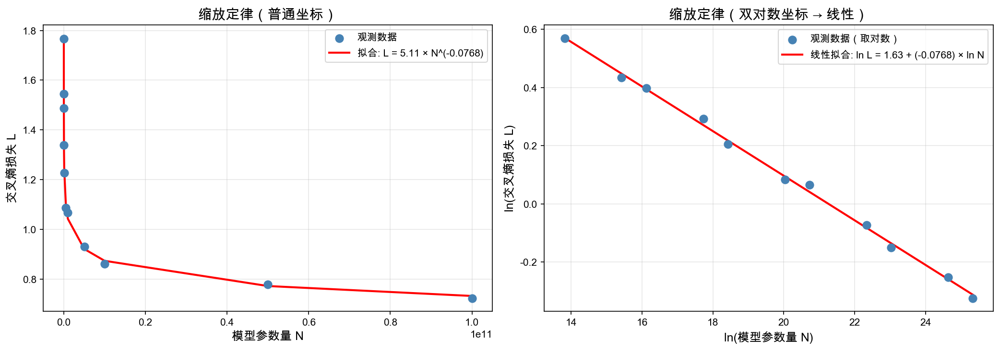

# 第九章：缩放定律 — 幂律、Chinchilla 与计算预算

> 🌱 "如果你能预测未来，你就能规划现在。" —— 缩放定律让我们在大模型训练之前，就能预测它的表现。

---

## 🎯 本章目标

学完这一章，咱们要能回答这几个问题：

1. **什么是幂律？为什么大模型的损失函数会服从幂律？**
2. **Chinchilla 缩放定律告诉我们什么？如何用它决定"该用多大的模型、多少数据"？**
3. **线性回归和最小二乘法如何帮我们拟合这些规律？**

### 📍 这一章在 LLM 中的位置

```
数据收集 → 分词 → 预训练（缩放定律指导）→ SFT → RLHF/PPO/DPO/GRPO（对齐）→ 部署
                         ↑
                    本章全部内容
```

- **缩放定律**回答：花多少钱、用多少卡、训多大的模型，效果能到多少？这是"训练前的指南针"。

---

## 📝 概念讲解

### 1. 幂律（Power Law）：自然界的隐藏规律

#### 什么是幂律？

幂律说的是两个量 $x$ 和 $y$ 之间的关系：

$$y = a \cdot x^{-b}$$

其中 $a > 0$ 是系数，$b > 0$ 是幂指数。取对数后：

$$\ln y = \ln a - b \cdot \ln x$$

这是一条**直线**！所以幂律关系在"双对数坐标图"上是一条直线。

> 💡 **比喻时间**：想象你在看一棵树。树干粗细和高度的关系、树枝分叉的角度和数量、树叶面积和数量……自然界里到处都是这种"一个量变了，另一个量按照固定比例变化"的规律。幂律就是这种规律的数学表达。

#### 幂律在自然界的普遍性

| 领域 | 幂律现象 | 含义 |
|------|---------|------|
| 地震 | Gutenberg-Richter 定律 | 能量每增加一级，频率约降低 10 倍 |
| 城市 | Zipf 定律 | 人口排名第 k 的城市，人口约 ∝ 1/k |
| 网络 | Barabási-Albert 模型 | 少数节点拥有大量连接（无标度网络） |
| 语言 | Zipf 定律 | 词频排名第 k 的词，频率约 ∝ 1/k |
| 物理 | 相变临界点 | 磁化强度 ∝ $(T_c - T)^\beta$ |

#### Kaplan 缩放定律（2020）

OpenAI 的 Kaplan 等人在 2020 年发现了一个惊人的规律：**语言模型的交叉熵损失 $L$ 和模型参数量 $N$、数据量 $D$ 之间服从幂律关系**：

$$L(N) = \left(\frac{N_c}{N}\right)^{\alpha_N}$$

$$L(D) = \left(\frac{D_c}{D}\right)^{\alpha_D}$$

其中 $N_c$、$D_c$ 是常数，$\alpha_N \approx 0.076$，$\alpha_D \approx 0.095$。

> 🤔 **暂停想想**：$\alpha_N \approx 0.076$ 意味着什么？意味着模型参数增加 10 倍，损失只降低 $10^{0.076} \approx 1.19$ 倍——**收益是边际递减的**！这就是为什么盲目增大模型不一定划算。

> 🤔 **Kaplan 定律的局限**：Kaplan 的实验有一个关键缺陷——**训练不充分**。他们的大多数模型只训练了少量步数就记录损失，这导致实验数据偏向「大模型、小数据」的情景。换句话说，Kaplan 的拟合曲线低估了数据量的重要性，高估了模型大小的收益。这直接影响了业界决策——GPT-3（175B 参数、300B tokens）就是按 Kaplan 定律设计的，但后来发现它严重「训练不足」。

---

### 2. Chinchilla 缩放定律（2022）

DeepMind 的 Hoffmann 等人在 2022 年**修正了 Kaplan 的偏差**，提出了更精确的缩放定律（Chinchilla 论文）。他们的关键改进：让每个模型都训练到收敛，而非提前截断。这样拟合出来的规律才可靠。核心发现：

**给定计算预算 $C$（FLOPs），模型参数量 $N$ 和数据量 $D$ 应该等比例增长：**

$$N_{\text{opt}} \propto C^{0.5}, \quad D_{\text{opt}} \propto C^{0.5}$$

更具体地，损失可以表示为：

$$L(N, D) = \frac{A}{N^\alpha} + \frac{B}{D^\beta} + E$$

其中：
- $E$ 是不可约损失（irreducible loss），代表语言的固有熵
- $\frac{A}{N^\alpha}$ 是模型容量不足带来的损失
- $\frac{B}{D^\beta}$ 是数据不足带来的损失

实验测得：$\alpha \approx 0.34$，$\beta \approx 0.28$。

#### 计算最优分配

给定总计算量 $C = 6ND$（transformer 的近似 FLOPs），要最小化 $L(N, D)$：

$$N_{\text{opt}}(C) \approx 0.6 \cdot C^{0.5}, \quad D_{\text{opt}}(C) \approx 0.3 \cdot C^{0.5}$$

> 💡 **关键洞察**：在 Chinchilla 之前，大家倾向于"小模型大数据"（如 GPT-3 用 175B 参数但只训了 300B tokens）。Chinchilla 告诉我们，**同等算力下，应该用更小的模型但训更多的数据**。DeepSeek 和 Llama 系列后来的成功，都验证了这一点。

#### 咱们来算一算

假设有 $10^{23}$ FLOPs 的算力预算：

$$N_{\text{opt}} \approx 0.6 \times (10^{23})^{0.5} \approx 0.6 \times 3.16 \times 10^{11} \approx 1.9 \times 10^{11} \approx 190\text{B}$$

$$D_{\text{opt}} \approx 0.3 \times (10^{23})^{0.5} \approx 0.3 \times 3.16 \times 10^{11} \approx 9.5 \times 10^{10} \approx 95\text{B tokens}$$

所以大约用 190B 参数的模型，训 95B tokens。

---

### 3. 线性回归与最小二乘：拟合缩放定律的工具

> 💡 **这一节和前面的关系**：前面咱们学了幂律和缩放定律，它们的公式取对数后都是**线性关系**——比如 $\ln L = \ln A - \alpha \ln N$。这意味着，如果我们把实验数据画在双对数坐标纸上，应该能看到一条直线。那问题来了：**怎么从杂乱的数据点里找出这条直线？** 答案就是**最小二乘法**——一种从数据中找「最佳拟合线」的经典工具。这一节就是教你这把工具怎么用。

#### 为什么需要线性回归？

缩放定律取对数后变成了线性关系：$\ln L = \ln A - \alpha \ln N + \ln \epsilon$。我们需要从实验数据中拟合出 $A$ 和 $\alpha$。

#### 最小二乘法

给定数据点 $(x_1, y_1), (x_2, y_2), \ldots, (x_n, y_n)$，找直线 $y = wx + b$ 使残差平方和最小：

$$\min_{w, b} \sum_{i=1}^{n}(y_i - wx_i - b)^2$$

**推导**：对 $w$ 和 $b$ 分别求偏导并令为零：

$$\frac{\partial}{\partial w}\sum_{i}(y_i - wx_i - b)^2 = -2\sum_{i}x_i(y_i - wx_i - b) = 0$$

$$\frac{\partial}{\partial b}\sum_{i}(y_i - wx_i - b)^2 = -2\sum_{i}(y_i - wx_i - b) = 0$$

解这个方程组，得到：

$$w = \frac{\sum_{i}(x_i - \bar{x})(y_i - \bar{y})}{\sum_{i}(x_i - \bar{x})^2}$$

$$b = \bar{y} - w\bar{x}$$

> 🤔 **暂停想想**：为什么用"平方"而不是"绝对值"？因为平方是可微的，可以用解析方法求解；而且平方对大误差惩罚更重，这通常是我们想要的。

#### 💻 动手验证：用最小二乘拟合幂律

咱们用代码来验证上面学到的概念：用最小二乘法拟合 Kaplan 缩放定律，看看在双对数坐标下，损失和参数量是不是真的呈线性关系。


```python
# scripts/power_law_fit.py
"""
用最小二乘法拟合 Kaplan 缩放定律
验证：Loss ∝ N^{-α}
"""

import numpy as np
import matplotlib.pyplot as plt

np.random.seed(42)

# ========== 模拟数据 ==========
# 模型参数量（从 1M 到 100B）
N_values = np.array([1e6, 5e6, 1e7, 5e7, 1e8, 5e8, 1e9, 5e9, 1e10, 5e10, 1e11])
true_alpha = 0.076  # Kaplan 的 α
true_A = 5.0

# 生成带噪声的损失值
L_true = true_A * N_values ** (-true_alpha)
noise = np.random.normal(0, 0.02, len(N_values))
L_observed = L_true + noise * L_true  # 相对噪声

# ========== 最小二乘拟合（双对数空间）==========
log_N = np.log(N_values)
log_L = np.log(L_observed)

# 计算均值
log_N_mean = np.mean(log_N)
log_L_mean = np.mean(log_L)

# 最小二乘估计
alpha_hat = np.sum((log_N - log_N_mean) * (log_L - log_L_mean)) / np.sum((log_N - log_N_mean) ** 2)
log_A_hat = log_L_mean - alpha_hat * log_N_mean
A_hat = np.exp(log_A_hat)

print(f"真实参数: α = {true_alpha}, A = {true_A}")
print(f"拟合参数: α = {-alpha_hat:.4f}, A = {A_hat:.4f}")
print(f"相对误差: α 误差 = {abs(-alpha_hat - true_alpha)/true_alpha*100:.2f}%")

# ========== 可视化 ==========
fig, axes = plt.subplots(1, 2, figsize=(14, 5))

# 左图：普通坐标
L_fitted = A_hat * N_values ** alpha_hat
axes[0].scatter(N_values, L_observed, color='steelblue', s=60, zorder=5, label='观测数据')
axes[0].plot(N_values, L_fitted, 'r-', linewidth=2, label=f'拟合: L = {A_hat:.2f} × N^({alpha_hat:.4f})')
axes[0].set_xlabel('模型参数量 N', fontsize=12)
axes[0].set_ylabel('交叉熵损失 L', fontsize=12)
axes[0].set_title('缩放定律（普通坐标）', fontsize=14)
axes[0].legend(fontsize=10)
axes[0].grid(True, alpha=0.3)

# 右图：双对数坐标
axes[1].scatter(log_N, log_L, color='steelblue', s=60, zorder=5, label='观测数据（取对数）')
axes[1].plot(log_N, log_A_hat + alpha_hat * log_N, 'r-', linewidth=2,
             label=f'线性拟合: ln L = {log_A_hat:.2f} + ({alpha_hat:.4f}) × ln N')
axes[1].set_xlabel('ln(模型参数量 N)', fontsize=12)
axes[1].set_ylabel('ln(交叉熵损失 L)', fontsize=12)
axes[1].set_title('缩放定律（双对数坐标 → 线性）', fontsize=14)
axes[1].legend(fontsize=10)
axes[1].grid(True, alpha=0.3)

plt.tight_layout()
plt.savefig('./images/power_law_fit.png', dpi=150, bbox_inches='tight')
print("\n图片已保存到 ./images/power_law_fit.png")
```



> 🌱 **观察要点**：左图是普通坐标下的幂律曲线——看起来弯曲得很厉害。但右图取了对数后，数据点几乎完美地落在一条直线上！这就是幂律的"双对数直线"特征。最小二乘法帮咱们从杂乱的数据中精确地找到了这条直线，拟合出的 α 值和真实值非常接近。试试调整 `true_alpha` 和噪声大小，看看拟合结果会有什么变化？

---

## 🔢 公式推导总结

### 幂律拟合

给定 $(N_i, L_i)$ 数据，取双对数后用最小二乘拟合 $\ln L = \ln A - \alpha \ln N$：

$$\hat{\alpha} = \frac{\sum_i (\ln N_i - \overline{\ln N})(\ln L_i - \overline{\ln L})}{\sum_i (\ln N_i - \overline{\ln N})^2}$$

$$\ln \hat{A} = \overline{\ln L} + \hat{\alpha} \cdot \overline{\ln N}$$

---

## 🎯 LLM 关联：这些数学怎么用在实战中？

### 缩放定律的实战价值

| 决策场景 | 缩放定律告诉我们的 |
|---------|------------------|
| 多大模型？ | 给定算力 $C$，用 $N \propto C^{0.5}$ 估算最优参数量 |
| 多少数据？ | 数据量应和参数量等比例增长（Chinchilla 启示） |
| 训练多久？ | 损失下降遵循幂律，可以外推预测最终损失 |
| 值得训吗？ | 对比当前损失和预测的可达到损失，评估投入产出比 |

**真实案例**：
- **Llama 1**（Meta, 2023）：7B-65B 参数，训了 1T tokens——远超 Chinchilla 最优数据量，但推理成本更低
- **Chinchilla** 本身：70B 参数训 1.4T tokens，击败了更大的 Gopher（280B 参数）
- **DeepSeek-V3**：671B MoE 参数，用缩放定律指导训练配置

---

## ❓ 思考题

1. **幂律的指数**：Kaplan 发现 $\alpha_N \approx 0.076$，Chinchilla 发现 $\alpha \approx 0.34$。为什么这两个数值差别这么大？哪个更可靠？（提示：想想它们测量的是什么。）

2. **缩放定律的边界**：幂律会在无限参数/数据下一直成立吗？为什么"不可约损失 $E$"的存在是合理的？（提示：想想语言的固有不确定性。）

3. **算力翻倍**：如果算力预算从 $C$ 翻倍到 $2C$，根据 Chinchilla 缩放定律，最优参数量和最优数据量分别增加多少？损失能降低多少？（提示：$N \propto C^{0.5}$，$L \propto C^{-0.5 \times \alpha}$。）

---

## 📚 推荐阅读

1. **Kaplan et al. (2020)** - *Scaling Laws for Neural Language Models* — 开山之作
2. **Hoffmann et al. (2022)** - *Training Compute-Optimal Large Language Models* — Chinchilla 论文

---

## 📖 术语速查表

| 术语 | 英文 | 简明解释 |
|------|------|----------|
| **FLOPs** | Floating Point Operations | 浮点运算次数，衡量计算量的单位。训练一个 Transformer 的 FLOPs 约 $\approx 6ND$（$N$ = 参数量，$D$ = token 数） |
| **不可约损失** | Irreducible Loss | 数据中固有噪声和信息熵带来的最低可能损失，无论模型多大都无法消除 |
| **双对数坐标** | Log-Log Plot | 横轴和纵轴都取对数的坐标系，幂律关系在这种坐标系下呈现为直线 |

---

> 🌱 **小结**：缩放定律给了我们预测未来的能力——在大模型训练之前，就能预测它的表现。幂律、Chinchilla 和最小二乘法，这三把工具组合起来，就是训练前的指南针。但预训练只是 LLM 的第一步，接下来一个关键问题是：**预训练好的模型，如何通过人类反馈变得更好用、更安全？** 这就是下一章要讲的 RL 对齐。咱们下一章见！👉 [第十章：RL 基础与对齐](../chapter10-rl-alignment/README.md)
