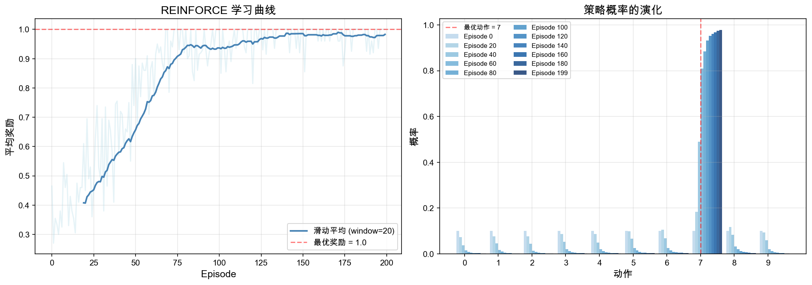
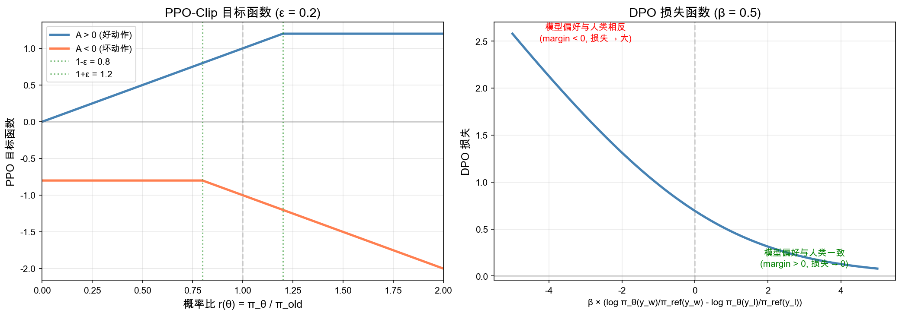

# 第十章：RL 基础与对齐 — PPO、DPO、GRPO

> 🌱 "预训练让模型能说话，对齐让模型说好话。" —— RL 算法是大模型从「能用」到「好用」的关键一跃。

---

## 🎯 本章目标

学完这一章，咱们要能回答这几个问题：

1. **强化学习（RL）的核心思想是什么？策略梯度是怎么工作的？**
2. **GRPO、DPO、PPO 这三种 RL 算法的数学原理分别是什么？它们在 LLM 对齐中扮演什么角色？**

### 📍 学习路线回顾

```
Ch1 线性代数 → Ch2 微积分 → Ch3 概率论 → Ch4 矩阵深入 → Ch5 优化 → Ch6 信息论 → Ch7 注意力 → Ch8 概率进阶 → Ch9 缩放定律 → Ch10 RL 对齐（你在这里）
```

这一章咱们从 Ch9 的缩放定律继续前进。Ch9 解决的是"训多大模型、用多少数据"的问题，这一章解决的是"训好的模型，怎么让它更好用、更安全"的问题。

### 📍 这一章在 LLM 中的位置

```
数据收集 → 分词 → 预训练（缩放定律指导）→ SFT → RLHF/PPO/DPO/GRPO（对齐）→ 部署
                                                   ↑
                                              本章全部内容
```

- **RL 对齐**回答：预训练好的模型，如何通过人类反馈变得更好用、更安全？这是"训练后的打磨"。

---

## 📝 概念讲解

### 1. 强化学习基础：策略梯度

#### 强化学习是什么？

在 LLM 语境下，强化学习是这样一幅画面：

```
智能体（LLM）→ 生成回答（动作）→ 获得奖励分数 → 更新策略（参数）→ 生成更好的回答
```

形式化定义：
- **状态** $s$：当前的对话上下文（prompt + 已生成的内容）
- **动作** $a$：生成的下一个 token
- **策略** $\pi_\theta(a|s)$：在状态 $s$ 下选择动作 $a$ 的概率（就是模型本身！）
- **奖励** $r$：对生成回答的质量评估（来自奖励模型或人类标注）

#### 目标函数

我们要最大化期望奖励：

$$J(\theta) = \mathbb{E}_{\tau \sim \pi_\theta}\left[\sum_{t=0}^{T} r(s_t, a_t)\right]$$

其中 $\tau = (s_0, a_0, s_1, a_1, \ldots)$ 是一条轨迹。

#### 策略梯度定理

$$\nabla_\theta J(\theta) = \mathbb{E}_{\tau \sim \pi_\theta}\left[\sum_{t=0}^{T} \nabla_\theta \ln \pi_\theta(a_t|s_t) \cdot R_t\right]$$

其中 $R_t = \sum_{t'=t}^{T} r(s_{t'}, a_{t'})$ 是从时刻 $t$ 开始的累积奖励。

> 💡 **直觉理解**：这个公式说的是——"如果一条轨迹的奖励高，就增大这条轨迹上所有动作的概率；如果奖励低，就降低概率。" $\ln \pi_\theta(a_t|s_t)$ 的梯度指向"增大该动作概率"的方向，乘以 $R_t$ 后就变成了"奖励高时多增大，奖励低时少增大（或减小）"。

#### REINFORCE 算法

用蒙特卡洛采样估计策略梯度：

1. 从 $\pi_\theta$ 采样一条轨迹 $\tau$
2. 计算累积奖励 $R_t$
3. 更新参数：$\theta \leftarrow \theta + \alpha \sum_t \nabla_\theta \ln \pi_\theta(a_t|s_t) \cdot R_t$

**问题**：方差太大！$R_t$ 的波动会导致训练不稳定。

**改进**：引入基线（baseline）$b(s_t)$：

$$\nabla_\theta J(\theta) \approx \sum_t \nabla_\theta \ln \pi_\theta(a_t|s_t) \cdot (R_t - b(s_t))$$

常用的基线是价值函数 $V(s_t)$，这就是 **Actor-Critic** 的雏形。

#### 💻 动手验证：模拟策略梯度

咱们用代码来验证上面学到的概念：用 REINFORCE 算法训练一个简单的策略，看看它能不能从均匀分布逐渐学会选择最优动作。


```python
# scripts/policy_gradient_sim.py
"""
模拟策略梯度优化过程
场景：一个简化的"猜数字"游戏，策略从均匀分布逐渐学到正确答案
"""

import numpy as np
import matplotlib.pyplot as plt

np.random.seed(42)

# ========== 环境设置 ==========
# 10 个动作，动作 7 是最优的
n_actions = 10
optimal_action = 7
reward_table = np.array([0.1, 0.2, 0.15, 0.3, 0.25, 0.4, 0.5, 1.0, 0.6, 0.35])

# ========== 策略初始化（均匀分布）==========
theta = np.zeros(n_actions)  # logits
learning_rate = 0.5
n_episodes = 200
n_steps_per_update = 10

# 记录
episode_rewards = []
policy_history = []

for episode in range(n_episodes):
    # 从 softmax 策略采样
    probs = np.exp(theta) / np.sum(np.exp(theta))
    
    # 采样多条轨迹
    trajectories = np.random.choice(n_actions, size=n_steps_per_update, p=probs)
    rewards = reward_table[trajectories]
    
    # 计算基线（均值）
    baseline = np.mean(rewards)
    
    # 策略梯度更新
    grad = np.zeros(n_actions)
    for a, r in zip(trajectories, rewards):
        # ∇ ln π(a) = one_hot(a) - π
        one_hot = np.zeros(n_actions)
        one_hot[a] = 1
        grad += (one_hot - probs) * (r - baseline)
    grad /= n_steps_per_update
    
    theta += learning_rate * grad
    
    # 记录
    episode_rewards.append(np.mean(rewards))
    if episode % 20 == 0 or episode == n_episodes - 1:
        policy_history.append((episode, probs.copy()))

# ========== 可视化 ==========
fig, axes = plt.subplots(1, 2, figsize=(14, 5))

# 左图：奖励曲线
axes[0].plot(episode_rewards, alpha=0.3, color='lightblue')
window = 20
smoothed = np.convolve(episode_rewards, np.ones(window)/window, mode='valid')
axes[0].plot(range(window-1, len(episode_rewards)), smoothed, color='steelblue', linewidth=2, label=f'滑动平均 (window={window})')
axes[0].axhline(y=reward_table[optimal_action], color='red', linestyle='--', alpha=0.5, label=f'最优奖励 = {reward_table[optimal_action]}')
axes[0].set_xlabel('Episode', fontsize=12)
axes[0].set_ylabel('平均奖励', fontsize=12)
axes[0].set_title('REINFORCE 学习曲线', fontsize=14)
axes[0].legend(fontsize=10)
axes[0].grid(True, alpha=0.3)

# 右图：策略演化
x = np.arange(n_actions)
colors = plt.cm.Blues(np.linspace(0.3, 1.0, len(policy_history)))
for i, (ep, probs) in enumerate(policy_history):
    axes[1].bar(x + i * 0.08 - 0.2, probs, width=0.08, color=colors[i], 
                label=f'Episode {ep}', alpha=0.8)
axes[1].axvline(x=optimal_action, color='red', linestyle='--', alpha=0.5, label=f'最优动作 = {optimal_action}')
axes[1].set_xlabel('动作', fontsize=12)
axes[1].set_ylabel('概率', fontsize=12)
axes[1].set_title('策略概率的演化', fontsize=14)
axes[1].set_xticks(x)
axes[1].legend(fontsize=8, ncol=2)
axes[1].grid(True, alpha=0.3)

plt.tight_layout()
plt.savefig('./images/policy_gradient.png', dpi=150, bbox_inches='tight')
print("图片已保存到 ./images/policy_gradient.png")
print(f"\n最终策略：")
final_probs = np.exp(theta) / np.sum(np.exp(theta))
for a in range(n_actions):
    bar = '█' * int(final_probs[a] * 50)
    print(f"  动作 {a}: {final_probs[a]:.3f} {bar}")
```



> 🌱 **观察要点**：左图的学习曲线展示了策略梯度从"随机猜"到"基本选对"的过程，虽然中间有波动（这就是策略梯度的**高方差**问题！）。右图的策略演化更直观——你可以看到概率质量从均匀分布逐渐集中到动作 7（最优动作）上。注意基线的引入显著降低了方差，让训练更稳定。

---

### 2. GRPO：Group Relative Policy Optimization

> 💡 **RL 对齐方法是怎么一步步发展出来的？** 在学具体算法之前，咱们先梳理一下脉络：
>
> | 阶段 | 方法 | 核心思想 | 优缺点 |
> |------|------|---------|--------|
> | ① SFT | 监督微调 | 用人工标注的「好回答」直接训练模型 | 简单有效，但模型只学到了「模仿」，不会主动规避坏回答 |
> | ② RLHF / PPO | 人类反馈强化学习 | 训练奖励模型 → 用 PPO 优化策略 | 效果好，但需要奖励模型 + 价值网络，训练复杂 |
> | ③ DPO | 直接偏好优化 | 绕过奖励模型，直接用偏好数据训练 | 更简单，但依赖离线偏好数据，难以在线探索 |
> | ④ GRPO | 组内相对策略优化 | 同一组回答互相比较，不需要价值网络 | 简单高效，特别适合数学等可验证场景 |
>
> 接下来咱们就按这个发展脉络来学——先看 GRPO，再看 DPO，最后看 PPO。顺序虽然和时间线不完全一致，但从简单到复杂，学起来更顺。

GRPO 是 DeepSeek-Math 提出的一种简化版策略优化方法，核心思想是：**不需要价值网络（Critic），用组内相对排名作为奖励信号**。

#### 核心思路

对于同一个 prompt，生成 $G$ 个回答（一组），用奖励模型给每个回答打分 $r_1, r_2, \ldots, r_G$，然后对奖励进行**组内标准化**：

$$\tilde{r}_i = \frac{r_i - \text{mean}(r_1, \ldots, r_G)}{\text{std}(r_1, \ldots, r_G)}$$

#### GRPO 目标函数

$$\mathcal{L}_{\text{GRPO}}(\theta) = \mathbb{E}\left[\frac{1}{G}\sum_{i=1}^{G} \min\left(\frac{\pi_\theta(y_i|x)}{\pi_{\text{old}}(y_i|x)} \cdot \tilde{r}_i, \text{clip}\left(\frac{\pi_\theta(y_i|x)}{\pi_{\text{old}}(y_i|x)}, 1-\epsilon, 1+\epsilon\right) \cdot \tilde{r}_i\right)\right]$$

其中：
- $\frac{\pi_\theta(y_i|x)}{\pi_{\text{old}}(y_i|x)}$ 是**重要性采样比率**（新策略和旧策略的概率比）
- $\text{clip}(\cdot, 1-\epsilon, 1+\epsilon)$ 限制比率在 $[1-\epsilon, 1+\epsilon]$ 范围内
- $\tilde{r}_i$ 是组内标准化奖励

> 💡 **比喻**：想象一个班级考试。你不需要知道满分是多少（不需要绝对评分），只需要知道你在班上排第几（相对排名）。GRPO 就是这个思路——同组回答相互比较，好的增强，差的减弱。

**优势**：省去了训练价值网络的开销，简单高效，特别适合数学推理等可验证场景。

---

### 3. DPO：Direct Preference Optimization

DPO 是 Stanford 提出的方法，核心思想是：**绕过奖励模型，直接用人类偏好数据优化策略**。

#### 从 RLHF 到 DPO

传统的 RLHF 流程：
1. SFT 阶段：得到 $\pi_{\text{SFT}}$
2. 训练奖励模型：$r_\phi(x, y)$
3. 用 PPO 优化：$\max_\theta \mathbb{E}_{x,y}[\pi_\theta(y|x) \cdot r_\phi(x,y)] - \beta \cdot KL(\pi_\theta \| \pi_{\text{ref}})$

DPO 直接跳过步骤 2 和 3！

#### 关键推导（不跳步！）

**第一步：定义 RLHF 的目标函数**

$$\max_{\pi_\theta} \mathbb{E}_{x \sim \mathcal{D}, y \sim \pi_\theta}\left[r(x, y)\right] - \beta \cdot D_{\text{KL}}(\pi_\theta \| \pi_{\text{ref}})$$

**第二步：展开 KL 散度**

$$D_{\text{KL}}(\pi_\theta \| \pi_{\text{ref}}) = \mathbb{E}_{y \sim \pi_\theta}\left[\ln \frac{\pi_\theta(y|x)}{\pi_{\text{ref}}(y|x)}\right]$$

所以目标变为：

$$\max_{\pi_\theta} \mathbb{E}_{y \sim \pi_\theta}\left[r(x,y) - \beta \ln \frac{\pi_\theta(y|x)}{\pi_{\text{ref}}(y|x)}\right]$$

**第三步：这个优化问题的闭式解**

可以证明（通过变分法，将其视为带 KL 约束的优化），最优策略为：

> ⚠️ **进阶注释**：这一步的严格证明需要用到**变分法（Calculus of Variations）**，具体来说是将带 KL 约束的最大化问题转化为 Lagrangian，然后对策略 $\pi$ 求泛函导数并令其为零。这超出了本章范围，咱们只需要**记住结论**：带 KL 惩罚的期望奖励最大化，其最优解就是下面的形式。感兴趣的同学可以参考 Peters & Schaal (2008) 的 *Reinforcement Learning of Motor Skills with Policy Gradients* 附录推导。

$$\pi^*(y|x) = \frac{1}{Z(x)} \pi_{\text{ref}}(y|x) \exp\left(\frac{1}{\beta}r(x,y)\right)$$

其中 $Z(x) = \sum_y \pi_{\text{ref}}(y|x) \exp\left(\frac{1}{\beta}r(x,y)\right)$ 是配分函数。

**第四步：反解奖励函数**

从第三步的等式中解出 $r(x,y)$：

$$\frac{\pi^*(y|x)}{\pi_{\text{ref}}(y|x)} = \frac{1}{Z(x)} \exp\left(\frac{1}{\beta}r(x,y)\right)$$

$$\ln \frac{\pi^*(y|x)}{\pi_{\text{ref}}(y|x)} = \frac{1}{\beta}r(x,y) - \ln Z(x)$$

$$r(x,y) = \beta \ln \frac{\pi^*(y|x)}{\pi_{\text{ref}}(y|x)} + \beta \ln Z(x)$$

**第五步：利用 Bradley-Terry 模型消除配分函数**

人类偏好数据的形式是：对于 prompt $x$，人类更喜欢 $y_w$（winner）而不是 $y_l$（loser）。Bradley-Terry 模型假设偏好概率为：

$$p(y_w \succ y_l | x) = \sigma\left(r(x, y_w) - r(x, y_l)\right)$$

其中 $\sigma$ 是 sigmoid 函数 $\sigma(z) = \frac{1}{1+e^{-z}}$。

将第四步的 $r$ 代入：

$$r(x, y_w) - r(x, y_l) = \beta \ln \frac{\pi^*(y_w|x)}{\pi_{\text{ref}}(y_w|x)} - \beta \ln \frac{\pi^*(y_l|x)}{\pi_{\text{ref}}(y_l|x)}$$

注意 $\beta \ln Z(x)$ 被消掉了！这就是 DPO 的精妙之处。

**第六步：得到 DPO 损失函数**

将上式代入 Bradley-Terry 模型，得到 DPO 的目标（要最大化的对数似然）：

$$\mathcal{L}_{\text{DPO}}(\theta) = -\mathbb{E}_{(x, y_w, y_l)}\left[\ln \sigma\left(\beta \ln \frac{\pi_\theta(y_w|x)}{\pi_{\text{ref}}(y_w|x)} - \beta \ln \frac{\pi_\theta(y_l|x)}{\pi_{\text{ref}}(y_l|x)}\right)\right]$$

> 🤔 **暂停想想**：当 $\pi_\theta$ 使 $y_w$ 的概率比 $\pi_{\text{ref}}$ 更高、$y_l$ 的概率比 $\pi_{\text{ref}}$ 更低时，括号内的值变大，$\sigma$ 接近 1，$\ln \sigma$ 接近 0，损失变小。完美！

**梯度**：

$$\nabla_\theta \mathcal{L}_{\text{DPO}} = -\mathbb{E}\left[\hat{r} \cdot \left(\nabla_\theta \ln \pi_\theta(y_w|x) - \nabla_\theta \ln \pi_\theta(y_l|x)\right)\right]$$

其中 $\hat{r} = \sigma\left(\beta \ln \frac{\pi_\theta(y_l|x)}{\pi_{\text{ref}}(y_l|x)} - \beta \ln \frac{\pi_\theta(y_w|x)}{\pi_{\text{ref}}(y_w|x)}\right)$。

直觉：如果模型已经很好地偏好 $y_w$，$\hat{r} \to 0$，梯度消失；反之梯度大，推动修正。

---

### 4. PPO：Proximal Policy Optimization

PPO 是 OpenAI 在 2017 年提出的，是 RLHF 中最经典的方法。

#### 核心思想

PPO 要解决的问题是：**策略更新步子太大容易"翻车"**。

> 💡 **比喻**：你在学骑自行车。如果你每次调整都转很大的弯，很容易摔倒。PPO 的做法是"小步慢走"——每次只允许策略做小幅度的改变。

#### 信任域思想

TRPO（PPO 的前身）要求每次更新满足：

$$D_{\text{KL}}(\pi_{\text{old}} \| \pi_{\text{new}}) \leq \delta$$

但 KL 约束的优化求解复杂。PPO 用一个更简单的替代方案：**裁剪（clipping）**。

#### PPO-Clip 目标函数

$$L^{\text{CLIP}}(\theta) = \mathbb{E}_t\left[\min\left(r_t(\theta) \hat{A}_t, \text{clip}(r_t(\theta), 1-\epsilon, 1+\epsilon) \hat{A}_t\right)\right]$$

其中：
- $r_t(\theta) = \frac{\pi_\theta(a_t|s_t)}{\pi_{\theta_{\text{old}}}(a_t|s_t)}$ 是概率比（重要性权重）
- $\hat{A}_t$ 是优势函数估计（advantage estimate）
- $\epsilon$ 通常取 0.1 或 0.2

#### 详细推导优势函数 $\hat{A}_t$

在 LLM 的 RLHF 中，优势函数为：

$$\hat{A}_t = R - V_\phi(s_t)$$

其中 $R$ 是整个回答的奖励（在 LLM 中通常是回答完整个 prompt 后才给一个总奖励），$V_\phi(s_t)$ 是价值网络（Critic）的估计。

使用 **GAE（Generalized Advantage Estimation）** 可以更好地估计：

$$\hat{A}_t^{\text{GAE}} = \sum_{l=0}^{T-t}(\gamma\lambda)^l \delta_{t+l}$$

其中 $\delta_t = r_t + \gamma V(s_{t+1}) - V(s_t)$ 是 TD 误差。

#### PPO 裁剪的工作原理

让我们分两种情况看：

**情况 1：$\hat{A}_t > 0$（好的动作）**

PPO 要增大 $r_t(\theta)$（增大好动作的概率），但不超过 $1+\epsilon$：
- 当 $r_t(\theta) < 1+\epsilon$ 时，目标为 $r_t(\theta) \cdot \hat{A}_t$，正常增大
- 当 $r_t(\theta) \geq 1+\epsilon$ 时，目标被裁剪为 $(1+\epsilon) \cdot \hat{A}_t$，停止增大

**情况 2：$\hat{A}_t < 0$（坏的动作）**

PPO 要减小 $r_t(\theta)$（减小坏动作的概率），但不低于 $1-\epsilon$：
- 当 $r_t(\theta) > 1-\epsilon$ 时，目标为 $r_t(\theta) \cdot \hat{A}_t$，正常减小
- 当 $r_t(\theta) \leq 1-\epsilon$ 时，目标被裁剪为 $(1-\epsilon) \cdot \hat{A}_t$，停止减小

#### PPO 完整损失

在 RLHF 中，PPO 的总损失包含三部分：

$$L_{\text{total}} = L^{\text{CLIP}} - c_1 \cdot L^{\text{VF}} + c_2 \cdot S[\pi_\theta]$$

- $L^{\text{CLIP}}$：策略裁剪损失（最大化）
- $L^{\text{VF}} = (V_\phi(s_t) - R)^2$：价值函数损失（最小化）
- $S[\pi_\theta] = -\sum_a \pi_\theta(a|s) \ln \pi_\theta(a|s)$：策略熵（鼓励探索）
- $c_1, c_2$ 是系数

#### 💻 动手验证：PPO 裁剪效果可视化

咱们用代码来验证上面学到的概念：把 PPO 的裁剪目标函数画出来，直观理解它为什么能防止策略更新"翻车"，同时看看 DPO 的损失函数长什么样。


```python
# scripts/ppo_clip_visual.py
"""
可视化 PPO 的裁剪函数
展示为什么裁剪能防止策略更新过大
"""

import numpy as np
import matplotlib.pyplot as plt

epsilon = 0.2
ratio = np.linspace(0.0, 2.0, 500)

fig, axes = plt.subplots(1, 2, figsize=(14, 5))

# 左图：不同优势值下的 PPO 目标
for A_val, color, label in [(1.0, 'steelblue', 'A > 0 (好动作)'),
                              (-1.0, 'coral', 'A < 0 (坏动作)')]:
    # 未裁剪
    unclipped = ratio * A_val
    # 裁剪后
    clipped_ratio = np.clip(ratio, 1 - epsilon, 1 + epsilon)
    clipped = clipped_ratio * A_val
    # PPO 取 min
    ppo_obj = np.minimum(unclipped, clipped)
    
    axes[0].plot(ratio, ppo_obj, color=color, linewidth=2.5, label=label)

axes[0].axhline(y=0, color='gray', linestyle='-', alpha=0.3)
axes[0].axvline(x=1.0, color='gray', linestyle='--', alpha=0.3)
axes[0].axvline(x=1-epsilon, color='green', linestyle=':', alpha=0.5, label=f'1-ε = {1-epsilon}')
axes[0].axvline(x=1+epsilon, color='green', linestyle=':', alpha=0.5, label=f'1+ε = {1+epsilon}')
axes[0].set_xlabel('概率比 r(θ) = π_θ / π_old', fontsize=12)
axes[0].set_ylabel('PPO 目标函数', fontsize=12)
axes[0].set_title(f'PPO-Clip 目标函数 (ε = {epsilon})', fontsize=14)
axes[0].legend(fontsize=10)
axes[0].grid(True, alpha=0.3)
axes[0].set_xlim(0, 2)

# 右图：DPO 损失函数
beta = 0.5
margin = np.linspace(-5, 5, 500)  # log π_w/π_ref - log π_l/π_ref
dpo_loss = -np.log(1 / (1 + np.exp(-beta * margin)))  # -log σ(β * margin)

axes[1].plot(margin, dpo_loss, color='steelblue', linewidth=2.5)
axes[1].axhline(y=0, color='gray', linestyle='-', alpha=0.3)
axes[1].axvline(x=0, color='gray', linestyle='--', alpha=0.3)
axes[1].annotate('模型偏好与人类一致\n(margin > 0, 损失 → 0)', 
                xy=(3, 0.1), fontsize=10, color='green',
                ha='center')
axes[1].annotate('模型偏好与人类相反\n(margin < 0, 损失 → 大)', 
                xy=(-3, 2.5), fontsize=10, color='red',
                ha='center')
axes[1].set_xlabel('β × (log π_θ(y_w)/π_ref(y_w) - log π_θ(y_l)/π_ref(y_l))', fontsize=10)
axes[1].set_ylabel('DPO 损失', fontsize=12)
axes[1].set_title(f'DPO 损失函数 (β = {beta})', fontsize=14)
axes[1].grid(True, alpha=0.3)

plt.tight_layout()
plt.savefig('./images/ppo_dpo_visual.png', dpi=150, bbox_inches='tight')
print("图片已保存到 ./images/ppo_dpo_visual.png")
```



> 🌱 **观察要点**：左图展示了 PPO-Clip 的核心机制——当优势为正（好动作）时，概率比被限制在 1+ε 以下；当优势为负（坏动作）时，概率比被限制在 1-ε 以上。这条"平顶"和"平底"就是 PPO 防止策略突变的安全阀。右图是 DPO 的损失函数，当模型的偏好方向和人类一致时（margin > 0），损失趋近于 0；反之损失迅速增大——这就是 DPO "直接优化偏好"的数学力量。对比两种方法，你能感受到 PPO 和 DPO 设计哲学的不同吗？

---

## 🔢 公式推导总结

### DPO 核心一步

$$r(x,y) = \beta \ln \frac{\pi_\theta(y|x)}{\pi_{\text{ref}}(y|x)} + \text{const}$$

偏好损失：

$$\mathcal{L}_{\text{DPO}} = -\mathbb{E}\left[\ln\sigma\left(\beta\left(\ln\frac{\pi_\theta(y_w|x)}{\pi_{\text{ref}}(y_w|x)} - \ln\frac{\pi_\theta(y_l|x)}{\pi_{\text{ref}}(y_l|x)}\right)\right)\right]$$

### PPO 裁剪核心

$$L^{\text{CLIP}} = \mathbb{E}\left[\min\left(\frac{\pi_\theta}{\pi_{\text{old}}} \cdot \hat{A},\ \text{clip}\left(\frac{\pi_\theta}{\pi_{\text{old}}}, 1-\epsilon, 1+\epsilon\right) \cdot \hat{A}\right)\right]$$

---

## 🎯 LLM 关联：这些数学怎么用在实战中？

### RLHF 对齐流程在 LLM 中的位置

```
预训练模型 → SFT（监督微调）→ RM（奖励模型训练）→ RL（PPO/DPO/GRPO 优化）→ 部署
                                              ↓
                                    选择对齐算法：
                                    ├─ PPO：经典方法，需要奖励模型 + 价值网络
                                    ├─ DPO：只需偏好数据，无需奖励模型
                                    └─ GRPO：组内对比，无需价值网络
```

**算法选择指南**：

| 算法 | 需要奖励模型？ | 需要价值网络？ | 训练稳定性 | 适用场景 |
|------|:----------:|:----------:|:-------:|---------|
| PPO | ✅ | ✅ | 中（需要调参） | 通用对齐 |
| DPO | ❌ | ❌ | 高 | 有偏好数据时 |
| GRPO | ✅ | ❌ | 高 | 数学推理、可验证任务 |

---

## ❓ 思考题

1. **DPO vs PPO**：DPO 不需要奖励模型，看起来更简单。但 DPO 有什么潜在的局限性？（提示：想想 DPO 假设了什么样的偏好结构，以及"在线"vs"离线"学习的区别。）

2. **PPO 裁剪**：如果 $\epsilon$ 设得太大（比如 $\epsilon = 1.0$），会发生什么？如果设得太小（比如 $\epsilon = 0.01$）呢？

3. **GRPO 的组内标准化**：为什么用组内标准化 $\tilde{r}_i = \frac{r_i - \text{mean}}{\text{std}}$ 而不是直接用原始奖励 $r_i$？（提示：想想绝对奖励值的大小对梯度的影响。）

---

## 📚 推荐阅读

1. **Schulman et al. (2017)** - *Proximal Policy Optimization Algorithms* — PPO 原始论文
2. **Rafailov et al. (2023)** - *Direct Preference Optimization* — DPO 论文
3. **Shao et al. (2024)** - *DeepSeekMath* — GRPO 方法
4. **Ziegler et al. (2019)** - *Fine-Tuning Language Models from Human Preferences* — RLHF 早期工作

---

## 📖 术语速查表

> 💡 这一章术语比较密集，这里汇总一下关键术语的简明解释，方便随时查阅。

| 术语 | 英文 | 简明解释 |
|------|------|----------|
| **SFT** | Supervised Fine-Tuning | 监督微调：用人工标注的高质量问答数据继续训练预训练模型，使其学会「回答问题」 |
| **配分函数 $Z(x)$** | Partition Function | 归一化常数 $Z(x) = \sum_y \pi_{\text{ref}}(y|x) \exp\left(\frac{1}{\beta}r(x,y)\right)$，保证概率之和为 1。DPO 的巧妙之处在于 $Z(x)$ 在偏好差中被消掉 |
| **GAE** | Generalized Advantage Estimation | 广义优势估计：用 $\hat{A}_t = \sum_{l=0}^{T-t}(\gamma\lambda)^l \delta_{t+l}$ 估计优势函数，平衡偏差和方差。$\gamma$ 是折扣因子，$\lambda$ 控制偏差-方差权衡 |
| **KL 散度** | Kullback-Leibler Divergence | 衡量两个分布 $P$ 和 $Q$ 的差异：$D_{\text{KL}}(P \| Q) = \mathbb{E}_P[\ln \frac{P}{Q}]$。在 RLHF 中用于约束策略不要偏离参考策略太远 |
| **logits** | Logits | 模型最后一层的原始输出（未归一化的分数），经过 softmax 后变为概率。例如模型输出 $[2.1, 0.5, -1.3]$ 就是 logits |
| **sigmoid $\sigma(z)$** | Sigmoid Function | $\sigma(z) = \frac{1}{1+e^{-z}}$，将任意实数映射到 $(0,1)$ 区间。在 DPO 中用于建模偏好概率 $p(y_w \succ y_l) = \sigma(r(y_w) - r(y_l))$ |
| **RLHF** | Reinforcement Learning from Human Feedback | 基于人类反馈的强化学习：用人类偏好数据训练奖励模型，再用 RL（通常是 PPO）优化策略 |
| **Actor-Critic** | Actor-Critic | 强化学习架构：Actor（策略网络）决定动作，Critic（价值网络）评估状态价值，两者协作训练 |
| **REINFORCE** | REINFORCE | 最基础的策略梯度算法：采样完整轨迹，用蒙特卡洛方法估计梯度。简单但方差大 |
| **one-hot** | One-Hot Encoding | 只有一个位置为 1、其余为 0 的向量。例如动作 3 在 10 个动作中的 one-hot 编码是 $[0,0,0,1,0,0,0,0,0,0]$ |

---

> 🌱 **小结**：RL 算法给了我们塑造模型行为的工具——从策略梯度的基础思想，到 GRPO 的组内对比、DPO 的偏好直接优化、PPO 的裁剪安全阀，每一种方法都在回答"如何让模型更好"这个核心问题。数学不只是纸上的符号——它是让大模型从"能说话"到"说好话"的基石。恭喜你走到了教程的最后一章！学无止境，继续探索吧 🚀
